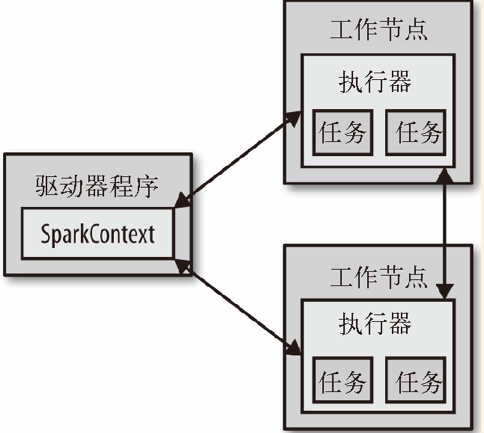

<!-- START doctoc generated TOC please keep comment here to allow auto update -->
<!-- DON'T EDIT THIS SECTION, INSTEAD RE-RUN doctoc TO UPDATE -->
**Table of Contents**  *generated with [DocToc](https://github.com/thlorenz/doctoc)*

- [2.2 Spark中Scala的shell](#22-spark%E4%B8%ADscala%E7%9A%84shell)
- [2.3 Spark核心概念简介](#23-spark%E6%A0%B8%E5%BF%83%E6%A6%82%E5%BF%B5%E7%AE%80%E4%BB%8B)
- [2.4 独立应用](#24-%E7%8B%AC%E7%AB%8B%E5%BA%94%E7%94%A8)
  - [2.4.1 初始化 `SparkContext`](#241-%E5%88%9D%E5%A7%8B%E5%8C%96-sparkcontext)
  - [2.4.2 构建独立应用](#242-%E6%9E%84%E5%BB%BA%E7%8B%AC%E7%AB%8B%E5%BA%94%E7%94%A8)
- [导航](#%E5%AF%BC%E8%88%AA)

<!-- END doctoc generated TOC please keep comment here to allow auto update -->

Spark使用Scala写的，运行在JVM上。

略过2.1节，下载Spark。

# 2.2 Spark中Scala的shell

Spark带有交互式的shell，可以作即时数据分析。Spark shell可以用来与分布式存储在多台机器上的的内存和硬盘上的数据进行交互，且处理过程的并发由Spark自动控制完成。

打开Scala版本的shell：

```shell
bin/spark-shell
```

控制日志的级别，要在`conf`目录下创建一个`log4j.properties`的文件：

```properties
log4j.rootCategory = WARN, console
```

在Spark中，我们通过对分布式数据集的操作来表达我们的计算意图。这些计算会自动在集群上进行。这样的数据集成为弹性分布式数据集（resilient distributed dataset，简称RDD）。RDD是Spark对分布式数据和计算的基本抽象

```
scala> val lines = sc.textFile("README.md") // 创建一个名为lines的RDD
lines: spark.RDD[String] = MappedRDD[...]

scala> lines.count() // 统计RDD中的元素个数
res0: Long = 127

scala> lines.first() // 这个RDD中的第一个元素，也就是README.md的第一行
res1: String = # Apache Spark
```

# 2.3 Spark核心概念简介

从上层来看，每个Spark应用都有一个驱动程序（driver program）来发起集群上的各种并行操作。驱动器程序包含应用的`main`函数，并且定义了集群上的分布式数据集，还对这些数据集应用了相关操作。Spark shell本身就是动器程序，你只需要输入想要运行的操作就可以了。

驱动器程序通过一个`SparkContext`对象来访问Spark。这个对象代表了计算集群中的一个连接。shell启动时自动创建了一个`SparkContext`对象：`sc`。

一旦有了`SparkContext`，就可以用它来创建RDD。驱动程序一般要管理多个执行器（executor）节点来执行计算操作。



最后，很多用来传递函数的API，可以将对应操作运行在集群上。

```
scala> val lines = sc.textFile(" README.md") // 创 建 一 个 叫 lines 的 RDD
lines: spark.RDD[ String] = MappedRDD[...]

scala> val pythonLines = lines.filter( line = > line.contains(" Python"))
pythonLines: spark.RDD[ String] = FilteredRDD[...]

scala> pythonLines.first()
res0: String = ## Interactive Python Shell
```

向Spark传递函数后，Spark会自动将函数发到各个执行器节点上。这样，你就可以在单一的驱动程序中编程，并且让代码自动运行在多个节点上。

# 2.4 独立应用

除了交互式运行外，Spark也可以在Java、Scala或Python的独立程序中被连接使用，这时你就需要自行初始化`SparkContext`。

在Java和Scala中，只需要给应用添加一个对于 spark-core 工件的 Maven 依赖。

```properties
groupId = org.apache.spark
artifactId = spark-core_2.10
version = 1.2.0
```

## 2.4.1 初始化 `SparkContext`

一旦你完成了应用和Spark的连接，就需要在程序中导入Spark包并创建`SparkContext`。

```scala
import org.apache.spark.SparkConf
import org.apache.spark.SparkContext
import org.apache.spark.SparkContext._

val conf = new SparkConf().setMaster("local").setAppName("My App")
val sc = new SparkContext(conf)
```

创建SparkContext的最基本的方法，你只需传递两个参数：

- **集群URL**：告诉Spark如何连接到集群上。例子中使用的是local，这个特殊值可以让Spark运行在单机单 线程上而无需连接到集群。
- **应用名**：例子中是My App。当连接到一个集群时，这个值可以帮助你在集群管理器的用户界面中找到你的应用。

在初始化`SparkContext`之后，你可以创建RDD并操控它们。

最后，关闭Spark可以调用`SparkContext`的`stop()`方法，或者直接退出应用（比如通过`System.exit(0)`或者`sys.exit()`）。

## 2.4.2 构建独立应用

Scala版本的单词量统计应用：

```scala
// 创建一个Scala版本的 Spark Context
val conf = new SparkConf().setAppName("wordCount")
val sc = new SparkContext(conf)

// 读取输入数据
val input = sc.textFile(inputFile)

// 把它切分成一个个单词
val words = input.flatMap(line = > line.split(" "))

// 转换为键值对并计数
val counts = words.map(word = > (word, 1)).reduceByKey{ case (x, y) = > x + y}

// 将统计出来的单词总数存入一个文本文件， 引发求值
counts.saveAsTextFile(outputFile)
```

sbt构建文件：

```properties
name := "learning-spark-mini-example"

version := "0.0.1"

scalaVersion := "2.10.4"

// 附加程序库
libraryDependencies ++= Seq( "org.apache.spark" %% "spark-core" % "1.2.0" % "provided"
```

一旦敲定了构建方式，就可以轻松打包并使用`bin/spark-submit`脚本来执行我们的应用了。

Scala构建与运行：

```shell
sbt clean package

$SPARK_HOME/bin/spark-submit \
    --class com.oreilly.learningsparkexamples.mini.scala.WordCount \
     ./target/... (as above) \
     ./README.md ./wordcounts
```


# 导航

[目录](README.md)

上一章：[1. Spark数据分析导论](1. Spark数据分析导论.md)

下一章：[3. RDD编程](3. RDD编程.md)
