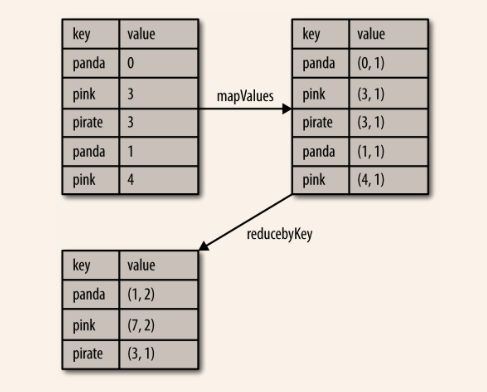
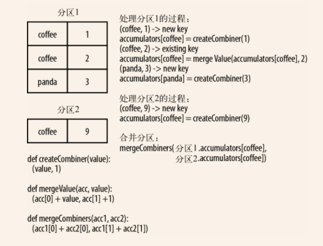
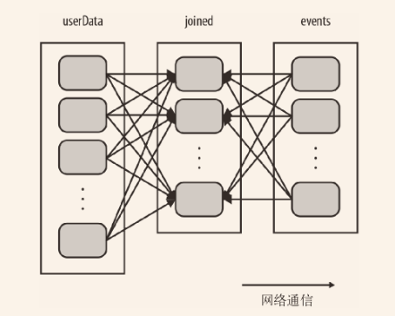
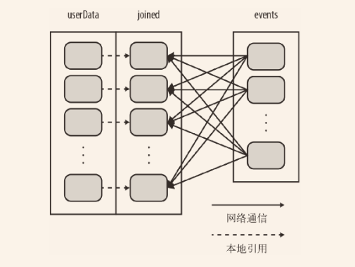

<!-- START doctoc generated TOC please keep comment here to allow auto update -->
<!-- DON'T EDIT THIS SECTION, INSTEAD RE-RUN doctoc TO UPDATE -->
**Table of Contents**  *generated with [DocToc](https://github.com/thlorenz/doctoc)*

- [4.1 动机](#41-%E5%8A%A8%E6%9C%BA)
- [4.2 创建 Pair RDD](#42-%E5%88%9B%E5%BB%BA-pair-rdd)
- [4.3 Pair RDD 的转化操作](#43-pair-rdd-%E7%9A%84%E8%BD%AC%E5%8C%96%E6%93%8D%E4%BD%9C)
  - [4.3.1 聚合操作](#431-%E8%81%9A%E5%90%88%E6%93%8D%E4%BD%9C)
  - [4.3.2 数据分组](#432-%E6%95%B0%E6%8D%AE%E5%88%86%E7%BB%84)
  - [4.3.3 连接](#433-%E8%BF%9E%E6%8E%A5)
  - [4.3.4 数据排序](#434-%E6%95%B0%E6%8D%AE%E6%8E%92%E5%BA%8F)
- [4.4 Pair RDD 的行动操作](#44-pair-rdd-%E7%9A%84%E8%A1%8C%E5%8A%A8%E6%93%8D%E4%BD%9C)
- [4.5 数据分区（进阶）](#45-%E6%95%B0%E6%8D%AE%E5%88%86%E5%8C%BA%E8%BF%9B%E9%98%B6)
  - [4.5.1 获取RDD的分区方式](#451-%E8%8E%B7%E5%8F%96rdd%E7%9A%84%E5%88%86%E5%8C%BA%E6%96%B9%E5%BC%8F)
  - [4.5.2 从分区中获益的操作](#452-%E4%BB%8E%E5%88%86%E5%8C%BA%E4%B8%AD%E8%8E%B7%E7%9B%8A%E7%9A%84%E6%93%8D%E4%BD%9C)
  - [4.5.3 影响分区方式的操作](#453-%E5%BD%B1%E5%93%8D%E5%88%86%E5%8C%BA%E6%96%B9%E5%BC%8F%E7%9A%84%E6%93%8D%E4%BD%9C)
  - [4.5.5 自定义分区方式](#455-%E8%87%AA%E5%AE%9A%E4%B9%89%E5%88%86%E5%8C%BA%E6%96%B9%E5%BC%8F)
- [导航](#%E5%AF%BC%E8%88%AA)

<!-- END doctoc generated TOC please keep comment here to allow auto update -->

键值对 RDD 是 Spark 中许多操作所需要的常见数据类型。键值对 RDD 通常用来进行聚合计算。我们一般要先通过一些初始 ETL（抽取、转化、装载）操作来将数据转化为键值对形式。键值对 RDD 提供了一些新的操作接口。

# 4.1 动机

Pair RDD 是很多程序的构成要素，因为它们提供了并行操作各个键或跨节点重新进行数据分组的操作接口。例如，pair RDD 提供 reduceByKey() 方法，可以分别归约每个键对应的数据，还有 join() 方法，可以把两个 RDD 中键相同的元素组合到一起，合并为一个 RDD。


# 4.2 创建 Pair RDD

很多存储键值对的数据格式会在读取时直接返回由其键值对数据组成的 pair RDD。此外，当需要把一个普通的 RDD 转为 pair RDD 时，可以调用 `map()` 函数来实现，传递的函数需要返回键值对。

使用第一个单词作为键创建出一个 pair RDD

```scala
val pairs = lines.map(x => (x.split(" ")(0), x))
```

当用 Scala 从一个内存中的数据集创建 pair RDD 时，只需要对这个由二元组组成的集合调用 `SparkContext.parallelize()` 方法


# 4.3 Pair RDD 的转化操作

Pair RDD 可以使用所有标准 RDD 上的可用的转化操作。传递函数的规则也适用于pair RDD。由于pair RDD是二元组，所以要传递的函数应该是操作二元组，而不是独立的元素。

以键值对集合{(1, 2), (3, 4), (3, 6)}为例：

| 函数名                                      | 目的                                       | 示例                                 | 结果                                       |
| ---------------------------------------- | ---------------------------------------- | ---------------------------------- | ---------------------------------------- |
| `reduceByKey(func)`                      | 合并具有相同键的值                                | `rdd.reduceByKey((x, y) => x + y)` | {(1, 2), (3, 10)}                        |
| `groupByKey()`                           | 对具有相同键的值进行分组                             | `rdd.groupByKey()`                 | {(1, [2], (3, [4, 6]))}                  |
| `combineByKey(createCobiner, mergeValue, mergeCombiners, partitioner)` | 使用不同的返回类型合并具有相同键的值                       | 见下文                                |                                          |
| `mapValues(func)`                        | 对pair RDD的每个值应用一个函数而不改变键                 | `rdd.mapValues(x = > x + 1)`       | {(1, 3), (3, 5), (3, 7)}                 |
| `flatMapValues(func)`                    | 对pair RDD的每个应用一个返回迭代器的函数，然后对返回的每个元素都生成一个对应原键的键值对记录 | `rdd.flatMapValues(x = (x to 5))`  | {(1, 2), (1, 3), (1, 4), (1, 5), (3, 4), (3, 5)} |
| `keys()`                                 | 返回一个仅包含键的RDD                             | `rdd.keys`                         | {1, 3, 3}                                |
| `values()`                               | 返回一个仅包含值的RDD                             | `rdd.values`                       | {2, 4, 6}                                |
| `sortByKey()`                            | 返回一个根据键排序的RDD                            | `rdd.sortByKey()`                  | {(1, 2), (3, 4), (3, 6)}                 |

两个pair RDD的转换操作，rdd = {(1, 2), (3, 4), (3, 6)} other = {(3, 9)}

| 函数名              | 目的                              | 示例                          | 结果                                       |
| ---------------- | ------------------------------- | --------------------------- | ---------------------------------------- |
| `subtractByKey`  | 删掉RDD中键与other中的键相同的元素           | `rdd.subtractByKey(other)`  | {(1, 2)}                                 |
| `join`           | 对两个RDD内连接                       | `rdd.join(other)`           | {(3, (4, 9)), (3, (6, 9))}               |
| `rightOuterJoin` | 对两个RDD进行连接，确保第一个RDD的键必须存在（右外连接） | `rdd.rightOuterJoin(other)` | {(3, (some(4), 9)), (3, (some(6), 9))}   |
| `leftOuterJoin`  | 对两个RDD进行连接，确保第二个RDD的键必须存在（左外连接） | `rdd.leftOuterJoin(other)`  | {(1,(2,None)), (3, (4,Some(9))), (3, (6,Some(9)))} |
| `cogroup`        | 将两个RDD中拥有相同键的数据分组到一起            | `rdd.cogroup(other)`        | {(1,([2],[])), (3, ([4, 6],[9]))}        |

用 Scala 对第二个元素进行筛选：

```scala
pairs.filter{case (key, value) => value.length < 20}
```


## 4.3.1 聚合操作

`reduceByKey()` 会为数据集中的每个键进行并行的归约操作，每个归约操作会将键相同的值合并起来。它会返回一个由各键和对应键归约出来的结果值组成的新的 RDD。

`foldByKey()` 使用一个与 RDD 和合并函数中的数据类型相同的零值作为初始值。与 `fold()`一样，`foldByKey()` 操作所使用的合并函数对零值与另一个元素进行合并，结果仍为该元素。

在 Scala 中使用 `reduceByKey()` 和 `mapValues()` 计算每个键对应的平均值：

```scala
rdd.mapValues(x => (x, 1)).reduceByKey((x, y) => (x._1 + y._1, x._2 + y._2))”
```



熟悉 MapReduce 中的合并器（combiner）概念的读者可能已经注意到，调用 `reduceByKey()` 和 `foldByKey()` 会在为每个键计算全局的总结果之前先自动在每台机器上进行本地合并。用户不需要指定合并器。更泛化的 `combineByKey()` 接口可以让你自定义合并的行为。

用 Scala 实现单词计数：

```scala
val input = sc.textFile("s3://...")
val words = input.flatMap(x => x.split(" "))
val result = words.map(x => (x, 1)).reduceByKey((x, y) => x + y)”
```

`combineByKey()` 是最为常用的基于键进行聚合的函数。大多数基于键聚合的函数都是用它实现的。和 aggregate() 一样，combineByKey() 可以让用户返回与输入数据的类型不同的返回值。

`combineByKey()`会遍历分区中的所有元素，因此每个元素的键要么还没有遇到过，要么就和之前的某个元素的键相同。

如果这是一个新的元素，`combineByKey()` 会使用一个叫作 `createCombiner()` 的函数来创建那个键对应的累加器的初始值。需要注意的是，这一过程会在每个分区中第一次出现各个键时发生，而不是在整个 RDD 中第一次出现一个键时发生。

如果这是一个在处理当前分区之前已经遇到的键，它会使用 `mergeValue()`方法将该键的累加器对应的当前值与这个新的值进行合并。

由于每个分区都是独立处理的，因此对于同一个键可以有多个累加器。如果有两个或者更多的分区都有对应同一个键的累加器，就需要使用用户提供的 `mergeCombiners()` 方法将各个分区的结果进行合并。

`combineByKey()`有多个参数分别对应聚合操作的各个阶段，因而非常适合用来解释聚合操作各个阶段的功能划分。

`combineByKey()` 求每个键对应的平均值:

```scala
val result = input.combineByKey(
  (v) => (v, 1),
  (acc: (Int, Int), v) => (acc._1 + v, acc._2 + 1),
  (acc1: (Int, Int), acc2: (Int, Int)) => (acc1._1 + acc2._1, acc1._2 + acc2._2)
  ).map{ case (key, value) => (key, value._1 / value._2.toFloat) }
  result.collectAsMap().map(println(_))
```



每个 RDD 都有固定数目的分区 ，分区数决定了在 RDD 上执行操作时的并行度。

在执行聚合或分组操作时，可以要求 Spark 使用给定的分区数。Spark 始终尝试根据集群的大小推断出一个有意义的默认值，但是有时候你可能要对并行度进行调优来获取更好的性能表现。

大多数操作符都能接收第二个参数，这个参数用来指定分组结果或聚合结果的RDD 的分区数，

```scala
val data = Seq(("a", 3), ("b", 4), ("a", 1))
sc.parallelize(data).reduceByKey((x, y) => x + y)    // 默认并行度
sc.parallelize(data).reduceByKey((x, y) => x + y, 10)    // 自定义并行度
```

有时，我们希望在除分组操作和聚合操作之外的操作中也能改变 RDD 的分区。对于这样的情况，Spark 提供了 `repartition()` 函数。它会把数据通过网络进行混洗，并创建出新的分区集合。切记，对数据进行重新分区是代价相对比较大的操作。Spark有个优化版的`repartition()`：`coalesce()`。

你可以使用 `rdd.partitions.size()` 查看 RDD 的分区数，并确保调用 `coalesce()` 时将 RDD 合并到比现在的分区数更少的分区中。


## 4.3.2 数据分组

如果数据已经以预期的方式提取了键，`groupByKey()` 就会使用 RDD 中的键来对数据进行分组。对于一个由类型 K 的键和类型 V 的值组成的 RDD，所得到的结果 RDD 类型会是`[K, Iterable[V]]`。

`groupBy()`可以用于未成对的数据上，也可以根据除键相同以外的条件进行分组。它可以接收一个函数，对源 RDD 中的每个元素使用该函数，将返回结果作为键再进行分组。

除了对单个 RDD 的数据进行分组，还可以使用一个叫作 `cogroup()` 的函数对多个共享同一个键的 RDD 进行分组。对两个键的类型均为 K 而值的类型分别为 V 和 W 的 RDD 进行 cogroup() 时，得到的结果 RDD 类型为 `[(K, (Iterable[V], Iterable[W]))]` 。如果其中的一个 RDD 对于另一个 RDD 中存在的某个键没有对应的记录，那么对应的迭代器则为空。`cogroup()`提供了为多个 RDD 进行数据分组的方法。


## 4.3.3 连接

连接方式多种多样：右外连接、左外连接、交叉连接以及内连接。

普通的 `join` 操作符表示内连接。只有在两个 pair RDD 中都存在的键才叫输出。当一个输入对应的某个键有多个值时，生成的 pair RDD 会包括来自两个输入 RDD 的每一组相对应的记录。

```scala
storeAddress = {
  (Store("Ritual"), "1026 Valencia St"), (Store("Philz"), "748 Van Ness Ave"),
  (Store("Philz"), "3101 24th St"), (Store("Starbucks"), "Seattle")}

storeRating = {
  (Store("Ritual"), 4.9), (Store("Philz"), 4.8))}

storeAddress.join(storeRating) == {(Store("Ritual"), ("1026 Valencia St", 4.9)),
  (Store("Philz"), ("748 Van Ness Ave", 4.8)),
  (Store("Philz"), ("3101 24th St", 4.8))}
```

`leftOuterJoin(other)` 和 `rightOuterJoin(other)` 都会根据键连接两个 RDD，但是允许结果中存在其中的一个 pair RDD 所缺失的键。

在使用 `leftOuterJoin()` 产生的 pair RDD 中，源 RDD 的每一个键都有对应的记录。每个键相应的值是由一个源 RDD 中的值与一个包含第二个 RDD 的值的 Option 对象组成的二元组。

`rightOuterJoin()` 几乎与 `leftOuterJoin()` 完全一样，只不过预期结果中的键必须出现在第二个 RDD 中，而二元组中的可缺失的部分则来自于源 RDD 而非第二个 RDD。

```scala
storeAddress.leftOuterJoin(storeRating) ==
{(Store("Ritual"),("1026 Valencia St",Some(4.9))),
  (Store("Starbucks"),("Seattle",None)),
  (Store("Philz"),("748 Van Ness Ave",Some(4.8))),
  (Store("Philz"),("3101 24th St",Some(4.8)))}

storeAddress.rightOuterJoin(storeRating) ==
{(Store("Ritual"),(Some("1026 Valencia St"),4.9)),
  (Store("Philz"),(Some("748 Van Ness Ave"),4.8)),
  (Store("Philz"), (Some("3101 24th St"),4.8))}
```


## 4.3.4 数据排序

`sortByKey()` 函数接收一个叫作 `ascending` 的参数，表示我们是否想要让结果按升序排序（默认值为 `true` ）。有时我们也可能想按完全不同的排序依据进行排序。要支持这种情况，我们可以提供自定义的比较函数。

```scala
val input: RDD[(Int, Venue)] = ...
implicit val sortIntegersByString = new Ordering[Int] {
  override def compare(a: Int, b: Int) = a.toString.compare(b.toString)
}
rdd.sortByKey()
```


# 4.4 Pair RDD 的行动操作

以键值对集合`{(1, 2), (3, 4), (3, 6)}` 为例：

| 函数               | 描述                | 示例                   | 结果                          |
| ---------------- | ----------------- | -------------------- | --------------------------- |
| `countByKey()`   | 对每个键对应的的元素分别计数    | `rdd.countByKey()`   | {(1, 1), (3, 2)}            |
| `collectAsMap()` | 将结果以映射表的形式返回，以便查询 | `rdd.collectAsMap()` | Map{(1, 2), (3, 4), (3, 6)} |
| `lookup(key)`    | 返回给定键对应的所有值       | `rdd.lookup(3)`      | [4, 6]                      |


# 4.5 数据分区（进阶）

Spark 程序可以通过控制 RDD 分区方式来减少通信开销。Spark 中所有的键值对 RDD 都可以进行分区。系统会根据一个针对键的函数对元素进行分组。

Spark 中所有的键值对 RDD 都可以进行分区。系统会根据一个针对键的函数对元素进行分组。尽管 **Spark 没有给出显示控制每个键具体落在哪一个工作节点上的方法**（部分原因是 Spark 即使在某些节点失败时依然可以工作），但 Spark 可以确保同一组的键出现在同一个节点上。比如，你可能使用哈希分区将一个 RDD 分成了 100 个分区，此时键的哈希值对 100 取模的结果相同的记录会被放在一个节点上。你也可以使用范围分区法，将键在同一个范围区间内的记录都放在同一个节点上。

```scala
// 初始化代码；从HDFS商的一个Hadoop SequenceFile中读取用户信息
// userData中的元素会根据它们被读取时的来源，即HDFS块所在的节点来分布
// Spark此时无法获知某个特定的UserID对应的记录位于哪个节点上
val sc = new SparkContext(...)
val userData = sc.sequenceFile[UserID, UserInfo]("hdfs://...").persist()

// 周期性调用函数来处理过去五分钟产生的事件日志
// 假设这是一个包含(UserID, LinkInfo)对的SequenceFile
def processNewLogs(logFileName: String) {
  val events = sc.sequenceFile[UserID, LinkInfo](logFileName)
  val joined = userData.join(events)// RDD of (UserID, (UserInfo, LinkInfo)) pairs
  val offTopicVisits = joined.filter {
    case (userId, (userInfo, linkInfo)) => // Expand the tuple into its components
      !userInfo.topics.contains(linkInfo.topic)
  }.count()
  println("Number of visits to non-subscribed topics: " + offTopicVisits)
}
```

这段代码可以正确运行，但是不够高效。这是因为在每次调用 `processNewLogs() `时都会用到` join()` 操作，而我们对数据集是如何分区的却一无所知。默认情况下，连接操作会将两个数据集中的所有键的哈希值都求出来，将该哈希值相同的记录通过网络传到同一台机器上，然后在那台机器上对所有键相同的记录进行连接操作。因为 `userData `表比每五分钟出现的访问日志表 `events` 要大得多，所以要浪费时间做很多额外工作：在每次调用时都对` userData `表进行哈希值计算和跨节点数据混洗，虽然这些数据从来都不会变化。



要解决这一问题也很简单：在程序开始时，对 `userData` 表使用 `partitionBy()` 转化操作，将这张表转为哈希分区。在 `processNewLogs()` 中，`events` RDD 是本地变量。只在该方法中使用了一次，所以为`events`指定分区方式没有什么用处。 当调用 `userData.join(events)` 时，Spark 只会对 `events` 进行数据混洗操作，将 `events` 中特定 `UserID` 的记录发送到 `userData` 的对应分区所在的那台机器上。

```scala
val sc = new SparkContext(...)
val userData = sc.sequenceFile[UserID, UserInfo]("hdfs://...")
                 .partitionBy(new HashPartitioner(100))   // 构造100个分区
                 .persist()
```



## 4.5.1 获取RDD的分区方式

在 Scala 中，你可以使用 RDD 的 `partitioner` 属性来获取 RDD 的分区方式。它会返回一个 `scala.Option` 对象。你可以对这个` Option` 对象调用 `isDefined()` 来检查其中是否有值，调用 `get()` 来获取其中的值。如果存在值的话，这个值会是一个 `spark.Partitioner` 对象。这本质上是一个告诉我们 RDD 中各个键分别属于哪个分区的函数。

## 4.5.2 从分区中获益的操作

Spark 的许多操作都引入了将数据根据键跨节点进行混洗的过程。所有这些操作都会从数据分区中获益。如`cogroup()` 、`groupWith()` 、`join()` 、`leftOuterJoin()` 、`rightOuterJoin()` 、`groupByKey()` 、`reduceByKey()` 、`combineByKey()` 以及 `lookup()` 。

对于像 `reduceByKey()` 这样只作用于单个 RDD 的操作，运行在未分区的 RDD 上的时候会导致每个键的所有对应值都在每台机器上进行**本地**计算，只需要把本地最终归约出的结果值从各工作节点传回主节点，所以原本的网络开销就不算大。而对于诸如 `cogroup()` 和 `join()` 这样的二元操作，预先进行数据分区会导致其中至少一个 RDD（使用已知进行数据分区会导致其中至少一个 RDD（使用已知分区器的那个 RDD）不发生数据混洗。如果两个 RDD 使用同样 的分区方式，并且它们还缓存在同样的机器上（比如一个 RDD 是通过 `mapValues()` 从另一个 RDD 中创建出来的，这两个 RDD 就会拥有相同的键和分区方式），或者其中一个 RDD 还没有被计算出来，那么跨节点的数据混洗就不会发生了。

## 4.5.3 影响分区方式的操作

Spark 内部知道各操作会如何影响分区方式，并将会对数据进行分区的操作的结果 RDD 自动设置为对应的分区器。例如，如果你调用 `join()` 来连接两个 RDD；由于键相同的元素会被哈希到同一台机器上，Spark 知道输出结果也是哈希分区的，这样对连接的结果进行诸如 `reduceByKey()` 这样的操作时就会明显变快。

不过，转化操作的结果并不一定 会按已知的分区方式分区，这时输出的 RDD 可能就会没有设置分区器。例如，当你对一个哈希分区的键值对 RDD 调用 `map()`时，由于传给 `map()` 的函数理论上可以改变元素的键，因此结果就不会有固定的分区方式。

这里列出了所有会为生成的结果 RDD 设好分区方式的操作：`cogroup() `、`groupWith()` 、`join()` 、`leftOuterJoin()` 、`rightOuterJoin()` 、`groupByKey()` 、`reduceByKey() `、`combineByKey() `、`partitionBy()` 、`sort()` 、`mapValues()` （如果父 RDD 有分区方式的话）、`flatMapValues() `（如果父 RDD 有分区方式的话），以及 `filter()` （如果父 RDD 有分区方式的话）。其他所有的操作生成的结果都不会存在特定的分区方式。

最后，对于二元操作，输出数据的分区方式取决于父 RDD 的分区方式。默认情况下，结果会采用哈希分区，分区的数量和操作的并行度一样。不过，如果其中的一个父 RDD 已经设置过分区方式，那么结果就会采用那种分区方式。如果两个父RDD都设置了分区方式，结果RDD会采用第一个父RDD的分区方式。


## 4.5.5 自定义分区方式

Spark 还是允许你通过提供一个自定义的 Partitioner 对象来控制 RDD 的分区方式。

要实现自定义的分区器，你需要继承 `org.apache.spark.Partitioner` 类并实现下面三个方法：

- `numPartitions: Int` ：返回创建出来的分区数。
- `getPartition(key: Any): Int` ：返回给定键的分区编号（0 到 numPartitions-1 ）。
- `equals()` ：Spark 需要用这个方法来检查你的分区器对象是否和其他分区器实例相同，这样 Spark 才可以判断两个 RDD 的分区方式是否相同。

```scala
class DomainNamePartitioner(numParts: Int) extends Partitioner {
  override def numPartitions: Int = numParts
  override def getPartition(key: Any): Int = {
    val domain = new Java.net.URL(key.toString).getHost()
    val code = (domain.hashCode % numPartitions)
    if(code < 0) {
      code + numPartitions // 使其非负
    }else{
      code
    }
  }
  
  // 用来让Spark区分分区函数对象的Java equals方法
  override def equals(other: Any): Boolean = other match {
    case dnp: DomainNamePartitioner =>
      dnp.numPartitions == numPartitions
    case _ =>
      false
  }
}
```

使用自定义的 Partitioner 是很容易的：只要把它传给 `partitionBy()` 方法即可。

另外，`join()` 和 `groupByKey()` ，它们也可以接收一个可选的 Partitioner 对象来控制输出数据的分区方式。


# 导航

[目录](README.md)

上一章：[3. RDD编程](3. RDD编程.md)

下一章：[5. 数据读取与保存](5. 数据读取与保存.md)
