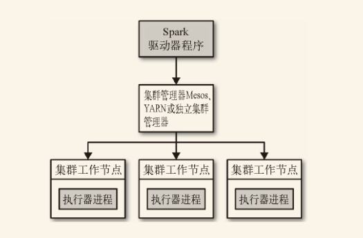

<!-- START doctoc generated TOC please keep comment here to allow auto update -->
<!-- DON'T EDIT THIS SECTION, INSTEAD RE-RUN doctoc TO UPDATE -->
**Table of Contents**  *generated with [DocToc](https://github.com/thlorenz/doctoc)*

- [7.2 Spark 运行时架构](#72-spark-%E8%BF%90%E8%A1%8C%E6%97%B6%E6%9E%B6%E6%9E%84)
  - [7.2.1 驱动器节点](#721-%E9%A9%B1%E5%8A%A8%E5%99%A8%E8%8A%82%E7%82%B9)
  - [7.2.2 执行器节点](#722-%E6%89%A7%E8%A1%8C%E5%99%A8%E8%8A%82%E7%82%B9)
  - [7.2.3 集群管理器](#723-%E9%9B%86%E7%BE%A4%E7%AE%A1%E7%90%86%E5%99%A8)
  - [7.2.4 启动一个程序](#724-%E5%90%AF%E5%8A%A8%E4%B8%80%E4%B8%AA%E7%A8%8B%E5%BA%8F)
  - [7.2.5 小结](#725-%E5%B0%8F%E7%BB%93)
- [7.3 使用 `spark-submit` 部署](#73-%E4%BD%BF%E7%94%A8-spark-submit-%E9%83%A8%E7%BD%B2)
- [7.4 打包代码与依赖](#74-%E6%89%93%E5%8C%85%E4%BB%A3%E7%A0%81%E4%B8%8E%E4%BE%9D%E8%B5%96)
  - [依赖冲突](#%E4%BE%9D%E8%B5%96%E5%86%B2%E7%AA%81)
- [7.5 Spark 应用内与应用间调度](#75-spark-%E5%BA%94%E7%94%A8%E5%86%85%E4%B8%8E%E5%BA%94%E7%94%A8%E9%97%B4%E8%B0%83%E5%BA%A6)
- [7.6 集群管理器](#76-%E9%9B%86%E7%BE%A4%E7%AE%A1%E7%90%86%E5%99%A8)
  - [7.6.1 独立集群管理器](#761-%E7%8B%AC%E7%AB%8B%E9%9B%86%E7%BE%A4%E7%AE%A1%E7%90%86%E5%99%A8)
    - [1. 启动集群管理器](#1-%E5%90%AF%E5%8A%A8%E9%9B%86%E7%BE%A4%E7%AE%A1%E7%90%86%E5%99%A8)
    - [2. 提交应用](#2-%E6%8F%90%E4%BA%A4%E5%BA%94%E7%94%A8)
    - [3. 配置资源用量](#3-%E9%85%8D%E7%BD%AE%E8%B5%84%E6%BA%90%E7%94%A8%E9%87%8F)
    - [4. 高度可用性](#4-%E9%AB%98%E5%BA%A6%E5%8F%AF%E7%94%A8%E6%80%A7)
  - [7.6.2 Hadoop YARN](#762-hadoop-yarn)
  - [7.6.3 Hadoop Mesos](#763-hadoop-mesos)
    - [1. Mesos 调度模式](#1-mesos-%E8%B0%83%E5%BA%A6%E6%A8%A1%E5%BC%8F)
    - [2. 客户端和集群模式](#2-%E5%AE%A2%E6%88%B7%E7%AB%AF%E5%92%8C%E9%9B%86%E7%BE%A4%E6%A8%A1%E5%BC%8F)
    - [3. 配置资源用量](#3-%E9%85%8D%E7%BD%AE%E8%B5%84%E6%BA%90%E7%94%A8%E9%87%8F-1)
  - [7.6.4 Amazon EC2](#764-amazon-ec2)
    - [1. 启动集群](#1-%E5%90%AF%E5%8A%A8%E9%9B%86%E7%BE%A4)
    - [2. 登录集群](#2-%E7%99%BB%E5%BD%95%E9%9B%86%E7%BE%A4)
    - [3. 销毁集群](#3-%E9%94%80%E6%AF%81%E9%9B%86%E7%BE%A4)
    - [4. 暂停和重启集群](#4-%E6%9A%82%E5%81%9C%E5%92%8C%E9%87%8D%E5%90%AF%E9%9B%86%E7%BE%A4)
    - [5. 集群存储](#5-%E9%9B%86%E7%BE%A4%E5%AD%98%E5%82%A8)
- [7.7 选择合适的集群管理器](#77-%E9%80%89%E6%8B%A9%E5%90%88%E9%80%82%E7%9A%84%E9%9B%86%E7%BE%A4%E7%AE%A1%E7%90%86%E5%99%A8)
- [导航](#%E5%AF%BC%E8%88%AA)

<!-- END doctoc generated TOC please keep comment here to allow auto update -->

Spark 可以在各种各样的集群管理器（Hadoop YARN、Apache Mesos，还有 Spark 自带的独立集群管理器）上运行，所以 Spark 应用既能够适应专用集群，又能用于共享的云计算环境。


# 7.2 Spark 运行时架构



在分布式环境下，Spark 集群采用的是**主/从**结构。在一个 Spark 集群中，有一个节点负责中央协调，调度各个分布式工作节点。这个中央协调节点被称为驱动器 （Driver）节点，与之对应的工作节点被称为执行器 （executor）节点。驱动器节点可以和大量的执行器节点进行通信，它们也都作为独立的 Java 进程运行。驱动器节点和所有的执行器节点一起被称为一个 Spark 应用 （application）。

Spark 应用通过一个叫作集群管理器 （Cluster Manager）的外部服务在集群中的机器上启动。Spark 自带的集群管理器被称为独立集群管理器。Spark 也能运行在 Hadoop YARN 和 Apache Mesos 这两大开源集群管理器上。

## 7.2.1 驱动器节点

Spark 驱动器是执行你的程序中的 `main()` 方法的进程。它执行用户编写的用来创建 SparkContext、创建 RDD，以及进行 RDD 的转化操作和行动操作的代码。其实，当你启动 Spark shell 时，你就启动了一个 Spark 驱动器程序。驱动器程序一旦终止，Spark 应用也就结束了。

驱动器程序在 Spark 应用中有两个职责：

- **把用户程序转换为任务**。

  Spark 程序其实是隐式地创建出了一个由操作组成的逻辑上的*有向无环图（Directed Acyclic Graph，简称 DAG）*。当驱动器程序运行时，它会把这个逻辑图转为物理执行计划。Spark 会对逻辑执行计划作一些优化，比如将连续的映射转为流水线化执行，将多个操作合并到一个步骤中等。这样 Spark 就把逻辑计划转为一系列*步骤（stage）*。而每个步骤又由多个*任务 (task)* 组成。这些任务会被打包并送到集群中。任务是 Spark 中最小的工作单元，用户程序通常要启动成百上千的独立任务。

- **为执行器节点调度任务**。

  执行器进程启动后，会向驱动器进程注册自己。因此，驱动器进程始终对应用中所有的执行器节点有完整的记录。每个执行器节点代表一个能够处理任务和存储 RDD 数据的进程。

  Spark 驱动器程序会根据当前的执行器节点集合，尝试把所有任务*基于数据所在位置*分配给合适的执行器进程。当任务执行时，执行器进程会把缓存数据存储起来，而驱动器进程同样会跟踪这些缓存数据的位置，并且利用这些位置信息来调度以后的任务，以尽量减少数据的网络传输。

  驱动器程序会将一些 Spark 应用的运行时的信息通过网页界面呈现出来，默认在端口 4040。

## 7.2.2 执行器节点

Spark 执行器节点是一种工作进程，负责在 Spark 作业中运行任务，任务间相互独立。Spark 应用启动时，执行器节点就被同时启动，并且始终伴随着整个 Spark 应用的生命周期而存在。如果有执行器节点发生了异常或崩溃，Spark 应用也可以继续执行。

执行器进程有两大作用：

- 负责运行组成 Spark 应用的任务，并将结果返回给驱动器进程；
- 通过自身的块管理器（Block Manager）为用户程序中要求缓存的 RDD 提供内存式存储。RDD 是直接缓存在执行器进程内的，因此任务可以在运行时充分利用缓存数据加速运算。

## 7.2.3 集群管理器

Spark 依赖于集群管理器来启动执行器节点，而在某些特殊情况下，也依赖集群管理器来启动驱动器节点。集群管理器是 Spark 中的可插拔式组件。除了 Spark 自带的独立集群管理器，Spark 也可以运行在其他外部集群管理器上，比如 YARN 和 Mesos。

## 7.2.4 启动一个程序

不论你使用的是哪一种集群管理器，`spark-submit` 都可以你的应用提交到那种集群管理器上，并通过不同的配置选项控制应用所使用的资源数量。

## 7.2.5 小结

在集群上运行 Spark 应用的详细过程：

1. 用户通过 `spark-submit` 脚本提交应用。
2. `spark-submit` 脚本启动驱动器程序，调用用户定义的 `main()` 方法。
3. 驱动器程序与集群管理器通信，申请资源以启动执行器节点。
4. 集群管理器为驱动器程序启动执行器节点。
5. 驱动器进程执行用户应用中的操作。根据程序中所定义的对 RDD 的转化操作和行动操作，驱动器节点把工作以任务的形式发送到执行器进程。
6. 任务在执行器程序中进行计算并保存结果。
7. 如果驱动器程序的 `main()` 方法退出，或者调用了 `SparkContext.stop()` ，驱动器程序会终止执行器进程，并且通过集群管理器释放资源。


# 7.3 使用 `spark-submit` 部署

```shell 
bin/spark-submit [options] <app jar | python file> [app options]
```

> [options] 是要传给 spark-submit 的选项列表。
>
> \<app jar | python File> 表示包含应用入口的 JAR 包或 Python 脚本。
>
> [app options] 是传给你的应用的选项。如果你的程序要处理传给 `main()` 方法的参数，它只会得到 [app options] 对应的标记，不会得到 spark-submit 的标记。

`spark-submit`的一些常用选项：

| 选项                  | 描述                                       |
| ------------------- | ---------------------------------------- |
| `--master`          | 要连接的集群管理器                                |
| `--deploy-mode`     | 选择在本地（client）启动驱动器程序，还是在集群中的一台工作节点机器（cluster）上启动。 |
| `--class`           | 运行Scala的主类                               |
| `--name`            | 应用的显示名，在Spark的网页界面                       |
| `--jars`            | 需要上传并放到应用的 CLASSPATH 中的 JAR 包的列表。如果应用依赖于少量第三方的 JAR 包，可以把它们放在这个参数里 |
| `--files`           | 需要放到应用工作目录中的文件的列表。这个参数一般用来放需要分发到各节点的数据文件 |
| `--executor-memory` | 执行器进程使用的内存大小                             |
| `--driver-memory`   | 驱动器进程使用的内存大小                             |

`spark-submit` 还允许通过 `--conf prop=value` 标记设置任意的 SparkConf 配置选项，也可以使用 `--properties-File `指定一个包含键值对的属性文件。


# 7.4 打包代码与依赖

Scala 用户也可以通过 `spark-submit` 的 `--jars` 标记提交独立的 JAR 包依赖。当只有一两个库的简单依赖，并且这些库本身不依赖于其他库时，这种方法比较合适。

常规的做法是使用构建工具，生成单个大 JAR 包，包含应用的所有的传递依赖。Scala 使用 sbt 构建项目。

build.sbt: 
```properties
import AssemblyKeys._

name := "Simple Project"

version := "1.0"

organization := "com.databricks"

scalaVersion := "2.10.3"

libraryDependencies ++= Seq(
    // Spark依赖
    "org.apache.spark" % "spark-core_2.10" % "1.2.0" % "provided",
    // 第三方库
    "net.sf.jopt-simple" % "jopt-simple" % "4.3",
    "joda-time" % "joda-time" % "2.0"
)

// 这条语句打开了assembly插件的功能
assemblySettings

// 配置assembly插件所使用的JAR
jarName in assembly := "my-project-assembly.jar"

// 一个用来把Scala本身排除在组合JAR包之外的特殊选项，因为Spark
// 已经包含了Scala
assemblyOption in assembly :=
  (assemblyOption in assembly).value.copy(includeScala = false)
```

在 sbt 工程构建中添加 `assembly` 插件:

```shell
# 显示project/assembly.sbt的内容
$ cat project/assembly.sbt
addSbtPlugin("com.eed3si9n" % "sbt-assembly" % "0.11.2")
```

## 依赖冲突

当用户应用与 Spark 本身依赖同一个库时可能会发生依赖冲突，导致程序崩溃。通常，依赖冲突表现为 Spark 作业执行过程中抛出 `NoSuchMethodError` 、`ClassNotFoundException` ，或其他与类加载相关的 JVM 异常。

对于这种问题，主要有两种解决方式：

- 一是修改你的应用，使其使用的依赖库的版本与 Spark 所使用的相同
- 二是使用通常被称为『shading』的方式打包你的应用。『shading』可以让你以另一个命名空间保留冲突的包，并自动重写应用的代码使得它们使用重命名后的版本”


# 7.5 Spark 应用内与应用间调度

在调度多用户集群时，Spark 主要依赖*集群管理器*来在 Spark 应用间共享资源。当 Spark 应用向集群管理器申请执行器节点时，应用收到的执行器节点个数可能比它申请的更多或者更少，这取决于集群的可用性与争用。许多集群管理器支持队列，可以为队列定义不同优先级或容量限制，这样 Spark 就可以把作业提交到相应的队列中。

Spark 提供了一种用来配置应用内调度策略的机制。Spark 内部的[公平调度器 （Fair Scheduler）](http://spark.apache.org/docs/latest/job-scheduling.html)会让长期运行的应用定义调度任务的优先级队列。


# 7.6 集群管理器

Spark 可以运行在各种集群管理器上，并通过集群管理器访问集群中的机器。如果你只想在一堆机器上运行 Spark，那么自带的独立模式是部署该集群最简单的方法。然而，如果你有一个需要与别的分布式应用共享的集群（比如既可以运行 Spark 作业又可以运行 Hadoop MapReduce 作业），Spark 也可以运行在两个广泛使用的集群管理器——Hadoop YARN 与 Apache Mesos 上面。最后，在把 Spark 部署到 Amazon EC2 上时，Spark 有个自带的脚本可以启动独立模式集群以及各种相关服务。

## 7.6.1 独立集群管理器

独立集群管理器由一个*主节点*和几个*工作节点*组成，各自都分配有一定量的内存和 CPU 核心。当提交应用时，你可以配置执行器进程使用的内存量，以及所有执行器进程使用的 CPU 核心总数。

### 1. 启动集群管理器

要使用集群启动脚本，请按如下步骤执行。

1. 将编译好的 Spark 复制到所有机器的一个相同的目录下，比如 `/home/yourname/spark`。
2. 设置好从主节点机器到其他机器的 SSH 无密码登陆。这需要在所有机器上有相同的用户账号，并在主节点上通过 `ssh-keygen` 生成 SSH 私钥，然后将这个私钥放到所有工作节点的 `.ssh/authorized_keys` 文件中。
3. 编辑主节点的 `conf/slaves` 文件并填上所有工作节点的主机名。
4. 在主节点上运行 `sbin/start-all.sh` （**要在主节点上运行而不是在工作节点上**）以启动集群。如果全部启动成功，你不会得到需要密码的提示符，而且可以在 [http://masternode:8080](http://masternode:8080) 看到集群管理器的网页用户界面，上面显示着所有的工作节点。
5. 要停止集群，在主节点上运行 `bin/stop-all.sh` 。


启动集群的另一种办法：Spark 的 `bin/spark-class` 脚本分别手动启动主节点和工作节点。在主节点上，输入：
```shell 
bin/spark-class org.apache.spark.deploy.master.Master
```

然后在工作节点上输入：
```shell 
bin/spark-class org.apache.spark.deploy.worker.Worker spark://masternode:707
```

默认情况下，集群管理器会选择合适的默认值自动为所有工作节点分配 CPU 核心与内存。

### 2. 提交应用

```
spark-submit --master spark://masternode:7077 yourapp
```

独立集群管理器支持两种部署模式 。在这两种模式中，应用的驱动器程序运行在不同的地方。

- 在客户端模式中（默认情况），驱动器程序会运行在你执行 `spark-submit` 的机器上，是 `spark-submit` 命令的一部分。这意味着你可以直接看到驱动器程序的输出，也可以直接输入数据进去（通过交互式 shell），但是这要求你提交应用的机器与工作节点间有很快的网络速度，并且在程序运行的过程中始终可用。
- 在集群模式下，驱动器程序会作为某个工作节点上一个独立的进程运行在独立集群管理器内部。它也会连接主节点来申请执行器节点。在这种模式下，`spark-submit` 是“一劳永逸”型，你可以在应用运行时关掉你的电脑。你还可以通过集群管理器的网页用户界面访问应用的日志。向 `spark-submit` 传递 `--deploy-mode cluster` 参数可以切换到集群模式。

### 3. 配置资源用量

独立集群管理器使用基础的调度策略，这种策略允许限制各个应用的用量来让多个应用并发执行。Apache Mesos 支持应用运行时的更动态的资源共享，而 YARN 则有分级队列的概念，可以让你限制不同类别的应用的用量。

在独立集群管理器中，资源分配靠下面两个设置来控制。

- 执行器进程内存

  你可以通过 `spark-submit` 的 `--executor-memory` 参数来配置此项。每个应用在每个工作节点上最多拥有一个执行器进程（一个机器可以运行多个节点），因此这个设置项能够控制执行器节点占用工作节点的多少内存。此设置项的默认值是 1 GB。

- 占用核心总数的最大值

   这是一个应用中所有执行器进程所占用的核心总数。此项的默认值是无限。也就是说，应用可以在集群所有可用的节点上启动执行器进程。你可以通过 `spark-submit` 的 `--total-executorcores` 参数设置这个值，或者在 Spark 配置文件中设置 `spark.cores.max` 的值。

最后，独立集群管理器在默认情况下会为每个应用使用尽可能分散的执行器进程。

### 4. 高度可用性

独立模式能够很好地支持工作节点的故障。如果你想让集群的主节点也拥有高度可用性，Spark 还支持使用 Apache ZooKeeper（一个分布式协调系统）来维护多个备用的主节点，并在一个主节点失败时切换到新的主节点上。

## 7.6.2 Hadoop YARN 

YARN 是在 Hadoop 2.0 中引入的集群管理器，它可以让多种数据处理框架运行在一个共享的资源池上，并且通常安装在与 Hadoop 文件系统（简称 HDFS）相同的物理节点上。YARN 可以让 Spark 在存储数据的物理节点上运行，以快速访问 HDFS 中的数据。

在 Spark 里使用 YARN 很简单：你只需要设置指向你的 Hadoop 配置目录的环境变量，然后使用 spark-submit 向一个特殊的的主节点 URL 提交作业即可。

找到你的 Hadoop 的配置目录，并把它设为环境变量 `HADOOP_CONF_DIR` 。这个目录包含 `yarn-site.xml` 和其他配置文件；如果你把 Hadoop 装到 `HADOOP_HOME` 中，那么这个目录通常位于 `HADOOP_HOME/conf` 中，否则可能位于系统目录 `/etc/hadoop/conf` 中。然后用如下方式提交你的应用：

```shell 
export HADOOP_CONF_DIR="..."
spark-submit --master yarn yourapp
```

和独立集群管理器一样，有两种将应用连接到集群的模式：客户端模式以及集群模式。

- 在客户端模式下，应用的驱动器程序运行在提交应用的机器上。
- 在集群模式下，驱动器程序也运行在一个 YARN 容器内部。


当在 YARN 上运行时，根据你在 `spark-submit` 或 `spark-shell` 等脚本的 `--num-executors` 标记中设置的值，Spark 应用会使用固定数量的执行器节点。默认情况下，这个值仅为2。你也可以设置通过 `--executor-memory` 设置每个执行器的内存用量，通过 `--executor-cores` 设置每个执行器进程从 YARN 中占用的核心数目。对于给定的硬件资源，Spark 通常在用量较大而总数较少的执行器组合（使用多核与更多内存）上表现得更好，因为这样 Spark 可以优化各执行器进程间的通信。然而，需要注意的是，一些集群限制了每个执行器进程的最大内存（默认为 8 GB），不让你使用更大的执行器进程。

出于资源管理的目的，某些 YARN 集群被设置为将应用调度到多个队列中。使用 `--queue` 选项来选择你的队列的名字。

## 7.6.3 Hadoop Mesos

Apache Mesos 是一个通用集群管理器，既可以运行分析型工作负载又可以运行长期运行的服务。要在 Mesos 上使用 Spark，需要把一个 `mesos://` 的 URI 传给 `spark-submit` ：

```shell 
spark-submit --master mesos://masternode:5050 yourapp
```

在运行多个主节点时，你可以使用 ZooKeeper 来为 Mesos 集群选出一个主节点。在这种情况下，应该使用 `mesos://zk://` 的 URI 来指向一个 ZooKeeper 节点列表。

```
mesos://zk://node1:2181/mesos,node2:2181/mesos,node3:2181/mesos
```

### 1. Mesos 调度模式

Mesos 提供了两种模式来在一个集群内的执行器进程间共享资源：

- 在“细粒度”模式（默认）中，执行器进程占用的 CPU 核心数会在它们执行任务时动态变化，因此一台运行了多个执行器进程的机器可以动态共享 CPU 资源。
- 在“粗粒度”模式中，Spark 提前为每个执行器进程分配固定数量的 CPU 数目，并且在应用结束前绝不释放这些资源，哪怕执行器进程当前不在运行任务。

你可以通过向 `spark-submit` 传递 `--conf spark.mesos.coarse=true` 来打开粗粒度模式。

### 2. 客户端和集群模式

在 Mesos 上 Spark 只支持以客户端的部署模式运行应用。也就是说，驱动器程序必须运行在提交应用的那台机器上。如果你还是希望在 Mesos 集群中运行你的驱动器节点，那么 Aurora 或 Chronos 这样的框架可以让你将任意脚本提交到 Mesos 上执行，并监控它们的运行。你可以使用这类框架中的一种来启动应用的驱动器程序。

### 3. 配置资源用量

你可以通过 `spark-submit` 的两个参数 `--executor-memory` 和 `--total-executor-cores` 来控制运行在 Mesos 上的资源用量，前者用来设置每个执行器进程的内存，后者则用来设置应用占用的核心数（所有执行器节点占用的总数）的最大值。默认情况下，Spark 会使用尽可能多的核心启动各个执行器节点，来将应用合并到尽量少的执行器实例中，并为应用分配所需要的核心数。如果你不设置 `--total-executor-cores `参数，Mesos 会尝试使用集群中所有可用的核心。

## 7.6.4 Amazon EC2

Spark 自带一个可以在 Amazon EC2 上启动集群的脚本(`spark-ec2`，位于Spark安装目录下的`ec2`目录)。这个脚本会启动一些节点，并且在它们上面安装独立集群管理器。这样一旦集群启动起来，你就可以根据前面讲到的独立模式使用方法来使用这个集群。除此以外，EC2 脚本还会安装好其他相关的服务，比如 HDFS、Tachyon 还有用来监控集群的 Ganglia。

EC2 脚本可以管理多个已命名的集群 ，并且使用 EC2 安全组来区分它们。对于每个集群，脚本都会为主节点创建一个叫作 `clustername-master` 的安全组，而为工作节点创建一个叫作 `clustername-slaves` 的安全组。

### 1. 启动集群

创建一个Amazon网络服务（AWS）账号，获取访问键ID和访问键密码，然后设置在环境变量：

```shell
export AWS_ACCESS_KEY_ID="..."
export AWS_SECRET_ACCESS_KEY="...
```

然后再创建出 EC2 的 SSH 密钥对，然后下载私钥文件（通常叫作 `keypair.pem`），这样你就可以 SSH 到你的机器上。

接下来，运行 `spark-ec2` 脚本的 `launch` 命令，提供你的密钥对的名字、私钥文件和集群的名字。默认情况下，这条命令会使用 `m1.xlarge` 类型的 EC2 实例，启动一个有一个主节点和一个工作节点的集群：

```shell 
cd /path/to/spark/ec2
./spark-ec2 -k mykeypair -i mykeypair.pem launch mycluste
```

### 2. 登录集群

使用存有私钥的 `.pem` 文件通过 SSH 登录到集群的主节点上。为了方便，`spark-ec2` 提供了登录命令：

```shell 
./spark-ec2 -k mykeypair -i mykeypair.pem login mycluster
```
进入集群以后，你就可以使用 `/root/spark` 中的 Spark 环境来运行程序了。

### 3. 销毁集群

要销毁 spark-ec2 所启动的集群，运行：

```shell 
./spark-ec2 destroy mycluster
```

这条命令会终止集群中的所有的实例。

### 4. 暂停和重启集群

spark-ec2 还可以让你中止运行集群的 Amazon 实例，并且可以让你稍后重启这些实例。停止这些实例会将它们关机，并丢失“临时”盘上的所有数据。“临时”盘上还配有一个给 spark-ec2 使用的 HDFS 环境。不过，中止的实例会 保留 `root` 目录下的所有数据，这样你就可以快速恢复自己的工作。

要中止一个集群，运行：

```shell 
./spark-ec2 stop mycluster
```

然后，过一会儿，再次启动集群：

```shell 
./spark-ec2 -k mykeypair -i mykeypair.pem start mycluster
```

### 5. 集群存储

Spark EC2已配置好了两套 Hadoop 文件系统以供存储临时数据。

- “临时”HDFS，使用节点上的临时盘。临时盘可以提供相当大的临时存储空间。不过它会在你关闭并重启 EC2 集群时丢失所有数据。这种文件系统安装在节点的 `/root/ephemeral-hdfs` 目录中。
- “永久”HDFS，使用节点的 root 分卷。这种 HDFS 在集群重启时仍然保留数据，不过一般空间较小，访问起来也比临时的那种慢。它安装于 `/root/persistent-hdfs` 目录。


# 7.7 选择合适的集群管理器

权衡各种集群管理器：

- 如果是从零开始，可以先选择独立集群管理器。独立模式安装起来最简单，而且如果你只是使用 Spark 的话，独立集群管理器提供与其他集群管理器完全一样的全部功能。
- 如果你要在使用 Spark 的同时使用其他应用，或者是要用到更丰富的资源调度功能（例如队列），那么 YARN 和 Mesos 都能满足你的需求。而在这两者中，对于大多数 Hadoop 发行版来说，一般 YARN 已经预装好了。
- Mesos 相对于 YARN 和独立模式的一大优点在于其细粒度共享的选项，该选项可以将类似 Spark shell 这样的交互式应用中的不同命令分配到不同的 CPU 上。因此这对于多用户同时运行交互式 shell 的用例更有用处。
- 在任何时候，最好把 Spark 运行在运行 HDFS 的节点上，这样能快速访问存储。你可以自行在同样的节点上安装 Mesos 或独立集群管理器。如果使用 YARN 的话，大多数发行版已经把 YARN 和 HDFS 安装在了一起。


# 导航

[目录](README.md)

上一章：[6. Spark编程进阶](6. Spark编程进阶.md)

下一章：[8. Spark调优与调试](8. Spark调优与调试.md)
