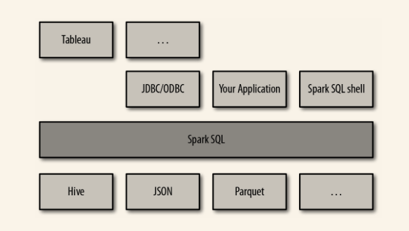

<!-- START doctoc generated TOC please keep comment here to allow auto update -->
<!-- DON'T EDIT THIS SECTION, INSTEAD RE-RUN doctoc TO UPDATE -->
**Table of Contents**  *generated with [DocToc](https://github.com/thlorenz/doctoc)*

- [9.1 连接Spark SQL](#91-%E8%BF%9E%E6%8E%A5spark-sql)
- [9.2 在应用中使用Spark SQL](#92-%E5%9C%A8%E5%BA%94%E7%94%A8%E4%B8%AD%E4%BD%BF%E7%94%A8spark-sql)
  - [9.2.1 初始化Spark SQL](#921-%E5%88%9D%E5%A7%8B%E5%8C%96spark-sql)
  - [9.2.2 基本查询示例](#922-%E5%9F%BA%E6%9C%AC%E6%9F%A5%E8%AF%A2%E7%A4%BA%E4%BE%8B)
  - [9.2.3 SchemaRDD](#923-schemardd)
  - [9.2.4 缓存](#924-%E7%BC%93%E5%AD%98)
- [9.3 读取和存储数据](#93-%E8%AF%BB%E5%8F%96%E5%92%8C%E5%AD%98%E5%82%A8%E6%95%B0%E6%8D%AE)
  - [9.3.1 Apache Hive](#931-apache-hive)
  - [9.3.2 Parquet](#932-parquet)
  - [9.3.3 JSON](#933-json)
  - [9.3.4 基于RDD](#934-%E5%9F%BA%E4%BA%8Erdd)
- [9.4 JDBC/ODBC服务器](#94-jdbcodbc%E6%9C%8D%E5%8A%A1%E5%99%A8)
  - [9.4.1 使用BeeLine](#941-%E4%BD%BF%E7%94%A8beeline)
  - [9.4.2 长生命周期的表与查询](#942-%E9%95%BF%E7%94%9F%E5%91%BD%E5%91%A8%E6%9C%9F%E7%9A%84%E8%A1%A8%E4%B8%8E%E6%9F%A5%E8%AF%A2)
- [9.5 用户自定义函数](#95-%E7%94%A8%E6%88%B7%E8%87%AA%E5%AE%9A%E4%B9%89%E5%87%BD%E6%95%B0)
  - [9.5.1 Spark SQL UDF](#951-spark-sql-udf)
  - [9.5.2 Hive UDF](#952-hive-udf)
- [9.6 Spark SQL性能](#96-spark-sql%E6%80%A7%E8%83%BD)
- [导航](#%E5%AF%BC%E8%88%AA)

<!-- END doctoc generated TOC please keep comment here to allow auto update -->



结构化数据是指任何有结构信息的数据。所谓结构信息，就是每条记录共用的已知的字段集合。当数据符合这样的条件时，Spark SQL 就会使得针对这些数据的读取和查询变得更加简单高效。具体来说，Spark SQL 提供了以下三大功能:

1. Spark SQL可以从各种结构化数据源（JSON、Hive、Parquet等）读取数据。
2. Spark SQL 不仅支持在 Spark 程序内使用 SQL 语句进行数据查询，也支持从类似商业智能软件 Tableau 这样的外部工具中通过标准数据库连接器（JDBC/ODBC）连接 Spark SQL 进行查询。
3. 当在 Spark 程序内使用 Spark SQL 时，Spark SQL 支持 SQL 与常规的 Python/Java/Scala 代码高度整合，包括连接 RDD 与 SQL 表、公开的自定义 SQL 函数接口等。

Spark SQL 提供了一种特殊的 RDD，叫作 SchemaRDD（新版本成为DataFrame）。SchemaRDD 是存放 Row 对象的 RDD，每个 Row 对象代表一行记录。SchemaRDD 还包含记录的结构信息（即数据字段）。SchemaRDD 可以利用结构信息更加高效地存储数据。此外，SchemaRDD 还支持 RDD 上所没有的一些新操作，比如运行 SQL 查询。SchemaRDD 可以从外部数据源创建，也可以从查询结果或普通 RDD 中创建。


# 9.1 连接Spark SQL

要在应用中引入 Spark SQL 需要添加一些额外的依赖。

带有 Hive 支持的 Spark SQL的 sbt：

```properties
libraryDependencies ++= Seq("org.apache.spark" %% "spark-hive_2.1.0" % "1.2.0")
```

如果你不能引入 Hive 依赖，那就应该使用工件 `spark-sql_2.10` 来代替 `spark-hive_2.10` 。

使用Spark SQL编程时，根据是否使用 Hive 支持，有两个不同的入口：

1. `HiveContext` ，它可以提供 HiveQL 以及其他依赖于 Hive 的功能的支持。使用`HiveContext`不需要实现部署好Hive。
2. 更为基础的 SQLContext 则支持 Spark SQL 功能的一个子集，子集中去掉了需要依赖于 Hive 的功能。

最后，若要把 Spark SQL 连接到一个部署好的 Hive 上，你必须把 `hive-site.xml` 复制到 Spark 的配置文件目录中（`$SPARK_HOME/conf`）。即使没有部署好 Hive，Spark SQL 也可以运行。


# 9.2 在应用中使用Spark SQL

基于已有的 `SparkContext` 创建出一个 `HiveContext`（如果使用的是去除了 Hive 支持的 Spark 版本，则创建出 `SQLContext`）。这个上下文环境提供了对 Spark SQL 的数据进行查询和交互的额外函数。使用 `HiveContext` 可以创建出表示结构化数据的 SchemaRDD，并且使用 SQL 或是类似 `map()` 的普通 RDD 操作来操作这些 SchemaRDD。

## 9.2.1 初始化Spark SQL

```scala
// 导入Spark SQL
import org.apache.spark.sql.hive.HiveContext
// 如果不能使用hive依赖的话
import org.apache.spark.sql.SQLContext
  
val sc = new SparkContext(...)
// 隐式转换
val hiveCtx = new HiveContext(sc)
```

## 9.2.2 基本查询示例

要在一张数据表上进行查询，需要调用 `HiveContext`或` SQLContext` 中的 `sql()` 方法。要做的第一件事就是告诉 Spark SQL 要查询的数据是什么。因此，需要先从 JSON 文件中读取一些推特数据，把这些数据注册为一张临时表并赋予该表一个名字，然后就可以用 SQL 来查询它了。

```scala
val input = hiveCtx.jsonFile(inputFile)
// 注册输入的SchemaRDD
input.registerTempTable("tweets")
// 依据retweetCount（转发计数）选出推文
val topTweets = hiveCtx.sql("SELECT text, retweetCount FROM
  tweets ORDER BY retweetCount LIMIT 10")
```

## 9.2.3 SchemaRDD

读取数据和执行查询都会返回 SchemaRDD。SchemaRDD 和传统数据库中的表的概念类似。从内部机理来看，SchemaRDD 是一个由 Row 对象组成的 RDD，附带包含每列数据类型的结构信息。Row 对象只是对基本数据类型（如整型和字符串型等）的数组的封装。

SchemaRDD 仍然是 RDD，所以你可以对其应用已有的 RDD 转化操作，比如 `map()` 和 `filter()` 。然而，SchemaRDD 也提供了一些额外的功能支持。最重要的是，你可以把任意 SchemaRDD 注册为临时表（`registerTempTable()`），这样就可以使用 `HiveContext.sql` 或 `SQLContext.sql` 来对它进行查询了。

SchemaRDD 可以存储一些基本数据类型，也可以存储由这些类型组成的结构体和数组。

SchemaRDD 使用 [HiveQL 语法](https://cwiki.apache.org/confluence/display/Hive/LanguageManual+DDL)定义的类型。

Row 对象表示 SchemaRDD 中的记录，其本质就是一个定长的字段数组。在 Scala 中，Row 对象有一系列 getter 方法，可以通过下标获取每个字段的值。

```scala
val topTweetText = topTweets.map(row => row.getString(0))
```

## 9.2.4 缓存

Spark SQL 的缓存机制与 Spark 中的稍有不同。由于我们知道每个列的类型信息，所以 Spark 可以更加高效地存储数据。为了确保使用更节约内存的表示方式进行缓存而不是储存整个对象，应当使用专门的 `hiveCtx.cacheTable("tableName")` 方法。当缓存数据表时，Spark SQL 使用一种列式存储格式在内存中表示数据。这些缓存下来的表只会在驱动器程序的生命周期里保留在内存中，所以如果驱动器进程退出，就需要重新缓存数据。


# 9.3 读取和存储数据

## 9.3.1 Apache Hive

当从 Hive 中读取数据时，Spark SQL 支持任何 Hive 支持的存储格式（SerDe），包括文本文件、RCFiles、ORC、Parquet、Avro，以及 Protocol Buffer。

```scala
import org.apache.spark.sql.hive.HiveContext

val hiveCtx = new HiveContext(sc)
val rows = hiveCtx.sql("SELECT key, value FROM mytable")
val keys = rows.map(row => row.getInt(0))
```

## 9.3.2 Parquet

[Parquet](http://parquet.apache.org/)是一种流行的列式存储格式，可以高效地存储具有嵌套字段的记录。Parquet 格式经常在 Hadoop 生态圈中被使用，它也支持 Spark SQL 的全部数据类型。Spark SQL 提供了直接读取和存储 Parquet 格式文件的方法。

首先，你可以通过 HiveContext.parquetFile 或者 SQLContext.parquetFile 来读取数据：

```scala
val rows = hiveCtx.parseFile(parquetFile)
val names = rows.map(row => row.name)
println(names.collect())
```

也可以把我Parquet文件注册为Spark SQL的临时表，然后在表上执行查询语句：

```scala
val tbl = rows.registerTempTable("people")
val pandaFriends = hiveCtx.sql("SELECT name FROM people WHERE favouriteAnimal =
\"panda\"")
println(pandaFriends.map(lambda row: row.name).collect()) 
```

最后使用`svaAsParquetFile()`把SchemaRDD的内容以Parquet格式保存。

## 9.3.3 JSON

要读取 JSON 数据，只要调用 `hiveCtx` 中的 `jsonFile()` 方法即可。 

```scala
val input = hiveCtx.jsonFile(inputFile)
```

## 9.3.4 基于RDD

除了读取数据，也可以基于 RDD 创建 SchemaRDD。在 Scala 中，带有 case class 的 RDD 可以隐式转换成 SchemaRDD。

```scala
case class HappyPerson(handle: String, favouriteBeverage: String)
...
// 创建了一个人的对象，并且把它转成SchemaRDD
val happyPeopleRDD = sc.parallelize(List(HappyPerson("holden", "coffee")))
// 注意：此处发生了隐式转换
// 该转换等价于sqlCtx.createSchemaRDD(happyPeopleRDD)
happyPeopleRDD.registerTempTable("happy_people")
```


# 9.4 JDBC/ODBC服务器

JDBC 服务器作为一个独立的 Spark 驱动器程序运行，可以在多用户之间共享。任意一个客户端都可以在内存中缓存数据表，对表进行查询。集群的资源以及缓存数据都在所有用户之间共享。

Spark SQL 的 JDBC 服务器与 Hive 中的 HiveServer2 相一致。由于使用了 Thrift 通信协议，它也被称为『Thrift server』。注意，JDBC 服务器支持需要 Spark 在打开 Hive 支持的选项下编译。

启动 JDBC 服务器：

```scala 
./sbin/start-thriftserver.sh --master sparkMaster
```

Spark 也自带了 Beeline 客户端程序，我们可以使用它连接 JDBC 服务器。

Spark的ODBC服务器由Simba制作。

## 9.4.1 使用BeeLine

在 Beeline 客户端中，你可以使用标准的 HiveQL 命令来创建、列举以及查询数据表。

## 9.4.2 长生命周期的表与查询

使用 Spark SQL 的 JDBC 服务器的优点之一就是我们可以在多个不同程序之间共享缓存下来的数据表。JDBC Thrift 服务器是一个单驱动器程序，这就使得共享成为了可能。你只需要注册该数据表并对其运行 CACHE 命令，就可以利用缓存了。


# 9.5 用户自定义函数

用户自定义函数，也叫 UDF，可以让我们使用 Scala 注册自定义函数，并在 SQL 中调用。

## 9.5.1 Spark SQL UDF 

```scala 
registerFunction("strLenScala", (_: String).length)
val tweetLength = hiveCtx.sql("SELECT strLenScala('tweet') FROM tweets LIMIT 10")
```

## 9.5.2 Hive UDF

要使用 Hive UDF，应该使用 `HiveContext`，而不能使用常规的 `SQLContext`。要注册一个 Hive UDF，只需调用 `hiveCtx.sql("CREATE TEMPORARY FUNCTION name AS class.function")`。

# 9.6 Spark SQL性能 

Spark SQL 可以利用其对类型的了解来高效地表示数据。当缓存数据时，Spark SQL 使用内存式的列式存储。这不仅仅节约了缓存的空间，而且尽可能地减少了后续查询中针对某几个字段查询时的数据读取。

Spark SQL中的性能选项

- `spark.sql.codegen`。设置为`true`时，Spark SQL会把每条查询语句在运行时编译为Java二进制节代码。这可以提高大型查询性能，降低小型查询性能。
- `spark.sql.inMemoryColumnarStorage.compressed`。自动对内存中的列式存储压缩。
- `spark.sql.inMemoryColumnarStorage.batchSize`。列式缓存时每个批处理的大小。
- `sql.sql.parquet.compression.codec`。使用哪种压缩编码器。

# 导航

[目录](README.md)

上一章：[8. Spark调优与调试](8. Spark调优与调试.md)

下一章：[10. Spark Streaming](10. Spark Streaming.md)

