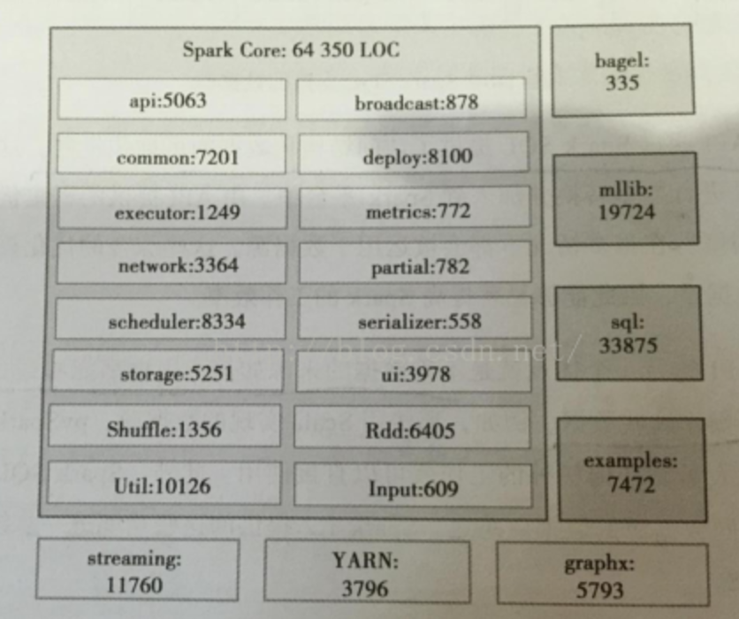

<!-- START doctoc generated TOC please keep comment here to allow auto update -->
<!-- DON'T EDIT THIS SECTION, INSTEAD RE-RUN doctoc TO UPDATE -->
**Table of Contents**  *generated with [DocToc](https://github.com/thlorenz/doctoc)*

- [1.1 Spark 的技术背景](#11-spark-%E7%9A%84%E6%8A%80%E6%9C%AF%E8%83%8C%E6%99%AF)
- [1.2 Spark 的优点](#12-spark-%E7%9A%84%E4%BC%98%E7%82%B9)
- [1.3 Spark 架构综述](#13-spark-%E6%9E%B6%E6%9E%84%E7%BB%BC%E8%BF%B0)
- [1.4 Spark 核心组件概述](#14-spark-%E6%A0%B8%E5%BF%83%E7%BB%84%E4%BB%B6%E6%A6%82%E8%BF%B0)
  - [1.4.1 Spark Streaming](#141-spark-streaming)
  - [1.4.2 MLlib](#142-mllib)
  - [1.4.3 Spark SQL](#143-spark-sql)
  - [1.4.3 GraphX](#143-graphx)
- [1.5 Spark 的整体代码结构规模](#15-spark-%E7%9A%84%E6%95%B4%E4%BD%93%E4%BB%A3%E7%A0%81%E7%BB%93%E6%9E%84%E8%A7%84%E6%A8%A1)
- [导航](#%E5%AF%BC%E8%88%AA)

<!-- END doctoc generated TOC please keep comment here to allow auto update -->

Apache Spark 是一种快速、通用、可扩展的大数据分析引擎，集批处理、实时流处理、交互式查询与图计算于一体。

# 1.1 Spark 的技术背景

现有的大多数集群计算系统都是基于非循环的数据流模型。即从稳定的物理存储（如分布式文件系统）中加载记录，记录被传入由一组确定性操作组成的DAG（Directed Acyclic Graph，有向无环图），然后写回稳定存储。DAG能够保证任务的调度和故障恢复。数据流不支持工作集，所以需要将数据输出到磁盘，每次查询时重新加载。

Spark实现了分布式的内存抽象，即RDD（Resilient Distributed Dataset，分布式数据集），支持工作集的应用，且具有数据流模型的优点：自动容错、位置感知性调度和可伸缩性。RDD运行用户在执行多个查询时将工作集缓存在内存中重用。

RDD是高度受限的共享内存模型：RDD是只读记录分区的集合。只能通过其他RDD的转换操作创建。RDD通过Lineage来重建丢失的分区：一个RDD中包含了如果从其他RDD衍生所必须的相关信息，不需要检查点操作就可以重建丢失的数据分区。

# 1.2 Spark 的优点

- 速度，基于内存。
- 易用，支持Java、Scala、Python的API，还有各种高级算法。
- 通用，批处理、Spark SQL、Spark Streaming、Spark MLlib、Spark GraphX。
- 可融合，方便与其他开源产品结合使用。如YARN、Mesos、HDFS、HBase、Cassandra。

# 1.3 Spark 架构综述

- Driver 是用户编写的数据处理逻辑，包含用户创建的`SparkContext`，后者是用户逻辑与Spark集群的交互接口。

- Cluster Manager负责集群的资源管理和调度，支持Standalone、Apache Me搜索和Hadoop YARN。

- Worker Node是集群中可以执行计算任务的节点。

- Executor是在一个Workder Node上位某应用启动的一个进程，负责运行任务，并将数据保存在内存或磁盘上。

- Task是被送到某个Executor上的计算单元。

  每个应用都各自独立的Executor，计算最终在计算节点的Executor中执行。

用户程序从提交到计算执行，经历以下阶段：

1. 用户程序创建SparkContext，连接到Cluster Manager。Cluster Manager会根据用户提交时的配置为本次提交分配计算资源，启动Executor。
2. Driver会将用户程序划分为不同的执行阶段，每个阶段由一组完全相同的Task组成。这些Task分别作用于待处理数据的不通风区。阶段划分和Task创建完成后，Driver向Executor发送Task。
3. Executor接收到Task后，会下载Task的运行时依赖，然后执行Task，并将运行状态汇报给Driver。
4. Driver根据收到的Task的运行状态来处理不同的状态更新。Task分为两种，一是Shuffle Map Task，实现数据的重新洗牌，结果保存在Executor所在节点的文件系统。二是Result Task，负责生产结果数据。
5. Driver会不断调用Task，将Task发送到Executor执行。在所有的Task都正确执行或超过执行次数的限制仍然没有成功后停止。

# 1.4 Spark 核心组件概述

## 1.4.1 Spark Streaming

Spark Streaming 基于Spark Core实现了可扩展、高吞吐和容错的实时数据流处理。Spark Streaming 将流式计算分解成一系列短小的批处理作业。

## 1.4.2 MLlib

MLlib是Spark对常用机器学习算法的实现库，同事包含相关的测试和数据生成器，包括分类、聚类、回归、聚类、协同过滤、降维以及底层基本的优化元素。

ML工具包使用Spark的SchemaRDD来表示机器学习的数据集合，提供了Spark SQL直接访问的接口。

## 1.4.3 Spark SQL

数据源API通过Spark SQL提供了访问结构化数据的可拔插机制，而不管数据的来源如何。

## 1.4.3 GraphX

Spark GraphX是Spark提供的关于图和图并行计算的API，它集ETL、试探性分析和迭代式的图计算于一体，却不失灵活性、易用性、容错性。

# 1.5 Spark 的整体代码结构规模

Spark Core是Spark的核心，Spark SQL、MLlib、GraphX和Spark Streaming都给予Spark Core实现。

# 导航

[目录](README.md)

下一章: [3. RDD实现详解](3. RDD实现详解.md)
