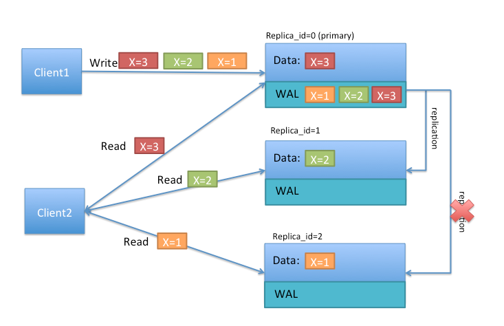

<!-- START doctoc generated TOC please keep comment here to allow auto update -->
<!-- DON'T EDIT THIS SECTION, INSTEAD RE-RUN doctoc TO UPDATE -->
**Table of Contents**  *generated with [DocToc](https://github.com/thlorenz/doctoc)*

- [64. Overview](#64-overview)
  - [64.1 NoSQL?](#641-nosql)
  - [64.2 什么时候需要 HBase？](#642-%E4%BB%80%E4%B9%88%E6%97%B6%E5%80%99%E9%9C%80%E8%A6%81-hbase)
  - [64.3 HBase 和 HDFS 的区别](#643-hbase-%E5%92%8C-hdfs-%E7%9A%84%E5%8C%BA%E5%88%AB)
- [65. 目录表（Catalog Tables）](#65-%E7%9B%AE%E5%BD%95%E8%A1%A8catalog-tables)
  - [65.1 `-ROOT-`](#651--root-)
  - [65.2 `hbase:meta`](#652-hbasemeta)
  - [65.3 启动顺序](#653-%E5%90%AF%E5%8A%A8%E9%A1%BA%E5%BA%8F)
- [66. Client](#66-client)
  - [66.1 集群连接](#661-%E9%9B%86%E7%BE%A4%E8%BF%9E%E6%8E%A5)
    - [HBase 1.0.0 API](#hbase-100-api)
    - [HBase 1.0.0之前的 API](#hbase-100%E4%B9%8B%E5%89%8D%E7%9A%84-api)
      - [连接池](#%E8%BF%9E%E6%8E%A5%E6%B1%A0)
  - [66.2 WriterBuffer 和 批量方法](#662-writerbuffer-%E5%92%8C-%E6%89%B9%E9%87%8F%E6%96%B9%E6%B3%95)
  - [66.3 外部客户端](#663-%E5%A4%96%E9%83%A8%E5%AE%A2%E6%88%B7%E7%AB%AF)
- [67. 客户端请求过滤器](#67-%E5%AE%A2%E6%88%B7%E7%AB%AF%E8%AF%B7%E6%B1%82%E8%BF%87%E6%BB%A4%E5%99%A8)
  - [67.1 结构过滤器](#671-%E7%BB%93%E6%9E%84%E8%BF%87%E6%BB%A4%E5%99%A8)
    - [FilterList](#filterlist)
  - [67.2 列值](#672-%E5%88%97%E5%80%BC)
    - [SingleColumnValueFilter](#singlecolumnvaluefilter)
  - [67.3 列值比较器](#673-%E5%88%97%E5%80%BC%E6%AF%94%E8%BE%83%E5%99%A8)
    - [RegexStringComparator](#regexstringcomparator)
    - [SubstringComparator](#substringcomparator)
  - [67.4 KeyValue 元数据](#674-keyvalue-%E5%85%83%E6%95%B0%E6%8D%AE)
    - [FamilyFilter](#familyfilter)
    - [QualifierFilter](#qualifierfilter)
    - [ColumnPrefixFilter](#columnprefixfilter)
    - [MultipleColumnPrefixFilter](#multiplecolumnprefixfilter)
    - [ColumnRangeFilter](#columnrangefilter)
  - [67.5 RowKey](#675-rowkey)
    - [RowFilter](#rowfilter)
  - [67.6 Utility](#676-utility)
    - [FirstKeyOnlyFilter](#firstkeyonlyfilter)
- [68. Master](#68-master)
  - [68.1 启动行为](#681-%E5%90%AF%E5%8A%A8%E8%A1%8C%E4%B8%BA)
  - [68.2 运行时影响](#682-%E8%BF%90%E8%A1%8C%E6%97%B6%E5%BD%B1%E5%93%8D)
  - [68.3 接口](#683-%E6%8E%A5%E5%8F%A3)
  - [68.4 进程](#684-%E8%BF%9B%E7%A8%8B)
    - [LoadBalancer](#loadbalancer)
    - [CatalogJanitor](#catalogjanitor)
- [69. RegionServer](#69-regionserver)
  - [69.1 接口](#691-%E6%8E%A5%E5%8F%A3)
  - [69.2 进程](#692-%E8%BF%9B%E7%A8%8B)
    - [CompactSplitThread](#compactsplitthread)
    - [MajorCompactionChecker](#majorcompactionchecker)
    - [MemStoreFlusher](#memstoreflusher)
    - [LogRoller](#logroller)
  - [69.3 协处理器](#693-%E5%8D%8F%E5%A4%84%E7%90%86%E5%99%A8)
  - [69.4 块缓存](#694-%E5%9D%97%E7%BC%93%E5%AD%98)
    - [缓存选择](#%E7%BC%93%E5%AD%98%E9%80%89%E6%8B%A9)
    - [通用缓存配置](#%E9%80%9A%E7%94%A8%E7%BC%93%E5%AD%98%E9%85%8D%E7%BD%AE)
    - [`LruBlockCache`设计](#lrublockcache%E8%AE%BE%E8%AE%A1)
    - [`LruBlockCache`使用](#lrublockcache%E4%BD%BF%E7%94%A8)
      - [只缓存 META 块](#%E5%8F%AA%E7%BC%93%E5%AD%98-meta-%E5%9D%97)
    - [Off-heap 块缓存](#off-heap-%E5%9D%97%E7%BC%93%E5%AD%98)
    - [压缩 BlockCache](#%E5%8E%8B%E7%BC%A9-blockcache)
  - [69.5 RegionServer 拆分](#695-regionserver-%E6%8B%86%E5%88%86)
  - [69.6 Write Ahead Log（WAL）](#696-write-ahead-logwal)
    - [MultiWAL](#multiwal)
    - [WAL 刷写](#wal-%E5%88%B7%E5%86%99)
    - [WAL 拆分](#wal-%E6%8B%86%E5%88%86)
      - [日志拆分的错误处理](#%E6%97%A5%E5%BF%97%E6%8B%86%E5%88%86%E7%9A%84%E9%94%99%E8%AF%AF%E5%A4%84%E7%90%86)
      - [日志拆分的性能调优](#%E6%97%A5%E5%BF%97%E6%8B%86%E5%88%86%E7%9A%84%E6%80%A7%E8%83%BD%E8%B0%83%E4%BC%98)
- [70. Region](#70-region)
  - [70.1 Region 个数的考量](#701-region-%E4%B8%AA%E6%95%B0%E7%9A%84%E8%80%83%E9%87%8F)
    - [为什么要控制 Region 的个数？](#%E4%B8%BA%E4%BB%80%E4%B9%88%E8%A6%81%E6%8E%A7%E5%88%B6-region-%E7%9A%84%E4%B8%AA%E6%95%B0)
  - [70.2 Region -> RegionServer 的指派](#702-region---regionserver-%E7%9A%84%E6%8C%87%E6%B4%BE)
    - [启动](#%E5%90%AF%E5%8A%A8)
    - [故障转移](#%E6%95%85%E9%9A%9C%E8%BD%AC%E7%A7%BB)
    - [Region负载均衡](#region%E8%B4%9F%E8%BD%BD%E5%9D%87%E8%A1%A1)
    - [Region 状态转换](#region-%E7%8A%B6%E6%80%81%E8%BD%AC%E6%8D%A2)
  - [70.3 Region -> RegionServer 的本地化](#703-region---regionserver-%E7%9A%84%E6%9C%AC%E5%9C%B0%E5%8C%96)
  - [70.4 Region 拆分](#704-region-%E6%8B%86%E5%88%86)
    - [自定义分割策略](#%E8%87%AA%E5%AE%9A%E4%B9%89%E5%88%86%E5%89%B2%E7%AD%96%E7%95%A5)
  - [70.5 手动 Region 分割](#705-%E6%89%8B%E5%8A%A8-region-%E5%88%86%E5%89%B2)
    - [决定分割点](#%E5%86%B3%E5%AE%9A%E5%88%86%E5%89%B2%E7%82%B9)
  - [70.6 在线的 region 合并](#706-%E5%9C%A8%E7%BA%BF%E7%9A%84-region-%E5%90%88%E5%B9%B6)
- [70.7 Store](#707-store)
    - [MemStore](#memstore)
    - [MemStore flush](#memstore-flush)
    - [扫描](#%E6%89%AB%E6%8F%8F)
    - [StoreFile（HFile）](#storefilehfile)
    - [Block](#block)
    - [KeyValue](#keyvalue)
    - [Compaction](#compaction)
      - [Compaction 策略](#compaction-%E7%AD%96%E7%95%A5)
      - [日期分层 Compaction](#%E6%97%A5%E6%9C%9F%E5%88%86%E5%B1%82-compaction)
    - [实验性的：Stripe Compaction](#%E5%AE%9E%E9%AA%8C%E6%80%A7%E7%9A%84stripe-compaction)
- [71. 批量加载](#71-%E6%89%B9%E9%87%8F%E5%8A%A0%E8%BD%BD)
  - [71.3 批量加载架构](#713-%E6%89%B9%E9%87%8F%E5%8A%A0%E8%BD%BD%E6%9E%B6%E6%9E%84)
    - [通过 MapReduce job 准备数据](#%E9%80%9A%E8%BF%87-mapreduce-job-%E5%87%86%E5%A4%87%E6%95%B0%E6%8D%AE)
    - [完成数据加载](#%E5%AE%8C%E6%88%90%E6%95%B0%E6%8D%AE%E5%8A%A0%E8%BD%BD)
- [72. HDFS](#72-hdfs)
  - [72.1 NameNode](#721-namenode)
  - [72.2 DataNode](#722-datanode)
- [73. 时间线一致的高可用读](#73-%E6%97%B6%E9%97%B4%E7%BA%BF%E4%B8%80%E8%87%B4%E7%9A%84%E9%AB%98%E5%8F%AF%E7%94%A8%E8%AF%BB)
  - [73.1 介绍](#731-%E4%BB%8B%E7%BB%8D)
  - [73.2 时间线一致性](#732-%E6%97%B6%E9%97%B4%E7%BA%BF%E4%B8%80%E8%87%B4%E6%80%A7)
  - [73.3 权衡](#733-%E6%9D%83%E8%A1%A1)
  - [73.5 散播写请求向 region replica](#735-%E6%95%A3%E6%92%AD%E5%86%99%E8%AF%B7%E6%B1%82%E5%90%91-region-replica)
    - [StoreFile Refresher](#storefile-refresher)
    - [异步 WAL 复制](#%E5%BC%82%E6%AD%A5-wal-%E5%A4%8D%E5%88%B6)
  - [73.6 StoreFile TTL](#736-storefile-ttl)
  - [73.7  Region replication for META table’s region](#737--region-replication-for-meta-tables-region)
  - [73.8 内存审计](#738-%E5%86%85%E5%AD%98%E5%AE%A1%E8%AE%A1)
  - [73.9 `Secondary replica` 故障转移](#739-secondary-replica-%E6%95%85%E9%9A%9C%E8%BD%AC%E7%A7%BB)
  - [73.10 配置属性](#7310-%E9%85%8D%E7%BD%AE%E5%B1%9E%E6%80%A7)
  - [73.11 用户接口](#7311-%E7%94%A8%E6%88%B7%E6%8E%A5%E5%8F%A3)
  - [73.12 创建带有 `region replication`的表](#7312-%E5%88%9B%E5%BB%BA%E5%B8%A6%E6%9C%89-region-replication%E7%9A%84%E8%A1%A8)
  - [73.13 读 API](#7313-%E8%AF%BB-api)
- [74. 存储 中尺寸的对象（MOB）](#74-%E5%AD%98%E5%82%A8-%E4%B8%AD%E5%B0%BA%E5%AF%B8%E7%9A%84%E5%AF%B9%E8%B1%A1mob)
  - [74.1 为 MOB 配置列](#741-%E4%B8%BA-mob-%E9%85%8D%E7%BD%AE%E5%88%97)
  - [74.2 测试 MOB](#742-%E6%B5%8B%E8%AF%95-mob)
  - [74.3 配置 MOB 缓存](#743-%E9%85%8D%E7%BD%AE-mob-%E7%BC%93%E5%AD%98)
  - [74.4 MOB 优化](#744-mob-%E4%BC%98%E5%8C%96)
- [导航](#%E5%AF%BC%E8%88%AA)

<!-- END doctoc generated TOC please keep comment here to allow auto update -->

# 64. Overview

## 64.1 NoSQL?

HBase 是一个“NoSQL”数据库。NOSQL 不像传统的 RDBMS，不支持 SQL 语句。HBase 也缺少 RDBMS 的列类型、二级索引、触发器、高级查询语言。

HBase 支持线性化和模块化扩充，如果集群从10个扩充到20个RegionServer，存储空间和处理容量都同时翻倍。 RDBMS 也能很好扩充， 但仅对一个点 - 特别是对一个单独数据库服务器的大小 - 同时，为了更好的性能，需要特殊的硬件和存储设备。 HBase 特性：

- 强一致性读写: HBase 不是 "最终一致性(eventually consistent)" 数据存储. 这让它很适合高速计数聚合类任务。
- 自动分片(Automatic sharding): HBase 表通过region分布在集群中。数据增长时，region会自动分割并重新分布。
- RegionServer 自动故障转移
- Hadoop/HDFS 集成: HBase 支持本机外HDFS 作为它的分布式文件系统。
- MapReduce: HBase 通过MapReduce支持大并发处理， HBase 可以同时做源和目标.
- Java 客户端 API: HBase 支持易于使用的 Java API 进行编程访问.
- Thrift/REST API: HBase 也支持 Thrift 和 REST 作为非Java 前端.
- Block Cache 和 Bloom Filters: 对于大容量查询优化， HBase支持 Block Cache 和 Bloom Filters。
- 运维管理: HBase提供内置网页用于运维视角和JMX 度量.

## 64.2 什么时候需要 HBase？

- 足够多的数据。如果有上亿或上千亿行数据，HBase是很好的备选。 如果只有上千或上百万行，则用传统的RDBMS可能是更好的选择。因为所有数据可以在一两个节点保存，集群其他节点可能闲置。
- 确信可以不依赖所有RDBMS的额外特性 (e.g., 列数据类型, 第二索引, 事物,高级查询语言等.) 一个建立在RDBMS上应用，如不能仅通过改变一个JDBC驱动移植到HBase。相对于移植， 需考虑从RDBMS 到 HBase是一次完全的重新设计。
- 确信你有足够硬件。甚至 HDFS 在小于5个数据节点时，干不好什么事情 (根据如 HDFS 块复制具有缺省值 3), 还要加上一个 NameNode.

## 64.3 HBase 和 HDFS 的区别

HDFS 是分布式文件系统，适合保存大文件。官方宣称它并非普通用途文件系统，不提供文件的个别记录的快速查询。 另一方面，HBase基于HDFS且提供大表的记录快速查找(和更新)。

HBase 内部将数据放到索引好的 "存储文件(StoreFiles)" ，以便高速查询。存储文件位于 HDFS中。


# 65. 目录表（Catalog Tables）

目录表 `hbase:meta` 作为 HBase 表存在。他们被HBase shell的 `list` 命令过滤掉了， 但它们和其它表一样存在。

## 65.1 `-ROOT-`

`-ROOT-`表在 HBase 0.96.0 中被移除。

`-ROOT-`表保存了`.META`表（`hbase:meta`的曾用名）的位置信息，`-ROOT-` 表结构如下:

- Key:
    1. .META. region key (.META.,,1)
- Values:
1. info:regioninfo (序列化 .META.的 HRegionInfo 实例 )
2. info:server ( 保存 .META.的RegionServer的server:port)
3. info:serverstartcode ( 保存 .META.的RegionServer进程的启动时间)

## 65.2 `hbase:meta`

`hbase:meta` 表保存系统中所有region列表。现在保存在 ZooKeeper 中。`hbase:meta`表结构如下:

- Key:
    1. Region key 格式 ([table],[region start key],[region id])
- Values:
    1. info:regioninfo (序列化的 HRegionInfo 实例 )
    2. info:server ( 保存RegionServer的server:port)
    3. info:serverstartcode ( 保存RegionServer进程的启动时间)

表在拆分的过程中，会生成两列：`info:splitA`和`info:splitB`，代表拆分后的两个 region。两列的值也是序列化后的`HRegionInfo`实例。拆分完成后，这一行就被删除。

## 65.3 启动顺序

1. 在 ZooKeeper 中找到`hbase:meta`表的位置。
2. `hbase:meta`表会更新 server 和 startcode 的值.


# 66. Client

HBase客户端的负责寻找相应的 RegionServers 来处理行。他是先查询`hbase:meta`目录表。然后再确定region的位置。定位到所需要的区域后，客户端会直接 去访问相应的region(不经过master)，发起读写请求。这些信息会缓存在客户端，这样就不用每发起一个请求就去查一下。如果一个region已经废弃(原因可能是master load balance或者RegionServer死了)，客户端就会重新进行这个步骤，决定要去访问的新的地址。

## 66.1 集群连接

API 在 HBase 1.0 之后有所改变。

### HBase 1.0.0 API

HBase 1.0 的客户端返回的是`Interface`，而不是特定的数据类型。在 HBase 1.0中，

1. 使用`ConnectionFactory`获得`Connection`实例。
2. 根据需要，从`Connection`实例获得`Table`、`Admin`和`RegionLocator`。
3. 关闭 `Table`、`Admin`和`RegionLocator`。
4. 关闭`Connection`实例。

`Connection`是重量级的对象，但是线程安全的，建议在程序中共享一个`Connection`实例。`Table`等实例是轻量级的，可以人以创建、关闭。

### HBase 1.0.0之前的 API

HBase 1.0.0 之前使用`HTable`实例与 HBase 集群通信。

`HTable`不是线程安全的，任意时刻，一个`HTable`实例只能被只一个线程使用。建议使用同一个`HBaseConfiguration`实例来创建`HTable`实例。这样可以共享ZooKeeper和socket实例。例如，最好这样做：

```java
HBaseConfiguration conf = HBaseConfiguration.create();
HTable table1 = new HTable(conf, "myTable");
HTable table2 = new HTable(conf, "myTable");
```

#### 连接池

对需要高端多线程访问的应用，可以预先建立`Connection`，

```java
// Create a connection to the cluster.
Configuration conf = HBaseConfiguration.create();
try (Connection connection = ConnectionFactory.createConnection(conf);
     Table table = connection.getTable(TableName.valueOf(tablename))) {
  // use table as needed, the table returned is lightweight
}
```

> `HTablePool`已经在 0.94 和 0.95、0.96 废弃。0.98.1将之移除。`HConnection`从1.0后废弃。

## 66.2 WriterBuffer 和 批量方法

`Table`不会自动刷新。要想 Buffer 写，使用`BufferedMutator`类。

在`Table`实例销毁之前，调用`close`或`flushCommits()`，它携带的`Put`请求会被发送到服务器端。

要批量 Put 或 Delete，使用`Table`的批量方法。


## 66.3 外部客户端

非 Java 的客户端请看这里[Apache HBase External APIs](http://hbase.apache.org/book.html#external_apis)


# 67. 客户端请求过滤器

Get 和 Scan 实例可以用 filters 配置，以应用于 RegionServer.

## 67.1 结构过滤器

结构过滤器包含其他过滤器

### FilterList

FilterList 代表一个过滤器列表，过滤器间具有 `FilterList.Operator.MUST_PASS_ALL` 或 `FilterList.Operator.MUST_PASS_ONE` 关系。

```java
FilterList list = new FilterList(FilterList.Operator.MUST_PASS_ONE);
SingleColumnValueFilter filter1 = new SingleColumnValueFilter(
  cf,
  column,
  CompareOp.EQUAL,
  Bytes.toBytes("my value")
  );
list.add(filter1);
SingleColumnValueFilter filter2 = new SingleColumnValueFilter(
  cf,
  column,
  CompareOp.EQUAL,
  Bytes.toBytes("my other value")
  );
list.add(filter2);
scan.setFilter(list);
```

## 67.2 列值

### SingleColumnValueFilter
SingleColumnValueFilter 用于测试列值相等 (CompareOp.EQUAL ), 不等 (CompareOp.NOT_EQUAL),或范围 (e.g., CompareOp.GREATER). 下面示例检查列值和字符串'my value' 相等...

```java
SingleColumnValueFilter filter = new SingleColumnValueFilter(
	cf,
	column,
	CompareOp.EQUAL,
	Bytes.toBytes("my value")
	);
scan.setFilter(filter);
```

## 67.3 列值比较器

过滤器包内有好几种比较器类。这些比较器和其他过滤器一起使用, 如，

### RegexStringComparator
RegexStringComparator 支持值比较的正则表达式 。

```java
RegexStringComparator comp = new RegexStringComparator("my.");   // any value that starts with 'my'
SingleColumnValueFilter filter = new SingleColumnValueFilter(
	cf,
	column,
	CompareOp.EQUAL,
	comp
	);
scan.setFilter(filter);
```

### SubstringComparator
SubstringComparator 用于检测一个子串是否存在于值中。大小写不敏感。

```java
SubstringComparator comp = new SubstringComparator("y val");   // looking for 'my value'
SingleColumnValueFilter filter = new SingleColumnValueFilter(
	cf,
	column,
	CompareOp.EQUAL,
	comp
	);
scan.setFilter(filter);
```

其他过滤器注入`BinaryPrefixComparator`、`BinaryComparator`等。

## 67.4 KeyValue 元数据

由于HBase 采用键值对保存内部数据，键值元数据过滤器评估一行的键是否存在(如 ColumnFamily:Column qualifiers) 。

### FamilyFilter
FamilyFilter 用于过滤列族。 通常，在Scan中选择ColumnFamilie优于在过滤器中做。

### QualifierFilter
QualifierFilter 用于基于列名(即 Qualifier)过滤.

### ColumnPrefixFilter
ColumnPrefixFilter 可基于列名(即Qualifier)前缀过滤。

```java
Table t = ...;
byte[] row = ...;
byte[] family = ...;
byte[] prefix = Bytes.toBytes("abc");
Scan scan = new Scan(row, row); // (optional) limit to one row
scan.addFamily(family); // (optional) limit to one family
Filter f = new ColumnPrefixFilter(prefix);
scan.setFilter(f);
scan.setBatch(10); // set this if there could be many columns returned
ResultScanner rs = t.getScanner(scan);
for (Result r = rs.next(); r != null; r = rs.next()) {
  for (KeyValue kv : r.raw()) {
    // each kv represents a column
  }
}
rs.close();
```

### MultipleColumnPrefixFilter
MultipleColumnPrefixFilter 和 ColumnPrefixFilter 行为差不多，但可以指定多个前缀。

```java
Table t = ...;
byte[] row = ...;
byte[] family = ...;
byte[][] prefixes = new byte[][] {Bytes.toBytes("abc"), Bytes.toBytes("xyz")};
Scan scan = new Scan(row, row); // (optional) limit to one row
scan.addFamily(family); // (optional) limit to one family
Filter f = new MultipleColumnPrefixFilter(prefixes);
scan.setFilter(f);
scan.setBatch(10); // set this if there could be many columns returned
ResultScanner rs = t.getScanner(scan);
for (Result r = rs.next(); r != null; r = rs.next()) {
  for (KeyValue kv : r.raw()) {
    // each kv represents a column
  }
}
rs.close();
```

### ColumnRangeFilter
ColumnRangeFilter 可以进行高效内部扫描。

```java
HTableInterface t = ...;
byte[] row = ...;
byte[] family = ...;
byte[] startColumn = Bytes.toBytes("bbbb");
byte[] endColumn = Bytes.toBytes("bbdd");
Scan scan = new Scan(row, row); // (optional) limit to one row
scan.addFamily(family); // (optional) limit to one family
Filter f = new ColumnRangeFilter(startColumn, true, endColumn, true);
scan.setFilter(f);
scan.setBatch(10); // set this if there could be many columns returned
ResultScanner rs = t.getScanner(scan);
for (Result r = rs.next(); r != null; r = rs.next()) {
  for (KeyValue kv : r.raw()) {
    // each kv represents a column
  }
}
rs.close();
```

## 67.5 RowKey

### RowFilter

通常认为行选择时Scan采用 `startRow/stopRow` 方法比较好。然而 `RowFilter` 也可以用。

## 67.6 Utility

### FirstKeyOnlyFilter

This is primarily used for rowcount jobs. 参考 [FirstKeyOnlyFilter](http://hbase.apache.org/apidocs/org/apache/hadoop/hbase/filter/FirstKeyOnlyFilter.html).


# 68. Master

`HMaster`是 Master Server 的实现。Master 负责监控所有 RegionServer 实例，也是元数据改变的接口。在分布式集群中，Master 运行在 NameNode 上。详细阅读[HBase HMaster Architecture ](http://blog.zahoor.in/2012/08/hbase-hmaster-architecture/)

## 68.1 启动行为

如果一个集群中有多个 Master，它们会出现竞争集群的控制权。如果活跃的 Master 在 ZooKeeper 的租约到期或者宕机，剩下的 Master 会争相接管 Master 的角色。

## 68.2 运行时影响

Master 挂掉之后会发生什么呢？因为 HBase 的客户端直接与 RegionServer 通信，整个集群看上去运转良好。另外，`hbase:meta`表也不存在 Master。

但是，Master 负责维护 RegionServer 的灾难恢复、region 拆分，所以集群无 Master 状态下在运行一段时间后就会出错。

## 68.3 接口

`HMasterInterface`暴露的方法，都是面向元数据的：

- Table (`createTable`, `modifyTable`, `removeTable`, `enable`, `disable`)
- ColumnFamily (`addColumn`, `modifyColumn`, `removeColumn`)
- Region (`move`, `assign`, `unassign`)

## 68.4 进程

Master 运行着几个后台线程：

### LoadBalancer

没有 region 转换的时候，负载均衡器就会间歇性地运行、移动 region 来达到集群的均衡。

### CatalogJanitor

间歇性地，检查和清理`hbase:meta`表。


# 69. RegionServer

`HRegionServer`是 RegionServer 的实现，它负责服务和管理 region。在分布式集群中，RegionServer 运行在 DataNode 上。

## 69.1 接口

`HRegionRegionInterface`暴露的方法包括了面向数据和 region维护的方法：

- 数据（get/put/delete/next...)
- Region（splitRegion, compactRegion）
     例如当`Admin`执行在一个表上执行`majorCompact`，客户端实际上在迭代请求所有的 region 压缩。

## 69.2 进程

RegionServer 后台运行几种线程:

### CompactSplitThread
检查分割并处理最小紧缩。

### MajorCompactionChecker
检查主紧缩。

### MemStoreFlusher
周期将写到内存存储的内容刷到文件存储。

### LogRoller
周期检查RegionServer 的 HLog.


## 69.3 协处理器

协处理器在0.92版添加。 有一个详细帖子 [Blog Overview of CoProcessors](https://blogs.apache.org/hbase/entry/coprocessor_introduction) 供参考。

## 69.4 块缓存

HBase 提供了两种不同的块缓存实现：

- 堆上的`LruBlockCache`，默认
- `BucketCache`，通常在堆外

### 缓存选择

`LruBlockCache`是原始的实现，完全使用 Java 堆空间。`BucketCache`主要为堆外空间设计，尽管它也能将数据保存在堆上。

`BucketCache`从 0.98.6 后引入 HBase。

从`BucketCache`中取数据，比从`LruBlockCache`中慢得多，但要更稳定一些。因为`BucketCache`较少 GC。如果使用 off-heap 模式，`BucketCache`压根不用 GC。

当你打开`BucketCache`，你也就开启了双层缓存系统。L1缓存由`LruBlockCache`实例实现，off-heap 的 L2缓存由`BucketCache`实现。

双层缓存系统由`CombinedBlockCache`管理，它将数据块放在 L2 `BucketCache`，元数据块（INDEX 和 BLOOM）放在on-heap 的 L1 `LruBlockCache`。

### 通用缓存配置

[http://hbase.apache.org/devapidocs/org/apache/hadoop/hbase/io/hfile/CacheConfig.html](http://hbase.apache.org/devapidocs/org/apache/hadoop/hbase/io/hfile/CacheConfig.html)

设置这项选项后，需要重启集群才能生效。

### `LruBlockCache`设计

`LruBlockCache`缓存是一个 LRU 的缓存，它包括三种优先级块：

1. Single：如果一个Block第一次被访问，则放在这一优先级队列中；
2. Multi：如果一个Block被多次访问，则从Single队列移到Multi队列中；
3. In-memory：如果一个Block的 family 是inMemory的，则放到这个队列中

Block 换出的时候，会优先考虑 Single 队列，其次是 Multi，最后才是 In-memory。

将一个 Column Family 标记为 in-memory 的方法：

```java
HColumnDescriptor.setInMemory(true);
```

创建一个 in-memory 的表：

```
hbase> create 't', {Name => 'f', IN_MEMORY => 'true'}
```

### `LruBlockCache`使用

Block 缓存默认为所有用户表打开。

计算 HBase 所需缓存空间的公式：

```
number of region servers * heap size * hfile.block.cache.size * 0.99
```

block 缓存的默认值是0.25，意思是使用可用堆的25%空间。0.99 表示 LRU 缓存的负载因子。

其他需要考虑的因素：

- 目录表。`-ROOT-`和`hbase:meta`表默认缓存，且是 in-memory 级别。前者只占用几百字节，后者顶多几 MB。
- HFile 索引。HFile 有多层索引，索引的大小和块大小、key 的大小、存储数据的数量有关。单个 region server 的 HFile 索引有 GB 级也是正常的。
- Keys。The values that are stored are only half the picture, since each value is stored along with its keys.
- Bloom Filters。和 HFile 索引一样，也被存在 LRU 中。

HFile 索引和布隆过滤器的使用情况，可以在 RegionServer 的 Web UI 查看。

如果 WSS (working set size，计算需要使用的内存大小)没法放在内存里，那么使用块缓存也就没有意义。如：

1. 全量随机读取。缓存的命中率几乎为0，对这样的表设置块缓存就是浪费，也会产生更多的垃圾。
2. 映射一张表。每行数据只读一次的 Scan 操作，缓存也没啥意义。

#### 只缓存 META 块

只缓存 META 块，DATA 块不缓存。如果 `fscache` 能容下 DATA 块，那对随机读写超大数据集合来说非常有效。

为了让此设置生效，需要修改表和每个 Column Family 的属性：`BLOCKCACHE => 'false'`。这只是禁止了列族的 BlockCache，你永远无法禁止 META 块的缓存。

### Off-heap 块缓存

使用`BucketCache`的的常见姿势是双层缓存：

- L1 on-heap 的 `LruBlockCache`
- L2 的 `BucketCache`

双层缓存由 `CombinedBlockCache`管理。INDEX 和 BLOOM 放在 L1，DATA 块放置在 L2。HBase 1.0 之后可以改变这种配置，将 META 和 DATA 都放置在 L1：

```
hbase > create 't', {NAME => 't', CONFIGURATION => {CACHE_DATA_IN_L1 => 'true' }}
```

`BucketCache` 块缓存可以部署在 on-heap，off-heap，或者文件上，通过 `hbase.bucketcache.ioengine` 设置：

- `heap`
- `offheap`
- `file:PATH_TO_FILE`

如果想绕过`CombinedBlockCache`，设置`CacheConfig.BUCKET_CACHE_COMBINED_KEY`为`false`。这之后，从 L1中剔除的块会放在 L2。块缓存的时候，先放在 L1。查找块的时候，先找 L1, 然后在找 L2。这种模式称为 `Raw L1+L2`。

### 压缩 BlockCache

默认是关闭的，设置`hbase.block.data.cachecompressed`为`true`打开。它能够提升吞吐量、GC 性能。

打开之后，缓存中的 BlockCache 就是磁盘上的格式，它在缓存前不会解压、解密块。

## 69.5 RegionServer 拆分 

写请求由 RegionServer 处理，它们先被内存中，称之为`memstore`。一旦`memstore`满了，就会被刷写到磁盘中。存储文件聚集之后，RegionServer 会将它们合并成更少、更大的文件。 拆分策略决定了 region 是否需要拆分。

region 拆分的时候，数据不是立刻写到 `daughter regions`的文件中。它会创建很多类似软连接的小文件，称为`Reference files`，指向 parent 存储文件的顶部或底部（取决于拆分点）。`Reference file`向正常的数据文件一样使用，但只涉及所有记录的一般。当没有更多的引用指向不可变的数据文件时，region 就开始拆分。

RegionServer 需要在拆分前后通知 Master、更新`.META.`表、重新组织 HDFS 目录结构。为了错误回退，RegionServer在将操作日志保存在内存中。详细的拆分过程见[ RegionServer Split Process](http://hbase.apache.org/book.html#regionserver_split_process_image)。


1. RegionServer 在本地决定拆分 region，首先取得一个共享的读锁，防止 Schema 改变。然后在 ZooKeeper 中创建一个 znode，并将状态设置为`SPLITTING`。
2. Master 从 ZooKeeper 得知该 znode 的信息。
3. RegionServer 在 parent region 目录下创建一个名为`.splits`的子目录。
4. RegionServer 关闭 parent region，下线 parent region。这时，客户端关于该 region 请求会抛出`NotServingRegionException`。
5. RegionServer 在`.splits`目录下创建 daughter region A 和 B 的目录，添加必要的数据结构。然后拆分存储文件，这时有两个引用文件指向parentregion。
6. RegionServer 在 HDFS 上创建真正的 region 目录，移动引用文件的位置。
7. RegionServer 发送`Put`请求到`.META.`表，将 parent region 置为 offline，添加 daughter region的信息，但 daughter region 在表中没有单独的条目。这时 client 还是不能从`.META.`查到 daughter region 的信息。
8. RegionServer 并发打开 daughters A 和 B。
9. RegionServer 将 daughters A 和 B 的 host 信息加到`.META.`。这时两个 daughters 才上线。
10. RegionServer 更新 znode 状态为`SPLIT`，master 会得知该变化。这时拆分过程就算完成了。
11. 拆分后，引用文件仍然存在。daughter regions 在重写数据文件的时候删除它们。master 上的 GC 会定期检查 daughter region 是否有指向 parent region 的引用，如果没有，parent region 会被移除。

## 69.6 Write Ahead Log（WAL）

WAL 记录了 HBase 的所有改变记录，它保存在文件里。当 RegionServer 宕机而 MemStore 没有及时刷写的时候，WAL 就被用来回放数据的操作。如果写入 WAL 失败，则整个修改数据的操作就是失败。

每个 RegionServer 都有唯一的 WAL 实例。在记录到达 MemStore，需先写入 WAL 记录。

WAL 保存在 HDFS 的`/hbase/WALs`目录下。

### MultiWAL

一台 RegionServer 是串行写 WAL 的，这也是 WAL 的性能瓶颈。

HBase 1.0 引入了 MultiWAL，它允许 RegionServer 并发地写入多个 WAL 流。

要开启 MultiWAL，设置`hbase.wal.provider`为`multiwal`。

### WAL 刷写

TODO

### WAL 拆分

一台 RegionServer 有多个 region，这些 region 共享一个 WAL 文件。WAL 文件的修改必须按照 region 分组，方便以后重新生成 region 的数据。这个分组过程称之为 日志拆分。

日志拆分的时机：

1. 集群启动的时候，由`HMaster`完成。
2. RegionServer 宕机的时候，由`ServerShutdownHandler`完成。

日志拆分的过程：

1. `/hbase/WALs/<host>, <port>, <startcode>`目录重命名。确保已存在的、有效的 WAL 文件不会被仍活跃的 RegionServer 意外写入。
2. 一次拆分一个日志文件。
  一次读取一个修改条目并将其放入按 region 区分的 buffer。同时 RegionServer 启动多个写线程，负责将region 对应的修改条目放到临时的恢复文件中：
  ` /hbase/<table_name>/<region_id>/recovered.edits/.temp`。日志拆分完成后，`.temp`文件重命名为该文件第一条日志的序列 ID。这个序列 ID 就是用来确认是否所有的修改已经被写入 HFile。
3. 拆分完成后，每个受影响的 region 要指给 RegionServer。
  region 打开的时候，`recovered.edits`文件夹中的修改记录被写入 MemStore 。当所有的修改文件被重放后，MemStore 被写入 HFile，修改文件被删除。

#### 日志拆分的错误处理

`hbase.hlog.split.skip.errors`选项置为`true`，错误会被用如下方式处理：

1. 拆分中的所有错误会被记录。
2. 出错的 WAL 日志会被移到 HBase 根目录下的 `.corrupt`目录下。
3. 继续处理 WAL 。

如果置为`false`（默认情况下），异常会被抛出，拆分被记录为失败。

特殊地，即便`hbase.hlog.split.skip.errors`为`false`， `EOFException` 出现时，拆分仍然会继续。

#### 日志拆分的性能调优

分布式日志拆分对于性能的优化粒度极大，只需将`hbase.master.distributed.log.splitting`置为`true`。

分布式日志开启后，HMaster 就控制着拆分的过程，但实际的拆分工作还是 RegionServer 完成的：

1.  集群启动时，HMaster 会创建一个`split log manager`实例。

    manager 管理所有的日志文件，将所有的日志文件放到 ZooKeeper的日志拆分节点。

2. manager 监视日志拆分的 task 和 worker。

3. 每个 RegionServer 的拆分 worker 执行拆分 task。

4. manager 监视未完成的 task。

分布式日志回放，可以直接将 WAL 修改回放到另一台 RegionServer 上，而不用创建`recovered.edits`文件。它避免了创建和并行读取成千的`recovered.edits`文件，加快了 RegionServer 的恢复速度。


 # 70. Region

HBase 表的层次结构：

```
Table                    (HBase table)
    Region               (Regions for the table)
        Store            (Store per ColumnFamily for each Region for the table)
            MemStore     (MemStore for each Store for each Region for the table)
            StoreFile    (StoreFiles for each Store for each Region for the table)
                Block    (Blocks within a StoreFile within a Store for each Region for the table)
```

## 70.1 Region 个数的考量

HBase 被设计为在一台服务器上运行少量（20 ~ 200）的相对大（5 ~ 20G）的 region。

### 为什么要控制 Region 的个数？

通常情况下，一个 RegionServer 保持100个 region 是最优的。保持 region 个数较少的原因有：

- MemStore-local 为每个 MemStore分配的缓存是 2MB，这意味着每个 region 的每个 family 都是 2MB。其中 2MB 是可配置的。
- 过多的 region 会触发压缩。
- master 要承载更多的 region，指定、移动它们都是很大的复旦。
- HBase 的老版本，过多的 region 会触发 OOM。

## 70.2 Region -> RegionServer 的指派

### 启动

当HBase启动时，区域分配如下：

1. 启动时主服务器调用 `AssignmentManager`.
2. `AssignmentManager` 在 `hbase:meta` 中查找已经存在的区域分配。
3. 如果区域分配还有效（如 RegionServer 还在线） ，那么分配继续保持。
4. 如果区域分配失效，`LoadBalancerFactory` 被调用来分配区域。 `DefaultLoadBalancer` 将随机分配区域到RegionServer.
5. `hbase:meta` 随 RegionServer 分配更新（如果需要）， RegionServer 启动区域开启代码（RegionServer 启动时进程）。

### 故障转移

当区域服务器出故障退出时：

1. 区域立即不可获取，因为区域服务器退出。

2. 主服务器会检测到区域服务器退出。

3. 区域分配会失效并被重新分配，如同启动时序。

4. in-flight 查询重试

5. 所有的操作转向一台新的 RegionServer，延迟时间：

   `ZooKeeper session timeout + split time + assignment/replay time`。

### Region负载均衡

Region 之间的移动由 `LoadBalancer`控制。

### Region 状态转换


## 70.3 Region -> RegionServer 的本地化

Region 到 RegionServer 的本地化是由 HDFS 的 block 复制实现的。HDFS 客户端在选择读取replica 的位置时：

1. 第一个 replica 写入本地节点
2. 第二个 replica 写入另外一个机架的随机节点
3. 第三个 replica 写入同一个机架的另外一个随机节点
4. 余下的 replica 写入集群的随机节点


## 70.4 Region 拆分

RegionServer 分割操作是不可见的，因为 Master 不会参与其中。 RegionServer 切割region的步骤是，先将该region下线，然后切割，将其子region加入到`hbase:meta`元信息中，再将他们加入到原本的 RegionServer 中，最后汇报 Master。

### 自定义分割策略

自定义的分割策略需要扩展 HBase 默认的 `IncreasingToUpperBoundRegionSplitPolicy`。 可以从 HBase 的配置文件，或表的属性设置全局、局部的分割策略。

## 70.5 手动 Region 分割

Admin 可以手动拆分 region，但在此之前你要想好是否要拆分：

- 数据是按时间排序，这意味着读写压力都在最后一个 region 上。
- 某个 region 上存在热点。
- 集群中的 RegionServer 增加，要重写协调 region。
- Bulk-load 容易造成 region 的不平衡。

### 决定分割点

分割 reigon 的方式依赖于数据的特征，说白了就是 key 的设计。

- 字母数字的 Rowkey。使用字母或在数字边界来分割 region。
- 自定义的算法。HBase 提供了`RegionSplitter`工具，它采用`SplitAlgorithm`来决定分割点。它包括了两种分割算法：`HexStringSplit`将 Rowkey 看做是十六进制的字符串；`UniformSplit`将 Rowkey 看作是随机的字节数组。


## 70.6 在线的 region 合并

```
merge_region 'ENCODED_REGIONNAME', 'ENCODED_REGIONNAME', true
```

`merge_region` 请求是异步的，它不会等待合并完成而立刻返回。`true`表示强制 merge，默认情况下，只有相邻的 reigon 才能合并。

1. Client 发送合并的 RPC 请求到 Master
2. Master 将 region 移动到负载较重的 reigon 所在区域的 RegionServer。
3. Mater 发送合并请求给这台 RegionServer。

region 的合并在 RegionServer 看来就是一个本地事务。它

1. 下线 region，
2. 在文件系统上合并 region，
3. 更新 `hbase:meta`表中的 region 信息，
4. 打开合并后的 region，
5. 将合并汇报给 Master。


# 70.7 Store

一个 Store 对应一个 MemStore 和 多个 StoreFiles（HFiles）。一个 Store 对应于一个表在某个 region 上的一个列族。

### MemStore

MemStore 保存着 Store 在内存中的修改。收到 flush 秦秋之后，当前的 MemStore 被移到快照之后清空。HBase 使用新的 MemStore 来应对修改，备份先前的快照直到刷写完成。完成后，快照被丢弃。

flush 的时候，同一个 region 的所有 MemStore 都会flush。

### MemStore flush

MemStore 的flush 由以下条件触发，最小的 flush 单元是 region，而不是独立的 Memstore level：

- MemStore 的大小超过`hbase.hregion.memstore.flush.size`。同一个 region 的所有 MemStore 都被 flush。
- 总共的 MemStore 大小超过`hbase.regionserver.global.memstore.upperLimit`。flush 的属性是从大到小，直到总大小降到`hbase.regionserver.global.memstore.lowerLimit`。
- 某台 RegionServer 的WAL 日志条数达到`hbase.regionserver.max.logs`。多个 region 的 MemStore 都会 flush。flush 顺序基于时间。

### 扫描

Client 请求扫描时，HBase 为每个 region 生成一个 `RegionScanner`：

- `RegionScanner`有一个`StoreScanner`对象列表，每个列族对应一个列表。
- 每个`StoreScanner`有包含一个`StoreFileScanner`列表，一个`KeyValueScanner`列表。一个`StoreFileScanner`对应于列族的 HFile。
- 两个列表合并为一个， 升序排列。
- `StoreFileScanner` 对象被构造的时候，与`MultiVersionConcurrencyControl`关联。后者有一个读取点`memstoreTS`，自动过滤读取点后的更新。

### StoreFile（HFile）

StoreFile 存放着最终的数据。

HFile 的格式是基于 SSTable（详见 BitTable 的论文）。

更多参考：

- [HFile: A Block-Indexed File Format to Store Sorted Key-Value Pairs](http://cloudepr.blogspot.com/2009/09/hfile-block-indexed-file-format-to.html)
- [HBase I/O: HFile](http://th30z.blogspot.com/2011/02/hbase-io-hfile.html?spref=tw)


HFile 工具：

```
hbase org.apache.hadoop.hbase.io.hfile.HFile
```

### Block

StoreFile 由多个 block 组成，每个列族的 block 大小都可配。

压缩是在 block 这一层。

### KeyValue

KeyValue 包装了一个字节数组：

- key 长度
- value 长度
- key 
- value

其中，Key 可分解为：

- row 长度
- rowkey
- 列族长度
- 列族
- 列限定符
- 时间戳
- key 类型（Put、Delete、DeleteColumn 等）

KeyValue 实例不会跨 block 分隔。即便 KeyValue 是8MB，而 block-size 是64kb，这个 KeyValue 仍会被读作连续的 block。


### Compaction

当 MemStore 的大小超过`hbase.hregion.memstore.flush.size`，它就被 flush 到 StoreFile 中。一个 Store 中的 StoreFile 数量随着时间递增。Compaction 操作就是合并 Store 中的StoreFile，以减少后者的数量。这样可以提升读操作的性能。Compaction 本身是很消耗资源的。

Compaction 可以分为

- Minor Compaction。选择几个小的、连续的 StoreFile ，将其重写到一个单独的 StoreFile 中。Minor Compaction 不会滤掉已删除或过期的版本。
- Major Compaction。Major Compaction 的最终结果是一个 Store 只保留一个 StoreFile。它也会处理删除标记和最大笨笨。

**Compaction 和删除**

HBase 中的删除操作，不是真的删除数据，而是打上一个墓碑标记。查询的时候会滤掉这些数据。Major Compaction 的时候，这些数据才被真正删除。如果是 TTL 过期，不会有墓碑标记。过期数据同样会被过滤，也不会被重写到 Compacted 的 StoreFile 中。

**Compaction 和版本**

每个列族都有一个最大版本号。超过这个版本号的数据会被过滤，也不会被写到 compacted 后的 StoreFile 中。

Major Compaction 并不总是提高性能，它本身就很消耗资源。


Compaction 不会触发 region 的合并。

#### Compaction 策略

HBase 0.96.x 之前只有一种 compaction 策略，现在仍然可用的 `RatioBasedCompactionPolicy`。新引进的策略 `ExploringCompactionPolicy`。

不管是用哪种策略，选择哪个 StoreFile 进行 compaction 还是受到一些可配参数的影响。

一个 Store 最多可以有 `hbase.hstore.blockingStoreFiles` 个文件，所以 MemStore 必须等到 StoreFiles 的数量降到该阈值以下才能 flush。这就造成了：如果 MemStore 太大，同时 StoreFile 文件数太多，这个算法就卡住了。

**ExploringCompactionPolicy 算法**

`ExploringCompactionPolicy`算法会考虑所有连续的 StoreFile 组合。`ExploringCompactionPolicy`让 Minor Compaction 更高效，也减少了 Major Compaction 的发生。

`ExploringCompactionPolicy`的逻辑如下：

1. 创建 Store 中所有存在的 StoreFile 列表。
2. 如果是用户请求的 compaction，尝试执行请求的 compaction 类型。如果用户请求的是 Major Compaction，不见得能够执行。因为并不是所有的 StoreFile 刚好能够 compact。
3. 自动排除一些 StoreFile：
  - 大于 `habse.hstore.compaction.max.size`
  - 由批量加载创建的 StoreFile。
4. 迭代步骤1创建的列表，创建一个候选者集合的列表。一个候选集合包括`habse.hstore.compaction.min`个连续的 StoreFile。对每个集合执行一些操作以检查其是否是最好的 compaction 选项：
  - 集合中的 StoreFile 数量小于 `hbase.hstore.compaction.min`且大于`hbase.hstore.compaction.max`，排除。
  - 比较当前集合的大小和列表中已知的最小集合大小，如果前者更小，将这个集合保存下来。用作以后算法卡住时的备选。
  - 对集合中的每个 StoreFile 做检查：`hbase.hstore.compaction.max.size`、`hbase.hstore.compaction.min.size`、`hbase.hstore.compaction.ratio`。
5. 如果当前集合没被排除，再将它与先前的最优选择比较，必要时可以替换它。
6. 这个列表遍历完后，执行最优的 compaction。如果没有 StoreFile 被选中，而是有多个 StoreFile，那算法就卡住了，执行步骤3发现的最小 compaction。

**RationBasedCompactionPolicy 算法**

1. 创建一个候选者列表。候选者包括没有在 compaction 队列中的 StoreFile、比最新的 compacted 过的文件更新的 StoreFile。列表按照序列 ID 排序。序列 ID 由 `Put` 操作添加到 WAL 后生成，存在 HFile 的元数据中。
2. 检查算法是否卡住，如果是强制 Major Compaction。
3. 如果是用户请求的 compaction，那就老老实实地执行用户请求的 compaction 类型。
4. 自动排除一些 StoreFile：
  - 大于 `habse.hstore.compaction.max.size`
  - 由批量加载创建的 StoreFile。
5. 如果列表中的 StoreFile 数量大于 `hbase.hstore.compaction.max`，执行 Minor Compaction。如果用户请求的是 Major Compaction，那就照办。
6. 如果列表中的 StoreFile 数量小于 `hbase.hstore.compaction.min`，终止 Minor Compaction。
7. 如果 `hbase.hstore.compaction.ratio` 乘以 StoreFile 数量 小于给定的文件，该文件可被 Minor Compaction。
8. 如果最后一次 Major Compaction 是很久之前的事儿了，同时不止一个 StoreFile 要 Compact，那就执行 Major Compaction，即使他应该执行的是 Minor Compaction。

#### 日期分层 Compaction

日期分层Compaction 用来处理有限的时间范围，特别是扫描最近的数据。它不适用于以下场景：

- 超出时间范围的随机 get
- 频繁的删除和更新
- 频繁的无序的数据写入，尤其是写入未来的时间戳
- 频繁的带有重叠时间范围的批量加载

为某个表或列族开启日期分层 Compaction：`hbase.hstore.engine.class` 设置为 `org.apache.hadoop.hbase.regionserver.DateTieredStoreEngine`。

### 实验性的：Stripe Compaction

Stripe Compaction 是 HBase 0.98 引入的，旨在提高大 region 或不均匀、分布式的 rowkey 的 Compaction 性能。

为了更多细粒度的 Compaction，region 中的 StoreFile 会根据 row-key 分开管理。Stripe Compaction 改变了 HFile 的布局，在 region 中创建了子 region。这些子 region 在 compact 之前，能减少 Major Compaction 的次数。

使用 Stripe Compaction 的场景：

- 超大的 region。
- 不均匀的 key。

开启 Stripe Compaction的方法 `hbase.hstore.engine.class` 设置为 `org.apache.hadoop.hbase.regionserver.StripeStoreEngine`。


# 71. 批量加载

批量加载使用 MapReduce 的 job 用 HBase 内部数据结构输出表的数据，StoreFile 被直接加载到集群中。

批量加载绕过了写路径，也就绕过了 WAL。可以将 HFile 移动到另一个集群，然后再做处理。

## 71.3 批量加载架构

批量加载包括两个主要步骤：

### 通过 MapReduce job 准备数据

使用`HFileOutputFormat2`从 MapReduce 中生成 StoreFile。输出格式是 HBase 的内部存储格式，这样可以有效地为整个集群所用。

`HFileOutputFormat2`必须配置成每个 region 输出一个 HFile。`TotalOrderPartitioner`用来按照 key 进行分区。

### 完成数据加载

数据导入准备好后，使用`importtsv`工具，或者使用`HFileOutputFormat`的 MapReduce job、`completebulikload` 将数据导入到运行的集群中。

这个命令行工具会遍历所有数据文件，找到它所属的 region。然后它请求对应的 RegionServer，将数据文件移到 RegionServer 的存储目录，最后使其对客户端可见。

see [ImportTsv](http://hbase.apache.org/book.html#importtsv) 和 [CompleteBulkLoad](http://hbase.apache.org/book.html#completebulkload)


# 72. HDFS

HBase 运行在 HDFS 之上。

see [HDFS Architecture](http://hadoop.apache.org/docs/current/hadoop-project-dist/hadoop-hdfs/HdfsDesign.html)

## 72.1 NameNode

NameNode 负责维护文件系统的元信息。

## 72.2 DataNode

DataNode 负责存储 HDFS 块。


# 73. 时间线一致的高可用读

## 73.1 介绍

所有的读写请求都从单台 RegionServer 路由，这就确保所有的写操作是按序的，所有的读操作看到的都是最新提交的数据。

RegionServer 的恢复过程可分为3个阶段：

- 探测
- 指派
- 恢复

其中探测阶段是最耗时的，它依赖于 ZooKeeper 的 session 超时时间，常常是 20 ~ 30 秒。在 RegionServer 恢复之前，Client 都不能读取该 region 的数据。

为了实现读的高可用，HBase 提供了 `region replication`。region 的 replica 会出现在另一台 RegionServer 上。

region 的所有 relica 都有一个唯一的`replica_id`，从 0 开始计数。`replica == 0`的 region 成为 `primary region`，其它的称为 `secondary region`。只有 `primary region`能够接收 Client 的写请求。这也是 HBase 高可用的瓶颈所在。

## 73.2 时间线一致性

```java
public enum Consistency {
  STRONG,
  TIMELINE
}
```

`STRONG`是HBase 默认的一致性模型。如果 `region replication = 1`，那么每次读取都会走向`primary region`。这就确保客户端每次拿到的都是最新的数据。

`TIMELINE`设置下，读 RPC 会先发往 `primary region`，在一段时间间隔 `hbase.client.primaryCallTimeout.get` 后，发送另一个并行 RPC 发往 `secondary region replica`。哪个先返回，就使用它的结果。如果返回结果是来自`secondary replica`，那么 `Result.isStale()` 会被置为 `true`。用户可以用该成员变量查看数据过时的原因。

`TIMELINE` 一致性与纯粹的最终一致性有如下区别：

- 单一存储和顺序的更新。只有 `primary region` 接受写请求。这样避免了读请求的冲突。
- `secondaries` 接受 `primary region` 执行过的写请求。
- Client 能够感知到读到的数据是最新的还是过时的，也能够定位数据过时的原因。
- Client 够够观察写乱序，也能够即时回溯。




## 73.3 权衡

读 `secondary region` 的优势：

- 提高只读表的高可用
- 提高过期数据的高可用
- 过期数据读取以更低延迟读取

劣势：

- MemStore 过多
- 块缓存增加
- 额外的网络开销
- 额外的 RPC 

`TIMELINE` 一致性这个 feature 被分为两个阶段，第一阶段在 HBase 1.0.0 发布，第二阶段的开发于 HBase 1.1.0 完成。

## 73.5 散播写请求向 region replica 

`primary region` 要将写请求传播到 `secondaries`。有两种机制：

### StoreFile Refresher

HBase 1.0 引入了 StoreFile Refersher。每个 RegionServer 都有一个 `refresher` 线程，它会定期触发，将`primary region`的 StoreFile 刷新到 `secondary region replica`。

打开这个 feature，要将 `hbase.regionserver.storefile.refresh.period` 设置为非 0 的值。

### 异步 WAL 复制

HBase 1.1 引入了 WAL 异步复制。它和 HBase 的多数据中心复制很相似，只不过是从 `primary region` 复制到 `secondary region`。每个 `secondary replica` 接收、观察 `primary region` 提交的修改，并将这些修改在本地回放。

打开 WAL 异步复制，`hbase.region.replica.replication.enabled` 置为 `true`. 

## 73.6 StoreFile TTL

上述两种方式，`primary StoreFile` 都要在 `secondaries` 上打开，它们都使用 `HFileLink` 来引用这些文件。但是，没有机制来确保这些文件不会过早删除。因此，设置 `hbase.master.hfilecleaner.ttl` 为一个更大的值，可以预防一些 `IOException`。

## 73.7  Region replication for META table’s region

WAL 异步复制不适用于 META 表的 WAL。它只会用 StoreFile 来刷新。这时就要用到 `hbase.regionserver.meta.storefile.refresh.period` 。

## 73.8 内存审计

`secondary region replica` 引用 `primary region replica` 的数据文件，它仍然有自己的 MemStore，也使用 块缓存。不同的是，`secondary region replica` 在内存不足的时候不能刷写 MemStore 的数据。当 `primary region ` 刷写完成并将刷写复制到`secondary`之后，后者只能释放 MemStore 的内存。对既持有`primary replica`、又持有 `secondaries` 的 RegionServer 而言，`secondaries` 会触发额外的刷写操作。极端情况下，甚至没有额外的内存来容纳来自 `primary` 的 WAL 复制。

为了打破这种情况，`secondary` 允许选择一些从 `primary`来的请求，再将其刷写。这种情况只有在 `secondary region replica` 最大的 MemStore N 倍（`hbase.region.replica.storefile.refresh.memstore.multiplier` ）大于 `primary replica`的最大 MemStore。

这么做的缺陷是，`secondary` 可能有跨列族的部分 row 更新，因为每个列族单独刷写。所以这个操作不能很频繁。

## 73.9 `Secondary replica` 故障转移

`secondary` 必须等待一个完整的刷写周期（开始刷写、提交刷写）或者`primary`发来的`region open event`之后，才能开始接受用户的读请求。

为了加快恢复，`secondary region`可以在启动的时触发一个来自`primary`的刷写请求，这可以通过 `hbase.region.replica.wait.for.primary.flush` 配置。

## 73.10 配置属性

为了 HBase 的高可用，应该在 `hbase-site.xml` 中配置以下属性：

**服务端的属性**

```
hbase.regionserver.store.refresh.period
hbase.region.replica.replication.enabled
hbase.region.replica.replication.memstore.enabled
hbase.master.hfilecleaner.ttl
hbase.meta.replica.count
hbase.region.replica.storefile.refresh.memstore.multiplier
hbase.region.replica.wait.for.primary.flush
```

**客户端的属性**

```
hbase.ipc.client.specificThreadForWriting
hbase.client.primaryCallTimeout.get
hbase.client.primaryCallTimeout.multiget
hbase.client.replicaCallTimeout.scan
hbase.meta.replicas.use
```

## 73.11 用户接口

在 Master 的 UI 上，`region replia` 和 `primary region` 展示在一起。同一个 region 的 replica 共享 start 和 end key、region 名前缀。不同的是 `replica_id` 不同。

## 73.12 创建带有 `region replication`的表

```shell
create 't1', 'f1', {REGION_REPLICATION => 2}
```

## 73.13 读 API

```
get 't1','r6', {CONSISTENCY => "TIMELINE"}
```


# 74. 存储 中尺寸的对象（MOB）

HBase 针对 100KB 以下的小文件做了很多优化。当文件大于 100KB 之后，因为split 和 compaction，性能会急剧下降。

HBase-11339 这个issue 之后，MOB的性能大有提升。 针对 MOB 的性能，需要 `HFile version 3`。

## 74.1 为 MOB 配置列

```
hbase> create 't1', {NAME => 'f1', IS_MOB => true, MOB_THRESHOLD => 102400}
hbase> alter 't1', {NAME => 'f1', IS_MOB => true, MOB_THRESHOLD => 102400}
```

## 74.2 测试 MOB

```shell
sudo -u hbase hbase org.apache.hadoop.hbase.IntegrationTestIngestWithMOB \
            -threshold 1024 \
            -minMobDataSize 512 \
            -maxMobDataSize 5120
```

## 74.3 配置 MOB 缓存

和 HFile 不同的是，MOB 文件并不总是打开。每台 RegionServer 都可以配置一个 MOB 度缓存。

```
hbase.mob.file.cache.size
hbase.mob.cache.evict.period
hbase.mob.cache.evict.remain.ratio
```

## 74.4 MOB 优化

**手动 compact MOB 文件**

```
hbase> compact 't1', 'c1’, ‘MOB’
hbase> major_compact 't1', 'c1’, ‘MOB’
```

在代码中可以使用`Admin.compact` 和 `Admin.majorCompact`触发上述方法。


# 导航

[目录](README.md)

下一章：
