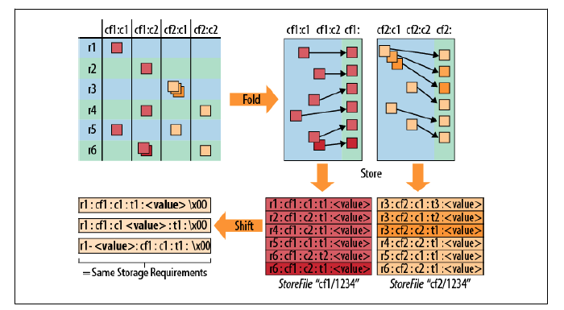
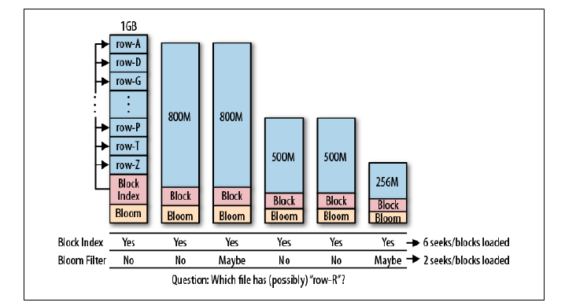
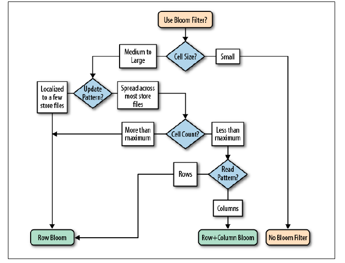

<!-- START doctoc generated TOC please keep comment here to allow auto update -->
<!-- DON'T EDIT THIS SECTION, INSTEAD RE-RUN doctoc TO UPDATE -->
**Table of Contents**  *generated with [DocToc](https://github.com/thlorenz/doctoc)*

- [9.1 行键设计](#91-%E8%A1%8C%E9%94%AE%E8%AE%BE%E8%AE%A1)
  - [9.1.1 概念](#911-%E6%A6%82%E5%BF%B5)
  - [9.1.2 高表与宽表](#912-%E9%AB%98%E8%A1%A8%E4%B8%8E%E5%AE%BD%E8%A1%A8)
  - [9.1.3 部分键扫描](#913-%E9%83%A8%E5%88%86%E9%94%AE%E6%89%AB%E6%8F%8F)
  - [9.1.4 分页](#914-%E5%88%86%E9%A1%B5)
  - [9.1.5 时间序列](#915-%E6%97%B6%E9%97%B4%E5%BA%8F%E5%88%97)
  - [9.1.6 时间顺序关系](#916-%E6%97%B6%E9%97%B4%E9%A1%BA%E5%BA%8F%E5%85%B3%E7%B3%BB)
- [9.2 高级模式](#92-%E9%AB%98%E7%BA%A7%E6%A8%A1%E5%BC%8F)
- [9.3 辅助索引](#93-%E8%BE%85%E5%8A%A9%E7%B4%A2%E5%BC%95)
  - [由客户端管理索引](#%E7%94%B1%E5%AE%A2%E6%88%B7%E7%AB%AF%E7%AE%A1%E7%90%86%E7%B4%A2%E5%BC%95)
  - [带索引的事务型 HBase](#%E5%B8%A6%E7%B4%A2%E5%BC%95%E7%9A%84%E4%BA%8B%E5%8A%A1%E5%9E%8B-hbase)
  - [带索引的  HBase](#%E5%B8%A6%E7%B4%A2%E5%BC%95%E7%9A%84--hbase)
  - [协处理器](#%E5%8D%8F%E5%A4%84%E7%90%86%E5%99%A8)
- [9.4 搜索集成](#94-%E6%90%9C%E7%B4%A2%E9%9B%86%E6%88%90)
  - [客户端管理](#%E5%AE%A2%E6%88%B7%E7%AB%AF%E7%AE%A1%E7%90%86)
  - [Lucene](#lucene)
  - [HBasene](#hbasene)
  - [协处理器](#%E5%8D%8F%E5%A4%84%E7%90%86%E5%99%A8-1)
- [9.5 事务](#95-%E4%BA%8B%E5%8A%A1)
  - [事务型 HBase](#%E4%BA%8B%E5%8A%A1%E5%9E%8B-hbase)
  - [ZooKeeper](#zookeeper)
- [9.6 布隆过滤器](#96-%E5%B8%83%E9%9A%86%E8%BF%87%E6%BB%A4%E5%99%A8)
- [9.7 版本管理](#97-%E7%89%88%E6%9C%AC%E7%AE%A1%E7%90%86)
  - [自定义版本控制](#%E8%87%AA%E5%AE%9A%E4%B9%89%E7%89%88%E6%9C%AC%E6%8E%A7%E5%88%B6)
- [导航](#%E5%AF%BC%E8%88%AA)

<!-- END doctoc generated TOC please keep comment here to allow auto update -->

# 9.1 行键设计

HBase 有两种基本的键结构：行键（row key）和列键（column key），两者都可以存储有意义的信息。这些信息有两类：

- 键本身存储的内容。
- 键的排列顺序。

## 9.1.1 概念

HBase 表中的数据分隔主要是用列族而不是列。图片的左上角展示了数据的逻辑布局，右上角展现了数据从逻辑布局到物理布局的转换。每一行的单元格有序存储，不同列族的数据存储在不同的文件中。换句话说，磁盘上一个列族下的所有单元格都存储在一个文件（store file）中，不同列族的单元格不会出现在同一个存储文件中。

HBase 不存储没有值的单元格，同一个单元格的多个版本被单独存储为连续的单元格，并添加必要的时间戳。单元格按照时间戳将序排列，保证 HFile 的 Reader 先读到的是最新的值。

含有结构信息的整个单元格在 HBase 中叫做 KeyValue，其中不仅包含用户生成时设定的列和值，还包括行键和时间戳。KeyValue 存储时先按行键排序，再按列键排序。

图片的右下角展示一个一张逻辑表在物理存储文件中的数据布局。

从左到右查询数据的性能变差：

## 9.1.2 高表与宽表

高表列少行多，而宽表则正好相反。根据前一段的介绍，用户应该尽量将需要查询的维度或信息存储在**行键**中，因为用它筛选的效率最高。

此外，HBase 只能按行分片，因此高表更有优势。

## 9.1.3 部分键扫描

HBase 的扫描功能和基于`HTable`的 API 更适合在高表上筛选数据。

用户可以根据查询精度的要求，构造特定的起始键和终止键来查询所需的数据。

## 9.1.4 分页

使用起始键和终止键的同时，也可以添加`offset`和`limit`参数来筛选数据。

## 9.1.5 时间序列

处理流式信息时，常见的是按时间序列组织的数据。这样有可能会引发*热点问题*，所有的更新都集中于一个 region server。

想要将数据分散到所有的 region 服务器上，可以：

- 加盐。使用 salt 前缀，这样做的缺点是用户要扫描一个连续的范围时，需要对每个 region server 都发起请求。这样也会带来并发量的好处。
- 字段交换/提升权重。如果用户设计的行键已经包含多个字段了，可以调整它们的位置。
- 随机化。使用 MD5 之类的散列函数将行键分散到所有 region server 上。随机化的方式适合每次只读取一行数据的应用。

总结一下，找到读写性能的平衡点不是一件简单的事儿，用户的数据访问模式决定了最终的行键结构。

## 9.1.6 时间顺序关系

每个列族下的列可以作为一个辅助索引单独进行排序，所有按照时间产生的数据，可以以独立行插入 HBase，也可以以列插入。后者对于少量的索引时适用的。

# 9.2 高级模式

每列的值都可以存储为任意字节数组的数据，借助 Avro 和 Protocol Buffer可以表示更复杂的、嵌套的结构：

- Avro

  HAvroBase 是一个使用 Avro 在每列中存储复杂记录的项目。它使用 Avro 的接口定义语言（IDL）来定义实际的模式。

- Protocol Buffer

  用 Protocol Buffer 的IDL 来定义一个外部模式，这个模式被用来序列化复杂的数据结构到 HBase 的列中。

# 9.3 辅助索引

HBase 没有为辅助索引提供原生的支持。通常的需求是用户能够通过主坐标（行键、列族、列限定符）来查找一个单元格。辅助索引存储了一个新坐标与现有坐标之间的映射关系。

## 由客户端管理索引

把责任完全转移到应用层的典型做法是把一个数据表和一个（或多个）查找/映射表结合起来。每当程序写数据表时，它也同时更新映射表（辅助索引表）。

读数据时可以直接在主表中查询，先从辅助索引表中查找原表行键，再再原表中读取实际数据。

HBase 不能保证跨行操作的原子性。从事务的角度来看，用户不能保证主表和依赖表的一致性。

## 带索引的事务型 HBase

开源的 ITHBase 提供了一个带索引的事务型 HBase 的解决方案，并增加了特殊的客户端和服务端类的实现。

最核心的扩展是增加了用来保证所有的辅助索引更新操作一致性的事务功能。在此基础上，提供了一个客户端类 `IndexedTableDescriptor`，这个类定义了一个数据表的辅助索引支持。

## 带索引的  HBase

另一种方案 IHBase 放弃了为每个索引使用单独的表，而是完全再内存中维护索引。当一个 region 第一次被打开，或者一个 memstore 被刷写到磁盘时，用户可以通过扫描整个 region 来建立索引。

当磁盘上的数据有索引时，内存中数据搜索的方式如下：它直接使用内存中的数据来搜索索引相关的详细数据。这个方案的优点时索引永远是同步的，且不需要额外的事务控制。

与基于表的索引相比，IHBase 有两方面不同：

1. 它很快，索引数据都在内存中，可以二分查找。
2. 需要大量额外的堆空间来维护索引。

缺点也很明显：

1. 入侵型很强，需要额外的 JAR 文件和配置来替换重要的客户端类和服务端类。
2. 需要额外的资源，尽管它使用内存交换了额外的 I/O 需求。
3. 它再按照基于辅助索引定义的排列顺序查询数据时，需要在数据表傻姑娘做随机查找。

## 协处理器

使用协处理器框架提供的服务端的钩子，且不用替换任何客户端类和服务端类。协处理器将为每一个 region 载入索引层，并维护索引。

# 9.4 搜索集成

使用索引可以按照行键以外的顺序来遍历数据表。但用户仍受限于使用键、或过滤器来筛选数据，或者直接便利数据来查找所需的内容。要想使用任意关键字来搜索数据，那只能集成一个完整的搜索引擎。

常见的选择是基于 Lucene 的方案。

## 客户端管理

客户端管理的实现需要使用 HBase 存储数据，同时使用 MapReduce 任务来建立索引，还需要使用 HBase 作为 Lucene 的后台存储。

另一种实现方法是把数据表的更新也转发到邻近的索引服务器中。在 HBase 上实现通过索引查找数据的方法取决于使用 HBase 作为数据的存储还是作为索引的存储。

一个不错的客户端管理方案是 Facebook 的收件箱搜索系统：

- 每一行是一个单独的收件箱，即每个用户在搜索表中有单独的一行。
- 列式消息中被索引的词语。
- 版本是消息 ID。
- 值包括附加信息，例如词组在文件中位置。

## Lucene

独立于 HBase 使用 Lucene 可以通过 MapReduce 来建立索引。

这种方法只是用 HBase 来存储数据，通过 Lucene 来执行搜索，通常只返回匹配的行键。

## HBasene

HBasene 选择的方法是直接在 HBase 内部建立搜索索引，同时为用户提供 Lucene 的 API。它把每个文档的字段（field）、词（term）存储在一个单独的行，同时将包含这个词的文档存储这一行的列中。

它同时也在同一张表中存储了其他支持 Lucene 查询的信息。它实现了一个`IndexWriter`，该类可以直接把文档存储在 HBase 表中，就像使用正常的 Lucene API。

## 协处理器

使用协处理器提供的钩子函数来维护索引，索引直接存储在 HDFS 上。每个 region 都有自己的索引，通过搜索分布在所有 region 上的索引来获得完整的结果。

# 9.5 事务

## 事务型 HBase

带索引的事务型 HBase 有一些取代默认客户端和服务端的扩展类，它们增加了跨行甚至跨表的事务支持。

每个 region server 都保持了一个事务的列表。每次读写操作都有一个事务 ID，以保护其调用不受其他事务的影响。

## ZooKeeper

ZooKeeper 在 HBase 集群的启动中扮演者种子或引导启动的角色。Cages 项目提供了一个锁的抽象概念，即跨多个资源的锁，并增加一个专门的事务类来把 ZooKeeper 当做分布式协调系统调用。

ZooKeeper 也提供了一个能够被用于实现两阶段提交协议的锁方案。它使用一个特定的 znode 来代表事务，且每个参与的客户端对应一个孩子 znode。客户端可以使用自己的 znode 标识自己在食物的那部分成功还是失败。其他客户端也可以监控同级的 znode，并采取适当的行动。

# 9.6 布隆过滤器

使用布隆过滤器的根本原因是默认机制决定了一个存储文件是否包含特定的受限于可用块索引的行键，同时这个索引又是相当粗粒度的，该索引只存储了文件包含块的开始键。

使用布隆过滤器能够减少 IO 操作的数量：

块索引能确定文件中是否包含某个键，region server 需要加载每一个块来检查该块中是否包含该行的单元格。

另外，布隆过滤器可以立即判断一个文件是否包含特定的行键。

使用行级还是行加列级别的布隆过滤器，取决于用户的使用模式：

# 9.7 版本管理

服务器的时间不同步，使用隐式的时间戳可能会导致完全不同的时间集。

在 HBase 中，删除操作的本质是添加一个带有特定时间戳的慕被标记到存储中。

## 自定义版本控制

你可以指定时间戳的值，创建自己的版本控制计划。

例如用户可以把时间戳和一个全局数字生成器结合使用，每次`put`函数都会用到它。

# 导航

[目录](README.md)

上一章：[8、架构](8、架构.md)

下一章：[10、集群监控](10、集群监控.md)
