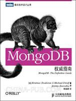

<!-- START doctoc generated TOC please keep comment here to allow auto update -->
<!-- DON'T EDIT THIS SECTION, INSTEAD RE-RUN doctoc TO UPDATE -->
**Table of Contents**  *generated with [DocToc](https://github.com/thlorenz/doctoc)*

- [目录](#%E7%9B%AE%E5%BD%95)

<!-- END doctoc generated TOC please keep comment here to allow auto update -->

[《MongoDB权威指南》](https://book.douban.com/subject/6068947/)读书笔记。

# 目录

[一，简介](一，简介.md)

[二，入门](二，入门.md)

[三，创建、更新及删除文档](三，创建、更新及删除文档.md)

[四，查询](四，查询.md)
