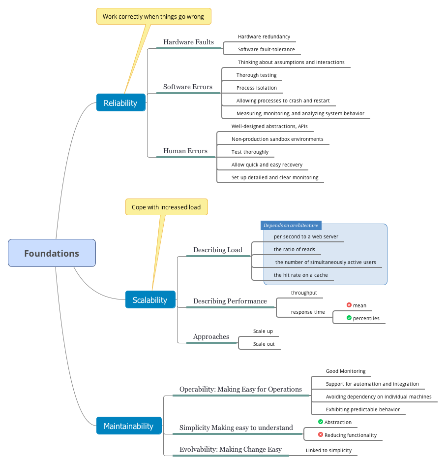

- [Thinking About Data Systems](#thinking-about-data-systems)
- [Reliability](#reliability)
  - [Hardware Faults](#hardware-faults)
  - [Software Errors](#software-errors)
  - [Human Errors](#human-errors)
- [Scalability](#scalability)
  - [Describing Load](#describing-load)
  - [Describing Performance](#describing-performance)
  - [Approaches for Coping with Load](#approaches-for-coping-with-load)
- [Maintainability](#maintainability)
  - [Operability: Making Life Easy for Operations](#operability-making-life-easy-for-operations)
  - [Simplicity: Managing Complexity](#simplicity-managing-complexity)
  - [Evolvability: Making Change Easy](#evolvability-making-change-easy)
- [Navigation](#navigation)

<!-- END doctoc generated TOC please keep comment here to allow auto update -->

A data-intensive application is typically built from standard building blocks that provide commonly needed functionality. For example, many applications need to:

- Store data so that they, or another application, can find it again later (databases)
- Remember the result of an expensive operation, to speed up reads (caches)
- Allow users to search data by keyword or filter it in various ways (search indexes)
- Send a message to another process, to be handled asynchronously (stream processing)
- Periodically crunch a large amount of accumulated data (batch processing)

When building an application, we still need to figure out which tools and which approaches are the most appropriate for the task at hand. And it can be hard to combine tools when you need to do something that a single tool cannot do alone.

# Thinking About Data Systems

We typically think of databases, queues, caches, etc. as being very different categories of tools. But the boundaries between the categories are becoming blurred. For example, 

1. there are datastores that are also used as message queues (Redis), 
2. and there are message queues with database-like durability guarantees (Apache Kafka).

Secondly, increasingly many applications now have such demanding or wide-ranging requirements that a single tool can no longer meet all of its data processing and storage needs.

**Reliability**
The system should continue to work correctly (performing the correct function at the desired level of performance) even in the face of adversity (hardware or software faults, and even human error). 

**Scalability**
As the system grows (in data volume, traffic volume, or complexity), there should be reasonable ways of dealing with that growth. 

**Maintainability**
Over time, many different people will work on the system (engineering and operations, both maintaining current behavior and adapting the system to new use cases), and they should all be able to work on it productively.

# Reliability

Reliability means, roughly, "continuing to work correctly, even when things go
wrong". The things that can go wrong are called faults, and systems that anticipate faults and can cope with them are called fault-tolerant or resilient.

Note that *a fault is not the same as a failure*. A fault is usually defined as one component of the system deviating from its spec, whereas a failure is when the system as a whole stops providing the required service to the user.

It is impossible to reduce the probability of a fault to zero; therefore it is usually best to design fault-tolerance mechanisms that prevent faults from causing failures.

By deliberately inducing faults, you ensure that the fault-tolerance machinery is continually exercised and tested, which can increase your confidence that faults will be handled correctly when they occur naturally.

## Hardware Faults

Our first response is usually to add redundancy to the individual hardware components in order to reduce the failure rate of the system. Disks may be set up in a RAID configuration, servers may have dual power supplies and hot-swappable CPUs, and datacenters may have batteries and diesel generators for backup power.

Recently, there is a move toward systems that can tolerate the loss of entire machines, by using software fault-tolerance techniques in preference or in addition to hardware redundancy.

We usually think of hardware faults as being random and independent from each other: one machine's disk failing does not imply that another machine's disk is going to fail.

## Software Errors

The bugs that cause these kinds of software faults often lie dormant for a long time until they are triggered by an unusual set of circumstances. In those circumstances, it is revealed that the software is making some kind of assumption about its environment—and while that assumption is usually true, it eventually stops being true for some reason.

There is no quick solution to the problem of systematic faults in software. Lots of small things can help: 

- carefully thinking about assumptions and interactions in the system; 
- thorough testing; 
- process isolation; 
- allowing processes to crash and restart; 
- measuring, monitoring, and analyzing system behavior in production.

## Human Errors

Even when they have the best intentions, humans are known to be unreliable.

How do we make our systems reliable, in spite of unreliable humans?

- Design systems in a way that minimizes opportunities for error. For example,
well-designed abstractions, APIs, and admin interfaces make it easy to do "the
right thing” and discourage “the wrong thing". 
- Decouple the places where people make the most mistakes from the places where
they can cause failures. In particular, provide fully featured non-production
sandbox environments where people can explore and experiment safely, using
real data, without affecting real users.
- Test thoroughly at all levels, from unit tests to whole-system integration tests and manual tests.
- Allow quick and easy recovery from human errors, to minimize the impact in the case of a failure. For example, make it fast to roll back configuration changes, roll out new code gradually (so that any unexpected bugs affect only a small subset of users), and provide tools to recompute data (in case it turns out that the old computation was incorrect).
- Set up detailed and clear monitoring, such as performance metrics and error
rates. 
- Implement good management practices and training.

# Scalability

Scalability is the term we use to describe a system's ability to cope with increased load. Note, however, that it is not a one-dimensional label that we can attach to a system: it is meaningless to say "X is scalable" or "Y doesn't scale."

Scalability means considering questions like "If the system grows in a particular way, what are our options for coping with the growth?" and "How can we add computing resources to handle the additional load?"

## Describing Load

First, we need to succinctly describe the current load on the system; only then can we discuss growth questions (what happens if our load doubles?). 

Load can be described with a few numbers which we call load parameters. The best choice of parameters depends on the architecture of your system: it may be 

- requests per second to a web server, 
- the ratio of reads to writes in a database, 
- the number of simultaneously active users in a chat room, 
- the hit rate on a cache, or something else.

## Describing Performance

Once you have described the load on your system, you can investigate what happens when the load increases. You can look at it in two ways:

- When you increase a load parameter and keep the system resources (CPU, memory, network bandwidth, etc.) unchanged, how is the performance of your system affected?
- When you increase a load parameter, how much do you need to increase the
resources if you want to keep performance unchanged?

In a batch processing system such as Hadoop, we usually care about **throughput** — the number of records we can process per second, or the total time it takes to run a job on a dataset of a certain size. In online systems, what's usually more important is the service's **response time** — that is, the time between a client sending a request and receiving a response.

> Latency and response time are not the same. The response time is what the client sees: besides the actual time to process the request (the service time), it includes network delays and queueing delays. Latency is the duration that a request is waiting to be handled—during which it is latent, awaiting
service.

In practice, in a system handling a variety of requests, the response time can vary a lot. We therefore need to think of response time not as a single number, but as a distribution of values that you can measure.

It's common to see the average response time of a service reported. However, the mean is not a very good metric if you want to know your "typical" response time, because it doesn't tell you how many users actually experienced
that delay.

Usually it is better to use percentiles. If you take your list of response times and sort it from fastest to slowest, then the median is the halfway point. In order to figure out how bad your outliers are, you can look at higher percentiles: the 95th, 99th, and 99.9th percentiles are common.

High percentiles of response times, also known as tail latencies, are important
because they directly affect users' experience of the service.

> The naive implementation is to keep a list of response times for all requests within the time window and to sort that list every minute. If that is too inefficient for you, there are algorithms that can calculate a good approximation of percentiles at minimal CPU and memory cost, such as forward decay, t-digest, or HdrHistogram.

## Approaches for Coping with Load

People often talk of a dichotomy between scaling up (vertical scaling, moving to a more powerful machine) and scaling out (horizontal scaling, distributing the load across multiple smaller machines). Distributing load across multiple machines is also known as a shared-nothing architecture.

Some systems are elastic, meaning that they can automatically add computing resources when they detect a load increase, whereas other systems are scaled manually. An elastic system can be useful if load is highly unpredictable, but manually scaled systems are simpler and may have fewer operational surprises.

The problem may be 

- the volume of reads, 
- the volume of writes, 
- the volume of data to store, the complexity of the data, 
- the response time requirements, 
- the access patterns, 
- or (usually) some mixture of all of these plus many more issues.

An architecture that scales well for a particular application is built around *assumptions of which operations will be common and which will be rare—the load parameters*. If those assumptions turn out to be wrong, the engineering effort for scaling is at best wasted, and at worst counterproductive. In an early-stage startup or an unproven product it's usually more important to be able to iterate quickly on product features than it is to scale to some hypothetical future load.

# Maintainability

It is well known that the majority of the cost of software is not in its initial development, but in its

- ongoing maintenance—fixing bugs, 
- keeping its systems operational,
- investigating failures, 
- adapting it to new platforms, 
- modifying it for new use cases, 
- repaying technical debt, and adding new features.

we will pay particular attention to three design principles for software systems:

- Operability
    Make it easy for operations teams to keep the system running smoothly.
- Simplicity
    Make it easy for new engineers to understand the system, by removing as much complexity as possible from the system. 
- Evolvability
    Make it easy for engineers to make changes to the system in the future, adapting it for unanticipated use cases as requirements change. 

## Operability: Making Life Easy for Operations

Data systems can do various things to make routine tasks easy, including:

- Providing visibility into the runtime behavior and internals of the system, with good monitoring
- Providing good support for automation and integration with standard tools
- Avoiding dependency on individual machines (allowing machines to be taken down for maintenance while the system as a whole continues running uninterrupted)
- Providing good documentation and an easy-to-understand operational model ("If I do X, Y will happen")
- Providing good default behavior, but also giving administrators the freedom to override defaults when needed
- Self-healing where appropriate, but also giving administrators manual control
over the system state when needed
- Exhibiting predictable behavior, minimizing surprises

## Simplicity: Managing Complexity

There are various possible symptoms of complexity: 

- explosion of the state space, 
- tight coupling of modules, 
- tangled dependencies, 
- inconsistent naming and terminology,
- hacks aimed at solving performance problems, 
- special-casing to work around issues elsewhere.

In complex software, there is also a greater risk of introducing bugs when making a change: when the system is harder for developers to understand and reason about, hidden assumptions, unintended consequences, and unexpected interactions are more easily overlooked.

Making a system simpler does not necessarily mean reducing its functionality; it can also mean removing accidental complexity. One of the best tools we have for removing accidental complexity is **abstraction**. A good abstraction can hide a great deal of implementation detail behind a clean, simple-to-understand façade.

## Evolvability: Making Change Easy

The ease with which you can modify a data system, and adapt it to changing requirements, is closely linked to its simplicity and its abstractions: simple and easy-to-understand systems are usually easier to modify than complex ones.

# Navigation

[Table of Contents](README.md)

Next: [2. Data Models and Query Languages](ch2.md)
