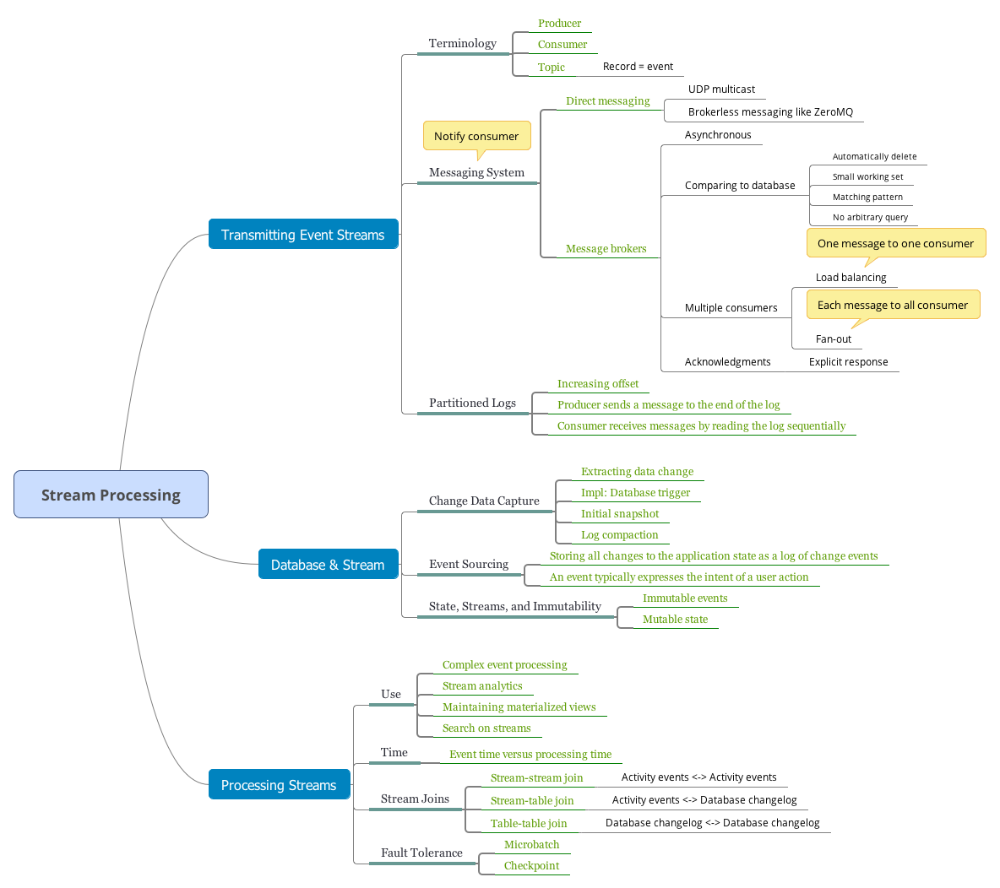
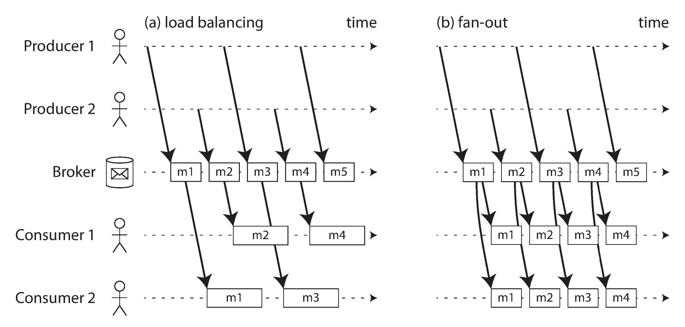
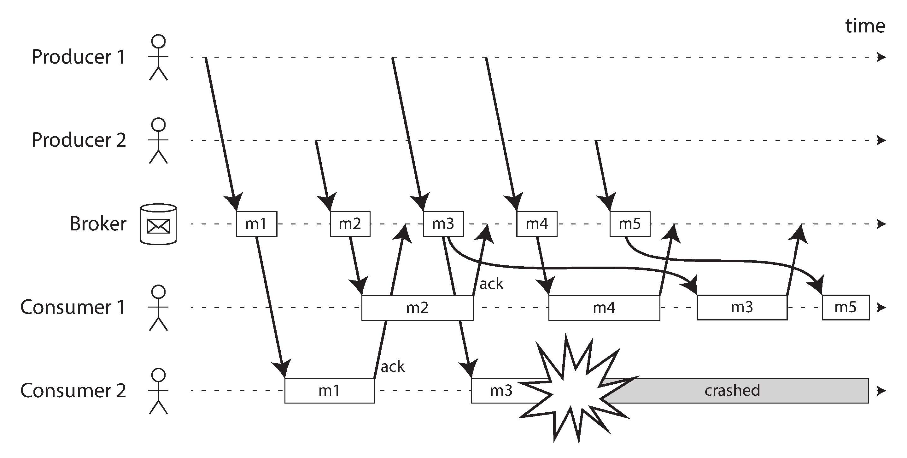
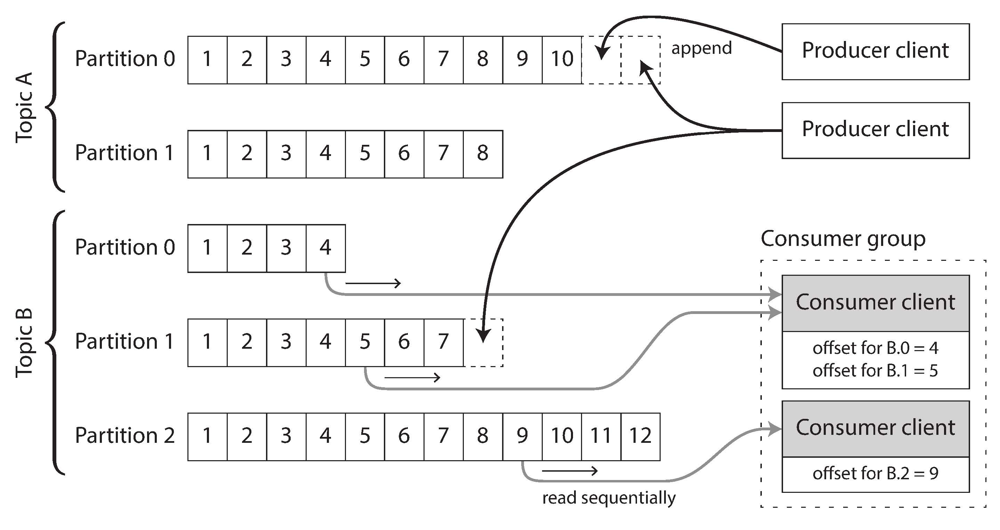
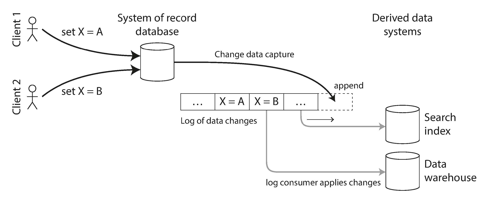

- [Transmitting Event Streams](#transmitting-event-streams)
  - [Messaging Systems](#messaging-systems)
    - [Direct messaging from producers to consumers](#direct-messaging-from-producers-to-consumers)
    - [Message brokers](#message-brokers)
    - [Message brokers compared to databases](#message-brokers-compared-to-databases)
    - [Multiple consumers](#multiple-consumers)
    - [Acknowledgments and redelivery](#acknowledgments-and-redelivery)
  - [Partitioned Logs](#partitioned-logs)
    - [Using logs for message storage](#using-logs-for-message-storage)
    - [Logs compared to traditional messaging](#logs-compared-to-traditional-messaging)
    - [Consumer offsets](#consumer-offsets)
    - [Disk space usage](#disk-space-usage)
    - [When consumers cannot keep up with producers](#when-consumers-cannot-keep-up-with-producers)
    - [Replaying old messages](#replaying-old-messages)
- [Databases and Streams](#databases-and-streams)
  - [Keeping System in Sync](#keeping-system-in-sync)
  - [Change Data Capture](#change-data-capture)
    - [Implementing change data capture](#implementing-change-data-capture)
    - [Initial snapshot](#initial-snapshot)
    - [Log compaction](#log-compaction)
    - [API support for change streams](#api-support-for-change-streams)
  - [Event Sourcing](#event-sourcing)
    - [Deriving current state from the event log](#deriving-current-state-from-the-event-log)
    - [Commands and events](#commands-and-events)
  - [State, Streams, and Immutability](#state-streams-and-immutability)
    - [Advantages of immutable events](#advantages-of-immutable-events)
    - [Deriving several views from the same event log](#deriving-several-views-from-the-same-event-log)
    - [Concurrency control](#concurrency-control)
    - [Limitations of immutability](#limitations-of-immutability)
- [Processing Streams](#processing-streams)
  - [Use of Stream Processing](#use-of-stream-processing)
    - [Complex event processing](#complex-event-processing)
    - [Stream analytics](#stream-analytics)
    - [Maintaining materialized views](#maintaining-materialized-views)
    - [Search on streams](#search-on-streams)
    - [Message passing and RPC](#message-passing-and-rpc)
  - [Reasoning About Time](#reasoning-about-time)
    - [Event time versus processing time](#event-time-versus-processing-time)
    - [Knowing when you're ready](#knowing-when-youre-ready)
    - [Whose clock are you using, anyway?](#whose-clock-are-you-using-anyway)
    - [Types of windows](#types-of-windows)
  - [Stream Joins](#stream-joins)
    - [Stream-stream join (window join)](#stream-stream-join-window-join)
    - [Stream-table join (stream enrichment)](#stream-table-join-stream-enrichment)
    - [Table-table join (materialized view maintenance)](#table-table-join-materialized-view-maintenance)
  - [Fault Tolerance](#fault-tolerance)
    - [Microbatching and checkpointing](#microbatching-and-checkpointing)
    - [Atomic commit revisited](#atomic-commit-revisited)
    - [Idempotence](#idempotence)
    - [Rebuilding state after a failure](#rebuilding-state-after-a-failure)
- [Navigation](#navigation)

<!-- END doctoc generated TOC please keep comment here to allow auto update -->

In general, a "stream" refers to data that is incrementally made available over time.

We will look at event streams as a data management mechanism: the unbounded, incrementally processed counterpart to the batch data.

# Transmitting Event Streams

In a stream processing context, a record is more commonly known as an *event*. An event usually contains a timestamp indicating when it happened according to a time-of-day clock.

An event may be encoded as a text string, or JSON, or perhaps in some binary form. This encoding allows you to store an event. It also allows you to send the event over the network to another node in order to process it.

In streaming terminology, an event is generated once by a producer (also known as a publisher or sender), and then potentially processed by multiple consumers (subscribers or recipients). In a streaming system, related events are usually grouped together into a topic or stream.

In principle, a file or database is sufficient to connect producers and consumers: a producer writes every event that it generates to the datastore, and each consumer periodically polls the datastore to check for events that have appeared since it last ran. 

The more often you poll, the lower the percentage of requests that return new events, and thus the higher the overheads become. Instead, it is better for consumers to be notified when new events appear.

Databases have traditionally not supported this kind of notification mechanism very well: relational databases commonly have triggers, which can react to a change (e.g., a row being inserted into a table), but they are very limited in what they can do.

## Messaging Systems

A common approach for notifying consumers about new events is to use a messaging system: a producer sends a message containing the event, which is then pushed to consumers.

What happens if the producers send messages faster than the consumers can process them? 

- Broadly speaking, there are three options: the system can drop messages, buffer messages in a queue, or apply backpressure (also known as flow control; i.e., blocking the producer from sending more messages).

What happens if nodes crash or temporarily go offline — are any messages lost? 

- As with databases, durability may require some combination of writing to disk and/or replication.

### Direct messaging from producers to consumers

A number of messaging systems use direct network communication between producers and consumers without going via intermediary nodes:

- UDP multicast
- Brokerless messaging libraries such as ZeroMQ
- StatsD and Brubeck use unreliable UDP messaging for collecting metrics from all machines on the network and monitoring them.

These direct messaging systems generally require the application code to be aware of the possibility of message loss.

### Message brokers

A widely used alternative is to send messages via a message broker (also known as a message queue), which is essentially a kind of database that is optimized for handling message streams. It runs as a server, with producers and consumers connecting to it as clients. Producers write messages to the broker, and consumers receive them by reading them from the broker.

consumers are generally asynchronous: when a producer sends a message, it normally only waits for the broker to confirm that it has buffered the message and does not wait for the message to be processed by consumers.

### Message brokers compared to databases

Some message brokers can even participate in two-phase commit protocols using XA or JTA.

There are still important differences between message brokers and databases:

- Databases usually keep data until it is explicitly deleted, whereas most message brokers automatically delete a message when it has been successfully delivered to its consumers.
- Most message brokers assume that their working set is fairly small. If the broker needs to buffer a lot of messages, each individual message takes longer to process, and the overall throughput may degrade.
- Databases often support secondary indexes and various ways of searching for data, while message brokers often support some way of subscribing to a subset of topics matching some pattern.
- Message brokers do not support arbitrary queries, but they do notify clients when data changes.

### Multiple consumers

When multiple consumers read messages in the same topic, two main patterns of messaging are used,

- **Load balancing**. Each message is delivered to one of the consumers, so the consumers can share the work of processing the messages in the topic.
- **Fan-out**. Each message is delivered to all of the consumers. 

### Acknowledgments and redelivery

In order to ensure that the message is not lost, message brokers use acknowledgments: a client must explicitly tell the broker when it has finished processing a message so that the broker can remove it from the queue.

The combination of load balancing with redelivery inevitably leads to messages being reordered. To avoid this issue, you can use a separate queue per consumer (i.e., not use the load balancing feature).

## Partitioned Logs

Receiving a message is destructive if the acknowledgment causes it to be deleted from the broker, so you cannot run the same consumer again and expect to get the same result.

### Using logs for message storage

A producer sends a message by appending it to the end of the log, and a consumer receives messages by reading the log sequentially. If a consumer reaches the end of the log, it waits for a notification that a new message has been appended.

In order to scale to higher throughput than a single disk can offer, the log can be partitioned. Different partitions can then be hosted on different machines, making each partition a separate log that can be read and written independently from other partitions. A topic can then be defined as a group of partitions that all carry messages of the same type.

Within each partition, the broker assigns a monotonically increasing sequence number, or offset, to every message.

### Logs compared to traditional messaging

To achieve load balancing across a group of consumers, instead of assigning individual messages to consumer clients, the broker can assign entire partitions to nodes in the consumer group.

Each client then consumes all the messages in the partitions it has been assigned. This coarse-grained load balancing approach has some downsides:

- The number of nodes sharing the work of consuming a topic can be at most the number of log partitions in that topic.
- If a single message is slow to process, it holds up the processing of subsequent messages in that partition.

### Consumer offsets

All messages with an offset less than a consumer's current offset have already been processed, and all messages with a greater offset have not yet been seen. Thus, the broker *does not need to track acknowledgments* for every single message — it only needs to periodically record the consumer offsets.

If a consumer node fails, another node in the consumer group is assigned the failed consumer's partitions, and it starts consuming messages at the last recorded offset.

### Disk space usage

Effectively, the log implements a bounded-size buffer that discards old messages when it gets full, also known as a circular buffer or ring buffer.

Regardless of how long you retain messages, the throughput of a log remains more or less constant, since every message is written to disk anyway.

### When consumers cannot keep up with producers

The log-based approach is a form of buffering with a large but fixed-size buffer.

You can monitor how far a consumer is behind the head of the log, and raise an alert if it falls behind significantly. As the buffer is large, there is enough time for a human operator to fix the slow consumer and allow it to catch up before it starts missing messages.

Even if a consumer does fall too far behind and starts missing messages, only that consumer is affected; it does not disrupt the service for other consumers.

### Replaying old messages

AMQP- and JMS-style message brokers, processing and acknowledging messages is a destructive operation, since it causes the messages to be deleted on the broker. 

On the other hand, in a log-based message broker, consuming messages is more like reading from a file: it is a read-only operation that does not change the log.

# Databases and Streams

In fact, a replication log is a stream of database write events, produced by the leader as it processes transactions. The followers apply that stream of writes to their own copy of the database and thus end up with an accurate copy of the same data.

## Keeping System in Sync

As the same or related data appears in several different places, they need to be kept in sync with one another: if an item is updated in the database, it also needs to be updated in the cache, search indexes, and data warehouse.

If periodic full database dumps are too slow, an alternative that is sometimes used is dual writes, in which the application code explicitly writes to each of the systems when data changes.

Another problem with dual writes is that one of the writes may fail while the other succeeds.

## Change Data Capture

The problem with most databases' replication logs is that they have long been considered to be an internal implementation detail of the database, not a public API. Clients are supposed to query the database through its data model and query language, not parse the replication logs and try to extract data from them.

More recently, there has been growing interest in change data capture (CDC), which is the process of observing all data changes written to a database and extracting them in a form in which they can be replicated to other systems.

### Implementing change data capture

Change data capture is a mechanism for ensuring that all changes made to the system of record are also reflected in the derived data systems so that the derived systems have an accurate copy of the data.

Essentially, change data capture makes one database the leader (the one from which the changes are captured), and turns the others into followers.

Database triggers can be used to implement change data capture by registering triggers that observe all changes to data tables and add corresponding entries to a changelog table. However, they tend to be fragile and have significant performance overheads.

Like message brokers, change data capture is usually asynchronous: the system of record database does not wait for the change to be applied to consumers before committing it. This design has the operational advantage that adding a slow consumer does not affect the system of record too much, but it has the downside that all the issues of replication lag apply.

### Initial snapshot

In many cases, keeping all changes forever would require too much disk space, and replaying it would take too long, so the log needs to be truncated.

Thus, if you don't have the entire log history, you need to start with a consistent snapshot.

The snapshot of the database must correspond to a known position or offset in the change log, so that you know at which point to start applying changes after the snapshot has been processed.

### Log compaction

If you can only keep a limited amount of log history, you need to go through the snapshot process every time you want to add a new derived data system. However, log compaction provides a good alternative.

The storage engine periodically looks for log records with the same key, throws away any duplicates, and keeps only the most recent update for each key. This compaction and merging process runs in the background.

The disk space required for such a compacted log depends only on the current contents of the database, not the number of writes that have ever occurred in the database. If the same key is frequently overwritten, previous values will eventually be garbage-collected, and only the latest value will be retained.

### API support for change streams

Increasingly, databases are beginning to support change streams as a first-class interface, rather than the typical retrofitted and reverse-engineered CDC efforts.

## Event Sourcing

Event sourcing involves *storing all changes to the application state as a log of change events*. The biggest difference is that event sourcing applies the idea at a different level of abstraction:

- In change data capture, the application uses the database in a mutable way, updating and deleting records at will. The log of changes is extracted from the database at a low level. The application writing to the database does not need to be aware that CDC is occurring.
- In event sourcing, the application logic is explicitly built on the basis of immutable events that are written to an event log. In this case, the event store is append-only, and updates or deletes are discouraged or prohibited. Events are designed to reflect things that happened at the application level, rather than low-level state changes.

Event sourcing is a powerful technique for data modeling: from an application point of view it is more meaningful to record the user's actions as immutable events, rather than recording the effect of those actions on a mutable database.

Specialized databases such as Event Store have been developed to support applications using event sourcing, but in general the approach is independent of any particular tool.

### Deriving current state from the event log

Applications that use event sourcing need to take the log of events (representing the data written to the system) and transform it into application state that is suitable for showing to a user.

Like with change data capture, replaying the event log allows you to reconstruct the current state of the system. However, log compaction needs to be handled differently:

- A CDC event for the update of a record typically contains the entire new version of the record, so the current value for a primary key is entirely determined by the most recent event for that primary key, and log compaction can discard previous events for the same key.
- On the other hand, with event sourcing, events are modeled at a higher level: an event typically expresses the intent of a user action, not the mechanics of the state update that occurred as a result of the action. In this case, later events typically do not override prior events, and so you need the full history of events to reconstruct the final state. 

### Commands and events

When a request from a user first arrives, it is initially a command: at this point it may still fail, for example because some integrity condition is violated. The application must first validate that it can execute the command. If the validation is successful and the command is accepted, it becomes an event, which is durable and immutable.

## State, Streams, and Immutability

The key idea is that mutable state and an append-only log of immutable events do not contradict each other: they are two sides of the same coin. The log of all changes, the changelog, represents the evolution of state over time.

### Advantages of immutable events

When a transaction occurs, it is recorded in an append-only ledger, which is essentially a log of events describing money, goods, or services that have changed hands.

Immutable events also capture more information than just the current state.

### Deriving several views from the same event log

By separating mutable state from the immutable event log, you can derive several different read-oriented representations from the same log of events. The analytic database Druid ingests directly from Kafka using this approach, Pistachio is a distributed key-value store that uses Kafka as a commit log, and Kafka Connect sinks can export data from Kafka to various different databases and indexes.

Many of the complexities of schema design, indexing, and storage engines are the result of wanting to support certain query and access patterns. For this reason, you gain a lot of flexibility by separating the form in which data is written from the form it is read, and by allowing several different read views. This idea is sometimes known as command query responsibility segregation (CQRS).

### Concurrency control

The biggest downside of event sourcing and change data capture is that the consumers of the event log are usually asynchronous, so there is a possibility that a user may make a write to the log, then read from a log-derived view and find that their write has not yet been reflected in the read view.

One solution would be to perform the updates of the read view synchronously with appending the event to the log.

On the other hand, deriving the current state from an event log also simplifies some aspects of concurrency control. Much of the need for multi-object transactions stems from a single user action requiring data to be changed in several different places.

### Limitations of immutability

Some workloads mostly add data and rarely update or delete; they are easy to make immutable. Other workloads have a high rate of updates and deletes on a comparatively small dataset; in these cases, the immutable history may grow prohibitively large, fragmentation may become an issue, and the performance of compaction and garbage collection becomes crucial for operational robustness.

In these circumstances, it's not sufficient to just append another event to the log to indicate that the prior data should be considered deleted—you actually want to rewrite history and pretend that the data was never written in the first place.

# Processing Streams

A piece of code that processes streams like this is known as an operator or a job. Stream processor consumes input streams in a read-only fashion and writes its output to a different location in an append-only fashion.

## Use of Stream Processing

### Complex event processing

Complex event processing (CEP) is an approach developed in the 1990s for analyzing event streams, especially geared toward the kind of application that requires searching for certain event patterns.

CEP allows you to specify rules to search for certain patterns of events in a stream.

A database stores data persistently and treats queries as transient: when a query comes in, the database searches for data matching the query, and then forgets about the query when it has finished. CEP engines reverse these roles: queries are stored long-term, and events from the input streams continuously flow past them in search of a query that matches an event pattern.

### Stream analytics

The boundary between CEP and stream analytics is blurry, but as a general rule, analytics tends to be less interested in finding specific event sequences and is more oriented toward aggregations and statistical metrics over a large number of events.

Stream analytics systems sometimes use probabilistic algorithms, such as Bloom filters for set membership, HyperLogLog for cardinality estimation, and various percentile estimation algorithms.

### Maintaining materialized views

Maintaining materialized views: deriving an alternative view onto some dataset so that you can query it efficiently, and updating that view whenever the underlying data changes.

### Search on streams

Conventional search engines first index the documents and then run queries over the index. By contrast, searching a stream turns the processing on its head: the queries are stored, and the documents run past the queries, like in CEP.

### Message passing and RPC

Although these systems are also based on messages and events, we normally don't think of them as stream processors:

- Actor frameworks are primarily a mechanism for managing concurrency and distributed execution of communicating modules, whereas stream processing is primarily a data management technique.
- Communication between actors is often ephemeral and one-to-one, whereas event logs are durable and multi-subscriber.
- Actors can communicate in arbitrary ways (including cyclic request/response patterns), but stream processors are usually set up in acyclic pipelines where every stream is the output of one particular job, and derived from a well-defined set of input streams.

It is also possible to process streams using actor frameworks. However, many such frameworks do not guarantee message delivery in the case of crashes, so the processing is not fault-tolerant unless you implement additional retry logic.

## Reasoning About Time

There is no point in looking at the system clock of the machine running the batch process, because the time at which the process is run has nothing to do with the time at which the events actually occurred.

Many stream processing frameworks use the local system clock on the processing machine (the processing time) to determine windowing. This approach has the advantage of being simple, and it is reasonable if the delay between event creation and event processing is negligibly short.

### Event time versus processing time

Message delays can also lead to unpredictable ordering of messages.

Confusing event time and processing time leads to bad data.

### Knowing when you're ready

A tricky problem when defining windows in terms of event time is that you can never be sure when you have received all of the events for a particular window, or whether there are some events still to come.

You need to be able to handle such straggler events that arrive after the window has already been declared complete. Broadly, you have two options:

1. Ignore the straggler events, as they are probably a small percentage of events in normal circumstances. You can track the number of dropped events as a metric, and alert if you start dropping a significant amount of data.
2. Publish a correction, an updated value for the window with stragglers included. You may also need to retract the previous output.

In some cases it is possible to use a special message to indicate, "From now on there will be no more messages with a timestamp earlier than t".

### Whose clock are you using, anyway?

Assigning timestamps to events is even more difficult when events can be buffered at several points in the system.

To adjust for incorrect device clocks, one approach is to log three timestamps: 

- The time at which the event occurred, according to the device clock
- The time at which the event was sent to the server, according to the device clock
- The time at which the event was received by the server, according to the server clock.

### Types of windows

Several types of windows are in common use [79, 83]:

- **Tumbling window**. A tumbling window has a fixed length, and every event belongs to exactly one window.
- **Hopping window**. A hopping window also has a fixed length, but allows windows to overlap in order to provide some smoothing.
- **Sliding window**. A sliding window contains all the events that occur within some interval of each other. 
- **Session window**. Unlike the other window types, a session window has no fixed duration. Instead, it is defined by grouping together all events for the same user that occur closely together in time, and the window ends when the user has been inactive for some time. 

## Stream Joins

Let's distinguish three different types of joins: 

### Stream-stream join (window join) 

Both input streams consist of activity events, and the join operator searches for related events that occur within some window of time.

For example, it may match two actions taken by the same user within 30 minutes of each other. The two join inputs may in fact be the same stream (a self-join) if you want to find related events within that one stream.

To implement this type of join, a stream processor needs to maintain state.

### Stream-table join (stream enrichment)

One input stream consists of activity events, while the other is a database changelog. The changelog keeps a local copy of the database up to date. For each activity event, the join operator queries the database and outputs an enriched activity event.

To perform this join, the stream process needs to look at one activity event at a time. 

Another approach is to load a copy of the database into the stream processor so that it can be queried locally without a network round-trip.

A stream processor is long-running, and the contents of the database are likely to change over time, so the stream processor's local copy of the database needs to be kept up to date.

### Table-table join (materialized view maintenance)

Both input streams are database changelogs. In this case, every change on one side is joined with the latest state of the other side. The result is a stream of changes to the materialized view of the join between the two tables.

Another way of looking at this stream process is that it maintains a materialized view for a query that joins two tables (tweets and follows).

These three joins all require the stream processor to maintain some state (search and click events, user profiles, or follower list) based on one join input, and query that state on messages from the other join input.

In data warehouses, this issue is known as a slowly changing dimension (SCD), and it is often addressed by using a unique identifier for a particular version of the joined record.

## Fault Tolerance

This principle is known as exactly-once semantics, although effectively-once would be a more descriptive term.

### Microbatching and checkpointing

One solution is to *break the stream into small blocks, and treat each block like a miniature batch process*. This approach is called microbatching, and it is used in Spark Streaming.

A variant approach, used in Apache Flink, is to *periodically generate rolling checkpoints* of state and write them to durable storage. If a stream operator crashes, it can restart from its most recent checkpoint and discard any output generated between the last checkpoint and the crash.

As soon as output leaves the stream processor, the framework is no longer able to discard the output of a failed batch. In this case, restarting a failed task causes the external side effect to happen twice, and microbatching or checkpointing alone is not sufficient to prevent this problem.

### Atomic commit revisited

In order to give the appearance of exactly-once processing in the presence of faults, we need to ensure that all outputs and side effects of processing an event take effect if and only if the processing is successful.

However, in more restricted environments it is possible to implement such an atomic commit facility efficiently.

Unlike XA, these implementations do not attempt to provide transactions across heterogeneous technologies, but instead keep them internal by managing both state changes and messaging within the stream processing framework.

### Idempotence

Our goal is to discard the partial output of any failed tasks so that they can be safely retried without taking effect twice. Distributed transactions are one way of achieving that goal, but another way is to rely on idempotence.

An idempotent operation is one that you can perform multiple times, and it has the same effect as if you performed it only once.

Even if an operation is not naturally idempotent, it can often be made idempotent with a bit of extra metadata. For example, when consuming messages from Kafka, every message has a persistent, monotonically increasing offset. When writing a value to an external database, you can include the offset of the message that triggered the last write with the value.

### Rebuilding state after a failure

One option is to keep the state in a remote datastore and replicate it, although having to query a remote database for each individual message can be slow.

An alternative is to keep state local to the stream processor, and replicate it periodically.

Flink periodically captures snapshots of operator state and writes them to durable storage such as HDFS; Samza and Kafka Streams replicate state changes by sending them to a dedicated Kafka topic with log compaction, similar to change data capture.

# Navigation

[Table of Contents](README.md)

Prev: [10. Batch Processing](ch10.md)

Next: [12. The Future of Data Systems](ch12.md)
