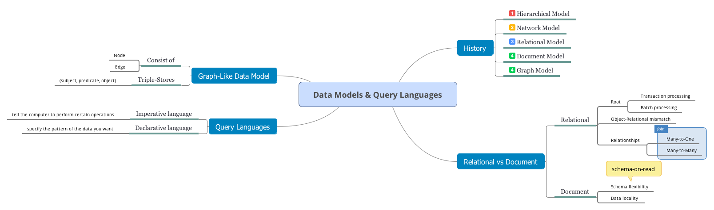

- [Relational Model Versus Document Model](#relational-model-versus-document-model)
  - [The Birth of NoSQL](#the-birth-of-nosql)
  - [The Object-Relational Mismatch](#the-object-relational-mismatch)
  - [Many-to-One and Many-to-Many Relationships](#many-to-one-and-many-to-many-relationships)
  - [Are Document Databases Repeating History?](#are-document-databases-repeating-history)
    - [The hierarchical model and the network model](#the-hierarchical-model-and-the-network-model)
    - [The relational model](#the-relational-model)
    - [Comparison to document databases](#comparison-to-document-databases)
  - [Relational Versus Document Databases Today](#relational-versus-document-databases-today)
    - [Which data model leads to simpler application code](#which-data-model-leads-to-simpler-application-code)
    - [Schema flexibility in the document model](#schema-flexibility-in-the-document-model)
    - [Data locality for queries](#data-locality-for-queries)
- [Query Languages for Data](#query-languages-for-data)
    - [MapReduce Querying](#mapreduce-querying)
- [Graph-Like Data Models](#graph-like-data-models)
  - [The Cypher Query Language](#the-cypher-query-language)
  - [Graph Queries in SQL](#graph-queries-in-sql)
  - [Triple-Stores and SPARQL](#triple-stores-and-sparql)
    - [The SPARQL query language](#the-sparql-query-language)
    - [Graph Databases Compared to the Network Model](#graph-databases-compared-to-the-network-model)
  - [The Foundation Datalog](#the-foundation-datalog)
- [Navigation](#navigation)

<!-- END doctoc generated TOC please keep comment here to allow auto update -->

Most applications are built by layering one data model on top of another. For each layer, the key question is: how is it represented in terms of the next-lower layer?

In a complex application there may be more intermediary levels, such as APIs built upon APIs, but the basic idea is still the same: each layer hides the complexity of the layers below it by providing a clean data model. These abstractions allow different groups of people — for example, the engineers at the database vendor and the application developers using their database — to work together effectively.

There are many different kinds of data models, and every data model embodies
assumptions about how it is going to be used. 

- Some kinds of usage are easy and some are not supported; 
- some operations are fast and some perform badly; 
- some data transformations feel natural and some are awkward.

# Relational Model Versus Document Model

The best-known data model today is probably that of SQL, based on the relational model: **data is organized into relations (called tables in SQL), where each relation is an unordered collection of tuples (rows in SQL)**.

The roots of relational databases lie in business data processing, which was performed on mainframe computers in the 1960s and '70s. The use cases appear mundane from today's perspective: 

- typically **transaction processing** (entering sales or banking transactions, airline reservations, stock-keeping in warehouses) and 
- **batch processing** (customer invoicing, payroll, reporting).

And remarkably, relational databases turned out to generalize very well, beyond their original scope of business data processing, to a broad variety of use cases.

## The Birth of NoSQL

There are several driving forces behind the adoption of NoSQL databases, including:

- A need for **greater scalability** than relational databases can easily achieve, including very large datasets or very high write throughput
- A widespread preference for **free and open source software** over commercial
database products
- Specialized query operations that are not well supported by the relational model
- Frustration with the **restrictiveness of relational schemas**, and a desire for a more dynamic and expressive data model.

## The Object-Relational Mismatch

Most application development today is done in object-oriented programming languages, which leads to a common criticism of the SQL data model: an awkward translation layer is required between the objects in the application code and the database model of tables, rows, and columns. The disconnect between the models is sometimes called an impedance mismatch.

Object-relational mapping (ORM) frameworks like ActiveRecord and Hibernate reduce the amount of boilerplate code required for this translation layer, but they can't completely hide the differences between the two models.

The JSON representation has better *locality* than the *multi-table schema*. If you want to fetch a profile in the relational example, you need to either
perform multiple queries (query each table by user_id) or perform a messy multiway join between the users table and its subordinate tables. In the JSON representation, all the relevant information is in one place, and one query is sufficient.

## Many-to-One and Many-to-Many Relationships

Whether you store an ID or a text string is a question of *duplication*. When you use an ID, the information that is meaningful to humans (such as the word Philanthropy) is stored in only one place, and everything that refers to it uses an ID (which only has meaning within the database). When you store the text directly, you are duplicating the human-meaningful information in every record that uses it.

Anything that is meaningful to humans may need to change sometime in the future—and if that information is duplicated, all the redundant copies need to be updated.

In relational databases, it's normal to refer to rows in other tables by ID, because joins are easy. In document databases, joins are not needed for one-to-many tree structures, and support for joins is often weak.

## Are Document Databases Repeating History?

### The hierarchical model and the network model

The CODASYL model was a generalization of the hierarchical model. In the tree structure of the hierarchical model, every record has exactly one parent; in the network model, a record could have multiple parents.

A query in CODASYL was performed by moving a cursor through the database by
iterating over lists of records and following access paths. If a record had multiple parents (i.e., multiple incoming pointers from other records), the application code had to keep track of all the various relationships.

With both the hierarchical and the network model, if you didn't have a path to the data you wanted, you were in a difficult situation. You could change the access paths, but then you had to go through a lot of handwritten database query code and rewrite it to handle the new access paths. It was difficult to make changes to an application's data model.

### The relational model

There are no labyrinthine nested structures, no complicated access paths to follow if you want to look at the data. You can read any or all of the rows in a table, selecting those that match an arbitrary condition. You can read a particular row by designating some columns as a key and matching on those. You can insert a new row into any table without worrying about foreign key relationships to and from other tables.

In a relational database, the *query optimizer* automatically decides which parts of the query to execute in which order, and which indexes to use. Those choices are effectively the "access path", but the big difference is that they are made automatically.

### Comparison to document databases

Document databases reverted back to the hierarchical model in one aspect: storing nested records (one-to-many relationships, like `positions`, `education`, and `contact_info`).

However, when it comes to representing many-to-one and many-to-many relationships, relational and document databases are not fundamentally different: in both cases, the related item is referenced by a *unique identifier*, which is called a foreign key in the relational model and a document reference in the document model. That identifier is resolved at read time by using a join or follow-up queries.

## Relational Versus Document Databases Today

The main arguments in favor of the document data model are *schema flexibility*, *better performance* due to locality, and that for some applications it is closer to the data structures used by the application. The relational model counters by providing *better support for joins*, and *many-to-one and many-to-many relationships*.

### Which data model leads to simpler application code

The relational technique of shredding — splitting a document-like structure into multiple tables can lead to cumbersome schemas and unnecessarily complicated application code.

The poor support for joins in document databases may or may not be a problem, depending on the application.

If your application does use many-to-many relationships, the document model becomes less appealing. It's possible to reduce the need for joins by denormalizing.

### Schema flexibility in the document model

No schema means that arbitrary keys and values can be added to a document, and when reading, clients have no guarantees as to what fields the documents may contain.

A more accurate term is *schema-on-read* (the structure of the data is implicit, and only interpreted when the data is read), in contrast with schema-on-write (the traditional approach of relational databases, where the schema is explicit and the database ensures all written data conforms to it).

Schema changes have a bad reputation of being slow and requiring downtime. This
reputation is not entirely deserved: most relational database systems execute the `ALTER TABLE` statement in a few milliseconds. MySQL is a notable exception — it copies the entire table on `ALTER TABLE`, which can mean minutes or even hours of downtime when altering a large table—although various tools exist to work around this limitation.

Running the `UPDATE` statement on a large table is likely to be slow on any database, since every row needs to be rewritten.

### Data locality for queries

A document is usually stored as a single continuous string, encoded as JSON, XML, or a binary variant thereof (such as MongoDB's BSON). If your application often needs to access the entire document (for example, to render it on a web page), there is a performance advantage to this storage locality.

It is generally recommended that you keep documents fairly small and avoid writes that increase the size of a document.

# Query Languages for Data

An **imperative language** tells the computer to perform certain operations in a certain order.

In a **declarative query language**, like SQL or relational algebra, you just specify the pattern of the data you want—what conditions the results must meet, and how you want the data to be transformed (e.g., sorted, grouped, and aggregated)—but not how to achieve that goal.

A declarative query language is attractive because it is typically more *concise and easier* to work with than an imperative API. But more importantly, it also *hides implementation details of the database engine*, which makes it possible for the database system to introduce performance improvements without requiring any changes to queries.

Finally, declarative languages often lend themselves to parallel execution.

### MapReduce Querying

The `map` and `reduce` functions are somewhat restricted in what they are allowed to do. They must be pure functions, which means they only use the data that is passed to them as input, they cannot perform additional database queries, and they must not have any side effects.

# Graph-Like Data Models

A graph consists of two kinds of objects: `vertices` (also known as nodes or entities) and `edges` (also known as relationships or arcs). Many kinds of data can be modeled as a graph.

You can think of a graph store as consisting of two relational tables, one for vertices and one for edges.

Some important aspects of this model are:

1. Any vertex can have an edge connecting it with any other vertex. There is no
schema that restricts which kinds of things can or cannot be associated.
2. Given any vertex, you can efficiently find both its incoming and its outgoing edges, and thus traverse the graph—i.e., follow a path through a chain of vertices — both forward and backward. 
3. By using different labels for different kinds of relationships, you can store several different kinds of information in a single graph, while still maintaining a clean data model.

## The Cypher Query Language

Cypher is a declarative query language for property graphs, created for the Neo4j graph database.

## Graph Queries in SQL

In a relational database, you usually know in advance which joins you need in your query. In a graph query, you may need to traverse a variable number of edges before you find the vertex you're looking for — that is, the number of joins is not fixed in advance.

Since SQL:1999, this idea of variable-length traversal paths in a query can be expressed using something called recursive common table expressions (the `WITH RECURSIVE` syntax).

## Triple-Stores and SPARQL

In a triple-store, all information is stored in the form of very simple three-part statements: `(subject, predicate, object)`. For example, in the triple `(Jim, likes, bananas)`, `Jim` is the subject, `likes` is the predicate (verb), and `bananas` is the object.

The subject of a triple is equivalent to a vertex in a graph. The object is one of two things:

1. A value in a primitive datatype, such as a string or a number. In that case, the predicate and object of the triple are equivalent to the key and value of a property on the subject vertex. For example, `(lucy, age, 33)` is like a vertex `lucy` with properties `{"age":33}`.
2. Another vertex in the graph. In that case, the predicate is an edge in the graph, the subject is the tail vertex, and the object is the head vertex. For example, in `(lucy, marriedTo, alain)` the subject and object `lucy` and `alain` are both vertices, and the predicate `marriedTo` is the label of the edge that connects them.

### The SPARQL query language

SPARQL is a query language for triple-stores using the RDF data model. It
predates Cypher, and since Cypher's pattern matching is borrowed from SPARQL, they look quite similar.

### Graph Databases Compared to the Network Model

At first glance, CODASYL's network model looks similar
to the graph model. They differ in several important ways:

- In CODASYL, a database had a schema that specified which record type could be nested within which other record type. In a graph database, there is no such
restriction: any vertex can have an edge to any other vertex. This gives much greater flexibility for applications to adapt to changing requirements.
- In CODASYL, the only way to reach a particular record was to traverse one of *the access paths* to it. In a graph database, you can refer directly to any vertex by its unique ID, or you can use an index to find vertices with a particular value.
- In CODASYL, the children of a record were an ordered set, so the database had to maintain that ordering (which had consequences for the storage layout) and applications that inserted new records into the database had to worry about the positions of the new records in these sets. In a graph database, *vertices and edges are not ordered* (you can only sort the results when making a query).
- In CODASYL, all queries were imperative, difficult to write and easily broken by changes in the schema. In a graph database, you can write your traversal in imperative code if you want to, but most graph databases also support high-level, *declarative query languages* such as Cypher or SPARQL.

## The Foundation Datalog

Datalog is a much older language than SPARQL or Cypher. It is less well known among software engineers, but it is nevertheless important, because it provides the foundation that later query languages build upon.

Datalog's data model is similar to the triple-store model, generalized a bit. Instead of writing a triple as `(subject, predicate, object)`, we write it as `predicate(subject, object)`.

# Navigation

[Table of Contents](README.md)

Prev: [1. Reliable, Scalable, and Maintainable Applications](ch1.md)

Next: [3. Storage and Retrieval](ch3.md) 
