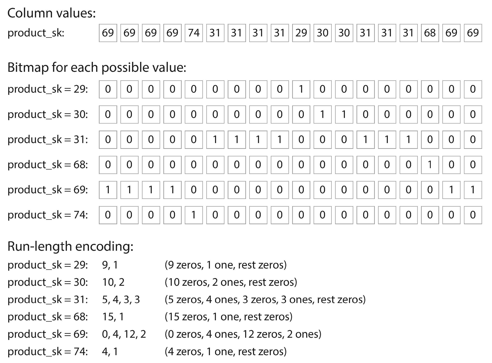

- [Data Structures That Power Your Database](#data-structures-that-power-your-database)
  - [Hash Indexes](#hash-indexes)
  - [SSTables and LSM-Trees](#sstables-and-lsm-trees)
    - [Constructing and maintaining SSTables](#constructing-and-maintaining-sstables)
    - [Making an LSM-tree out of SSTables](#making-an-lsm-tree-out-of-sstables)
    - [Performance optimizations](#performance-optimizations)
  - [B-Trees](#b-trees)
    - [Making B-trees reliable](#making-b-trees-reliable)
    - [B-tree optimizations](#b-tree-optimizations)
  - [Comparing B-Trees and LSM-Trees](#comparing-b-trees-and-lsm-trees)
    - [Advantages of LSM-trees](#advantages-of-lsm-trees)
    - [Downsides of LSM-Trees](#downsides-of-lsm-trees)
  - [Other Indexing Structures](#other-indexing-structures)
    - [Storing values within the index](#storing-values-within-the-index)
    - [Multi-column indexes](#multi-column-indexes)
    - [Full-text search and fuzzy indexes](#full-text-search-and-fuzzy-indexes)
    - [Keeping everything in memory](#keeping-everything-in-memory)
- [Transaction Processing or Analytics?](#transaction-processing-or-analytics)
  - [Data Warehousing](#data-warehousing)
    - [The divergence between OLTP databases and data warehouses](#the-divergence-between-oltp-databases-and-data-warehouses)
  - [Stars and Snowflakes: Schemas for Analytics](#stars-and-snowflakes-schemas-for-analytics)
- [Column-Oriented Storage](#column-oriented-storage)
  - [Column Compression](#column-compression)
  - [Sort Order in Column Storage](#sort-order-in-column-storage)
    - [Several different sort orders](#several-different-sort-orders)
  - [Writing to Column-Oriented Storage](#writing-to-column-oriented-storage)
  - [Aggregation: Data Cubes and Materialized Views](#aggregation-data-cubes-and-materialized-views)
- [Navigation](#navigation)

<!-- END doctoc generated TOC please keep comment here to allow auto update -->

# Data Structures That Power Your Database

In order to efficiently find the value for a particular key in the database, we need a different data structure: an *index*. In this chapter we will look at a range of indexing structures and see how they compare; the general idea behind them is to keep some additional metadata on the side, which acts as a signpost and helps you to locate the data you want. 

An index is an additional structure that is derived from the primary data. This is an important trade-off in storage systems: well-chosen indexes speed up read queries, but every index slows down writes.

## Hash Indexes

Key-value stores are quite similar to the dictionary type that you can find in most programming languages, and which is usually implemented as a hash map.

How do we avoid eventually running out of disk space? A good solution is to *break the log into segments of a certain size* by closing a segment file when it reaches a certain size, and making subsequent writes to a new segment file. We can then perform compaction on these segments.

Moreover, since compaction often makes segments much smaller (assuming that a key is overwritten several times on average within one segment), we can also *merge* several segments together at the same time as performing the compaction.

Each segment now has its own in-memory hash table, mapping keys to file offsets. In order to find the value for a key, we first check the most recent segment's hash map; if the key is not present we check the second-most-recent segment, and so on.

Lots of detail goes into making this simple idea work in practice. Briefly, some of the issues that are important in a real implementation are:

- File format
    CSV is not the best format for a log. It's faster and simpler to use a binary format that first encodes the length of a string in bytes, followed by the raw string.
- Deleting records
    If you want to delete a key and its associated value, you have to append a special deletion record to the data file (sometimes called a tombstone). When log segments are merged, the tombstone tells the merging process to discard any previous values for the deleted key.
- Crash recovery
    If the database is restarted, the in-memory hash maps are lost. In principle, you can restore each segment's hash map by reading the entire segment file from beginning to end and noting the offset of the most recent value for every key as you go along. Bitcask speeds up recovery by storing a snapshot of each segment's hash map on disk, which can be loaded into memory more quickly.
- Partially written records
    The database may crash at any time, including halfway through appending a record to the log. Bitcask files include checksums, allowing such corrupted parts of the log to be detected and ignored.
- Concurrency control
    As writes are appended to the log in a strictly sequential order, a common implementation choice is to have *only one writer thread*. Data file segments are append-only and otherwise immutable, so they can be read concurrently by multiple threads.

An append-only design turns out to be good for several reasons:

- Appending and segment *merging are sequential write operations*, which are generally much faster than random writes, especially on magnetic spinning-disk
  hard drives
- **Concurrency and crash recovery** are much simpler if segment files are appendonly or immutable. 
- Merging old segments avoids the problem of data files getting fragmented over time.

However, the hash table index also has limitations:

- The hash table must fit *in memory*. In principle, it is difficult to make an on-disk hash map perform well, which requires a lot of random access I/O.
- *Range queries* are not efficient.

## SSTables and LSM-Trees

Now we can make a simple change to the format of our segment files: we require that *the sequence of key-value pairs is sorted by key*.  We call this format Sorted String Table, or SSTable for short. We also require that *each key only appears once within each merged segment file* (the compaction process
already ensures that). SSTables have several big advantages over log segments with hash indexes:

1. Merging segments is simple and efficient, even if the files are bigger than the available memory.

2. In order to find a particular key in the file, you no longer need to keep an index of all the keys in memory. For an example: say you're looking for
  the key handiwork, but you don't know the exact offset of that key in the segment file. However, you do know the offsets for the keys handbag and handsome, and because of the sorting you know that handiwork must appear between those two.

3. Since read requests need to scan over several key-value pairs in the requested range anyway, it is possible to group those records into a block and compress it before writing it to disk.

### Constructing and maintaining SSTables

We can now make our storage engine work as follows:

- When a write comes in, add it to an in-memory balanced tree data structure. This in-memory tree is sometimes called a memtable.
- When the memtable gets bigger than some threshold—typically a few megabytes, write it out to disk as an SSTable file. This can be done efficiently because the tree already maintains the key-value pairs sorted by key. The new SSTable file becomes the most recent segment of the database. While the SSTable is being written out to disk, writes can continue to a new memtable instance.
- In order to serve a read request, first try to find the key in the memtable, then in the most recent on-disk segment, then in the next-older segment, etc.
- From time to time, run a merging and compaction process in the background to combine segment files and to discard overwritten or deleted values.

We can keep a separate log on disk to which every write is immediately appended for the database may crashes. Every time the memtable is written out to an SSTable, the corresponding log can be discarded.

### Making an LSM-tree out of SSTables

Storage engines that are based on this principle of *merging and compacting sorted files* are often called LSM storage engines.

Lucene, an indexing engine for full-text search, uses a similar method for storing its *term dictionary*. In Lucene, this mapping from term to postings list is kept in SSTable-like sorted files, which are merged in the background as needed.

### Performance optimizations

The LSM-tree algorithm can be slow when looking up keys that do not exist in the database: you have to check the memtable, then the segments all the way back to the oldest (possibly having to read from disk for each one) before you can be sure that the key does not exist. In order to optimize this kind of access, storage engines often use additional Bloom filters. 

A Bloom filter is a memory-efficient data structure for approximating the contents of a set. It can tell you if a key does not appear in the database, and thus saves many unnecessary disk reads for nonexistent keys.

There are also different strategies to determine the order and timing of how SSTables are compacted and merged. The most common options are *size-tiered* and *leveled*

- In size-tiered compaction, newer and smaller SSTables are successively merged into older and larger SSTables. 
- In leveled compaction, the key range is split up into smaller SSTables and
  older data is moved into separate "levels", which allows the compaction to proceed more incrementally and use less disk space.

## B-Trees

Like SSTables, B-trees keep *key-value pairs sorted by key*, which allows efficient key-value lookups and range queries. But B-trees have a very different design philosophy.

The log-structured indexes we saw earlier *break the database down into variable-size segments*, typically several megabytes or more in size, and always write a segment sequentially. By contrast, B-trees *break the database down into fixed-size blocks or pages*, traditionally 4 KB in size (sometimes bigger), and read or write one page at a time. This design corresponds m*ore closely to the underlying hardware*, as disks are
also arranged in fixed-size blocks.

Each page can be identified using an address or location, which allows one page to refer to another—similar to a pointer, but on disk instead of in memory.

The number of references to child pages in one page of the B-tree is called the branching factor. In practice, the branching factor depends on the amount of space required to store the page references and the range boundaries, but typically it is several hundred.

If you want to update the value for an existing key in a B-tree, you search for the leaf page containing that key, change the value in that page, and write the page back to disk (any references to that page remain valid). 

If you want to add a new key, you need to find the page whose range encompasses the new key and add it to that page.

If there isn't enough free space in the page to accommodate the new key, it is split into two half-full pages, and the parent page is updated to account for the new subdivision of key ranges.

### Making B-trees reliable

The basic underlying write operation of a B-tree is to overwrite a page on disk with new data. It is assumed that the overwrite does not change the location of the page; i.e., all references to that page remain intact when the page is overwritten. This is in stark contrast to log-structured indexes such as LSM-trees, which only append to files (and eventually delete obsolete files) but never modify files in place.

In order to make the database resilient to crashes, it is common for B-tree implementations to include an additional data structure on disk: a *write-ahead log* (WAL, also known as a redo log). This is an append-only file to which every B-tree modification must be written before it can be applied to the pages of the tree itself.

### B-tree optimizations

- Instead of overwriting pages and maintaining a WAL for crash recovery, some databases use a copy-on-write scheme. A modified page is written to a different location, and a new version of the parent pages in the tree is created, pointing at the new location.
- We can save space in pages by not storing the entire key, but abbreviating it.
- Many B-tree implementations try to lay out the tree so that *leaf pages appear in sequential order* on disk. However, it's difficult to maintain that order as the tree grows.
- Additional pointers have been added to the tree. For example, each leaf page may have *references to its sibling pages* to the left and right, which allows scanning keys in order without jumping back to parent pages.

## Comparing B-Trees and LSM-Trees

LSM-trees are typically faster for writes, whereas B-trees are thought to be faster for reads. Reads are typically slower on LSM-trees because they have to check several different data structures and SSTables at different stages of compaction.

### Advantages of LSM-trees

A B-tree index must write every piece of data at least twice: once to the write-ahead log, and once to the tree page itself (and perhaps again as pages are split). There is also overhead from having to write an entire page at a time, even if only a few bytes in that page changed.

Log-structured indexes also rewrite data multiple times due to repeated compaction and merging of SSTables. This effect—one write to the database resulting in multiple writes to the disk over the course of the database's lifetime—is known as write amplification. It is of particular concern on SSDs, which can only overwrite blocks a limited number of times before wearing out.

In write-heavy applications, the performance bottleneck might be the rate at which the database can write to disk.

Moreover, LSM-trees are typically able to sustain higher write throughput than B-trees, partly because they sometimes have lower write amplification (although this depends on the storage engine configuration and workload), and partly because they sequentially write compact SSTable files rather than having to overwrite several pages in the tree.

LSM-trees can be compressed better, and thus often produce smaller files on disk than B-trees. B-tree storage engines leave some disk space unused due to fragmentation.

### Downsides of LSM-Trees

A downside of log-structured storage is that the compaction process can sometimes interfere with the performance of ongoing reads and writes. B-trees can be more predictable.

Another issue with compaction arises at high write throughput: the disk's finite *write bandwidth needs to be shared between the initial write* (logging and flushing a memtable to disk) and the compaction threads running in the background.

An advantage of B-trees is that *each key exists in exactly one place in the index*, whereas a log-structured storage engine may have multiple copies of the same key in different segments. This aspect makes B-trees attractive in databases that want to offer strong transactional semantics.

## Other Indexing Structures

A secondary index can easily be constructed from a key-value index. The main difference is that keys are not unique; i.e., there might be many rows (documents, vertices) with the same key. Either way, both B-trees and log-structured indexes can be used as secondary indexes.

### Storing values within the index

The key in an index is the thing that queries search for, but the value can be one of two things: it could be the actual row (document, vertex) in question, or it could be a reference to the row stored elsewhere. In the latter case, the place where rows are stored is known as a *heap file*, and it stores data in no particular order (it may be append-only, or it may keep track of deleted rows in order to overwrite them with new data later).

The extra hop from the index to the heap file is too much of a performance penalty for reads, so it can be desirable to store the indexed row directly
within an index. This is known as a clustered index.

A compromise between a clustered index (storing all row data within the index) and a nonclustered index (storing only references to the data within the index) is known as a covering index or index with included columns, which stores some of a table's columns within the index.

### Multi-column indexes

The most common type of multi-column index is called a concatenated index, which simply combines several fields into one key by appending one column to another (the index definition specifies in which order the fields are concatenated).

Multi-dimensional indexes are a more general way of querying several columns at once, which is particularly important for geospatial data.

### Full-text search and fuzzy indexes

Lucene uses a SSTable-like structure for its term dictionary. This structure requires a small in-memory index that tells queries at which offset in the sorted file they need to look for a key. In Lucene, the in-memory index is a finite state automaton over the characters in the keys, similar to a *trie*. This automaton can be transformed into a *Levenshtein automaton*, which supports efficient search for words within a given edit distance.

### Keeping everything in memory

When an in-memory database is restarted, it needs to reload its state, either from disk or over the network from a replica (unless special hardware is used). Despite writing to disk, it's still an in-memory database, because the disk is merely used as an append-only log for durability, and reads are served entirely from memory. Writing to disk also has operational advantages: files on disk can easily be backed up, inspected, and analyzed by external utilities.

Besides performance, another interesting area for in-memory databases is providing *data models* that are difficult to implement with disk-based indexes.

The so-called *anti-caching* approach works by evicting the least recently used data from memory to disk when there is not enough memory, and loading it back into memory when it is accessed again in the future.

# Transaction Processing or Analytics?

| Property             | Transaction processing systems (OLTP)    | Analytic systems (OLAP)                  |
| -------------------- | ---------------------------------------- | ---------------------------------------- |
| Main read pattern    | Small number of records per query, fetched by key | Aggregate over large number of records   |
| Main write pattern   | Random-access, low-latency writes from user input | Bulk import (ETL) or event stream        |
| Primarily used by    | End user/customer, via web application   | Internal analyst, for decision support   |
| What data represents | Latest state of data (current point in time) | History of events that happened over time |
| Dataset size         | Gigabytes to terabytes                   | Terabytes to petabytes                   |

SQL turned out to be quite flexible in this regard: it works well for OLTP-type queries as well as OLAP-type queries.

## Data Warehousing

These OLTP systems are usually expected to be highly available and to process transactions with low latency, since they are often critical to the operation of the business.

A data warehouse, by contrast, is a separate database that analysts can query to their hearts' content, without affecting OLTP operations.

A big advantage of using a separate data warehouse, rather than querying OLTP systems directly for analytics, is that the data warehouse can be optimized for analytic access patterns.

### The divergence between OLTP databases and data warehouses

The data model of a data warehouse is most commonly relational, because SQL is generally a good fit for analytic queries.

## Stars and Snowflakes: Schemas for Analytics

Many data warehouses are used in a fairly formulaic style, known as a star schema (also known as dimensional modeling)

The name "star schema" comes from the fact that when the table relationships are visualized, the fact table is in the middle, surrounded by its dimension tables; the connections to these tables are like the rays of a star.

A variation of this template is known as the snowflake schema, where dimensions are further broken down into subdimensions.

# Column-Oriented Storage

In most OLTP databases, storage is laid out in a row-oriented fashion: all the values from one row of a table are stored next to each other.

The idea behind column-oriented storage is simple: don't store all the values from one row together, but store all the values from each column together instead. If each column is stored in a separate file, a query only needs to read and parse those columns that are used in that query, which can save a lot of work.

## Column Compression

Column-oriented storage often lends itself very well to compression. One technique that is particularly effective in data warehouses is bitmap encoding.

> Within each column family, they store all columns from a row together, along with a row key, and they do not use column compression. Thus, the Bigtable model is still mostly row-oriented.

Column-oriented storage layouts are also good for making efficient use of CPU cycles. For example, the query engine can take a chunk of compressed column data that fits comfortably in the CPU's L1 cache and iterate through it in a tight loop (that is, with no function calls).

## Sort Order in Column Storage

In a column store, it doesn't necessarily matter in which order the rows are stored. However, we can choose to impose an order, like we did with SSTables previously, and use that as an indexing mechanism.

We can only reconstruct a row because we know that the kth item in one column belongs to the same row as the kth item in another column.

Another advantage of sorted order is that it can help with compression of columns. A simple run-length encoding, like bitmap, could compress that column down to a few kilobytes—even if the table has billions of rows.

### Several different sort orders

Having multiple sort orders in a column-oriented store is a bit similar to having multiple secondary indexes in a row-oriented store. But the big difference is that the row-oriented store keeps every row in one place (in the heap file or a clustered index), and secondary indexes just contain pointers to the matching rows. In a column store, there normally aren't any pointers to data elsewhere, *only columns containing values*.

## Writing to Column-Oriented Storage

An update-in-place approach, like B-trees use, is not possible with compressed columns. If you wanted to insert a row in the middle of a sorted table, you would most likely have to rewrite all the column files. As rows are identified by their position within a column, the insertion has to update all columns consistently.

Fortunately, we have already seen a good solution: LSM-trees. All writes first go to an in-memory store, where they are added to a sorted structure and prepared for writing to disk. It doesn't matter whether the in-memory store is row-oriented or column-oriented. When enough writes have accumulated, they are
merged with the column files on disk and written to new files in bulk. 

Queries need to examine both the column data on disk and the recent writes in memory, and combine the two. However, the query optimizer hides this distinction from the user. From an analyst's point of view, data that has been modified with inserts, updates, or deletes is immediately reflected in subsequent queries.

## Aggregation: Data Cubes and Materialized Views

Columnar storage can be significantly faster for ad hoc analytical queries, so it is rapidly gaining popularity.

Another aspect of data warehouses that is worth mentioning briefly is materialized aggregates. If the same aggregates are used by many different queries, it can be wasteful to crunch through the raw data every time.

One way of creating such a cache is a materialized view. In a relational data model, it is often defined like a standard (virtual) view: a table-like object whose contents are the results of some query. 

# Navigation

[Table of Contents](README.md)

Prev: [2. Data Models and Query Languages](ch2.md)

Next: [4. Encoding and Evolution](ch4.md)
