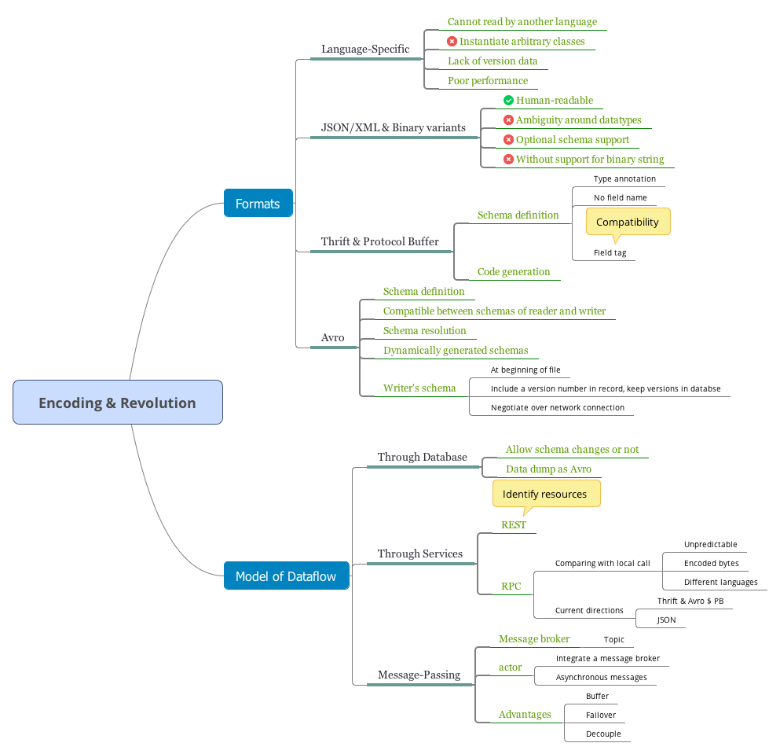
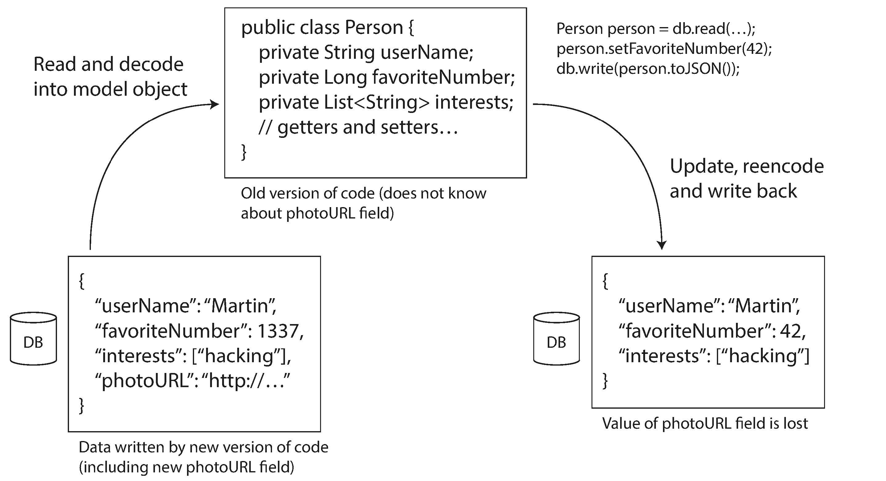

- [Formats for Encoding Data](#formats-for-encoding-data)
  - [Language-Specific Formats](#language-specific-formats)
  - [JSON, XML, and Binary Variants](#json-xml-and-binary-variants)
    - [Binary encoding](#binary-encoding)
  - [Thrift and Protocol Buffers](#thrift-and-protocol-buffers)
    - [Field tags and schema evolution](#field-tags-and-schema-evolution)
    - [Datatypes and schema evolution](#datatypes-and-schema-evolution)
  - [Avro](#avro)
    - [The writer's schema and the reader's schema](#the-writers-schema-and-the-readers-schema)
    - [Schema evolution rules](#schema-evolution-rules)
    - [But what is the writer's schema?](#but-what-is-the-writers-schema)
    - [Dynamically generated schemas](#dynamically-generated-schemas)
    - [Code generation and dynamically typed languages](#code-generation-and-dynamically-typed-languages)
  - [The Merits of Schemas](#the-merits-of-schemas)
- [Models of Dataflow](#models-of-dataflow)
  - [Dataflow Through Databases](#dataflow-through-databases)
    - [Different values written at different times](#different-values-written-at-different-times)
    - [Archival storage](#archival-storage)
  - [Dataflow Through Services: REST and RPC](#dataflow-through-services-rest-and-rpc)
    - [The problems with remote procedure calls (RPCs)](#the-problems-with-remote-procedure-calls-rpcs)
    - [Current directions for RPC](#current-directions-for-rpc)
    - [Data encoding and evolution for RPC](#data-encoding-and-evolution-for-rpc)
  - [Message-Passing Dataflow](#message-passing-dataflow)
    - [Message brokers](#message-brokers)
    - [Distributed actor frameworks](#distributed-actor-frameworks)
- [Navigation](#navigation)

<!-- END doctoc generated TOC please keep comment here to allow auto update -->

In most cases, a change to an application's features also requires a change to data that it stores: perhaps a new field or record type needs to be captured, or perhaps existing data needs to be presented in a new way.

Relational databases generally assume that all data in the database conforms
to one schema: although that schema can be changed (through schema migrations; i.e., `ALTER` statements), there is exactly one schema in force at any one point in time.

By contrast, schema-on-read ("schemaless") databases don't enforce a schema, so the database can contain a mixture of older and newer data formats written at different times.

When a data format or schema changes, a corresponding change to application code often needs to happen. However, in a large application, code changes often cannot happen instantaneously.

In order for the system to continue running smoothly, we need to maintain compatibility in both directions:

- Backward compatibility
    Newer code can read data that was written by older code.
- Forward compatibility 
    Older code can read data that was written by newer code.

# Formats for Encoding Data

Programs usually work with data in (at least) two different representations:

1. In memory, data is kept in objects, structs, lists, arrays, hash tables, trees, and so on.
2. When you want to write data to a file or send it over the network, you have to encode it as some kind of self-contained sequence of bytes (for example, a JSON document). 

The translation from the in-memory representation to a byte sequence is called *encoding* (also known as *serialization* or *marshalling*), and the reverse is called *decoding* (*parsing*, *deserialization*, *unmarshalling*).

## Language-Specific Formats

Many programming languages come with built-in support for encoding in-memory objects into byte sequences. For example, Java has `java.io.Serializable`, Python has `pickle`.

These encoding libraries have a number of deep problems:

- The encoding is often tied to a particular programming language, and reading
the data in another language is very difficult. 
- In order to restore data in the same object types, the decoding process needs to be able to instantiate arbitrary classes. This is frequently a source of security problems.
- Versioning data is often an afterthought in these libraries.
- Efficiency is also often an afterthought. For example, Java's built-in serialization is notorious for its bad performance and bloated encoding.

## JSON, XML, and Binary Variants

XML is often criticized for being too verbose and unnecessarily complicated. JSON's popularity is mainly due to its built-in support in web browsers.

JSON, XML and CSV are textual formats, and human-readable. They also have some subtle problems:

- There is a lot of ambiguity around the encoding of numbers. In XML and CSV, you cannot **distinguish between a number and a string** that happens to consist of digits.
- JSON and XML have good support for Unicode character strings, but they don't support **binary strings** (sequences of bytes without a character encoding).
- There is optional **schema support** for both XML and JSON. These schema languages are quite powerful, and thus quite complicated to learn and implement. CSV does not have any schema.

### Binary encoding

A profusion of binary encodings for JSON (MessagePack, BSON, BJSON, UBJSON, BISON, and Smile) and for XML (WBXML and Fast Infoset) extend the set of datatypes, but does not prescribe a schema.

## Thrift and Protocol Buffers

Apache Thrift and Protocol Buffers (protobuf) are binary encoding libraries that are based on the same principle. Both Thrift and Protocol Buffers require a schema for any data that is encoded.

Thrift and Protocol Buffers each come with a code generation tool that takes a schema definition like the ones shown here, and produces classes that implement the schema in various programming languages.

In Thrift, each field has a type annotation (to indicate whether it is a
string, integer, list, etc.) and, where required, a length indication (length of a string,
number of items in a list). The strings that appear in the data are also encoded as ASCII (or rather, UTF-8). 

The big difference compared to JSON is that there are no field names (`userName`, `favoriteNumber`, `interests`). Instead, the encoded data contains *field tags*, which are numbers (1, 2, and 3). Those are the numbers that appear in the schema definition.

Each field was marked either required or optional, but this makes no difference to how the field is encoded (nothing in the binary data indicates whether a field was required). The difference is simply that required enables a *runtime check* that fails if the field is not set, which can be useful for catching bugs.

### Field tags and schema evolution

An encoded record is just the concatenation of its encoded fields. Each field is identified by its tag number (the numbers 1, 2, 3) and annotated with a datatype (e.g., string or integer). If a field value is not set, it is simply omitted from the encoded record.

You can change the name of a field in the schema, since the encoded data never refers to field names, but you cannot change a field's tag, since that would make all existing encoded data invalid.

**Forward Compatibility**

You can add new fields to the schema, provided that you give each field a new tag number. If old code tries to read data written by new code, including a new field with a tag number it doesn't recognize, it can simply ignore that field. The datatype annotation allows the parser to determine how many bytes it needs to skip. 

**Backward Compatibility**

As long as each field has a unique tag number, new code can always read old data, because the tag numbers still have the same meaning. The only detail is that if you add a new field, you cannot make it required.

Removing a field is just like adding a field, with backward and forward compatibility concerns reversed.

### Datatypes and schema evolution

Changing the data type of a field is possible, but there is a risk that values will lose precision or get truncated.

Protocol Buffer does not have a list or array datatype, but instead has a `repeated` marker for fields.

## Avro

Avro also uses a schema to specify the structure of the data being encoded. It has two schema languages: one (Avro IDL) intended for human editing, and one (based on JSON) that is more easily machine-readable.

To parse the binary data, you go through the fields in the order that they appear in the schema and use the schema to tell you the datatype of each field. This means that the binary data can only be decoded correctly if the code reading the data is using the exact same schema as the code that wrote the data. Any mismatch in the schema between the reader and the writer would mean incorrectly decoded data.

### The writer's schema and the reader's schema

The key idea with Avro is that the writer's schema and the reader's schema don't have to be the same—they only need to be compatible. When data is decoded (read), the Avro library resolves the differences by looking at the writer's schema and the reader's schema side by side and translating the data from the writer's schema into the reader's schema.

It's no problem if the writer's schema and the reader's schema have their fields in a different order, because the schema resolution matches up the fields by field name.

### Schema evolution rules

To maintain compatibility, you may only add or remove a field that has a default value.

If you were to add a field that has no default value, new readers wouldn't be able to read data written by old writers, so you would break backward compatibility. If you were to remove a field that has no default value, old readers wouldn't be able to read data written by new writers, so you would break forward compatibility.

Changing the datatype of a field is possible, provided that Avro can convert the type. Changing the name of a field is possible but a little tricky: the reader's schema can contain aliases for field names, so it can match an old writer's schema field names against the aliases. This means that changing a field name is backward compatible but not forward compatible.

### But what is the writer's schema?

How does the reader know the writer's schema with which a particular piece of data was encoded?

- Large file with lots of records
    The writer of that file can just include the writer's schema once at the beginning of the file. Avro specifies a file format (object container files) to do this.
- Database with individually written records
    The simplest solution is to include a version number at the beginning of every encoded record, and to keep a list of schema versions in your database.
- Sending records over a network connection
    When two processes are communicating over a bidirectional network connection, they can negotiate the schema version on connection setup and then use that schema for the lifetime of the connection.

### Dynamically generated schemas

One advantage of Avro's approach, compared to Protocol Buffers and Thrift, is that the schema doesn't contain any tag numbers. The difference is that Avro is friendlier to dynamically generated schemas.

By contrast, if you were using Thrift or Protocol Buffers for this purpose, the field tags would likely have to be assigned by hand: every time the database schema changes, an administrator would have to manually update the mapping from database column names to field tags.

### Code generation and dynamically typed languages

Thrift and Protocol Buffers rely on code generation: after a schema has been defined, you can generate code that implements this schema in a programming language of your choice. Code generation is often frowned upon in dynamic languages, since they otherwise avoid an explicit compilation step. 
    
Avro provides optional code generation for statically typed programming languages, but it can be used just as well without any code generation.

## The Merits of Schemas

Binary encodings based on schemas are a viable option:

- They can be much more *compact* since they omit field names.
- The schema is a valuable form of *documentation*.
- For statically typed languages, the ability to generate code from schema is useful, enabling *type checking* at compile time.

# Models of Dataflow

## Dataflow Through Databases

In an environment where the application is changing, it is likely that some processes accessing the database will be running newer code and some will be running older code.

### Different values written at different times

When you deploy a new version of your application (of a server-side application, at least), you may entirely replace the old version with the new version within a few minutes. The same is not true of database contents: the five-year-old data will still be there, in the original encoding, unless you have explicitly rewritten it since then. This observation is sometimes summed up as data outlives code.

Rewriting (migrating) data into a new schema is certainly possible, but it's an expensive thing to do on a large dataset, so most databases avoid it if possible. Most relational databases allow simple schema changes, such as adding a new column with a null default value, without rewriting existing data.

### Archival storage

As the data dump is written in one go and is thereafter immutable, formats like Avro object container files are a good fit. This is also a good opportunity to encode the data in an analytics-friendly column-oriented format such as Parquet.

## Dataflow Through Services: REST and RPC

A server can itself be a client to another service. This approach is often used to decompose a large application into smaller services by area of functionality, such that one service makes a request to another when it requires some functionality or data from that other service. This way of building applications has traditionally been called a *service-oriented architecture* (SOA), more recently refined and rebranded as *microservices*
architecture.

REST is not a protocol, but rather a design philosophy that builds upon the principles of HTTP. It emphasizes simple data formats, *using URLs for identifying resources* and *using HTTP features for cache control, authentication, and content type negotiation*. An API designed according to the principles of REST is called RESTful.

SOAP is an XML-based protocol for making network API requests.

### The problems with remote procedure calls (RPCs)

The RPC model tries to make a request to a remote network service look the same as calling a function or method in your programming language, within the same process (this abstraction is called location transparency).

A network request is very different from a local function call:

- A local function call is predictable and either succeeds or fails, depending only on parameters that are under your control. A network request is unpredictable.
- When you call a local function, you can efficiently pass it references (pointers) to objects in local memory. When you make a network request, all those parameters need to be encoded into a sequence of bytes.
- The client and the service may be implemented in different programming languages, so the RPC framework must translate datatypes from one language into another.

### Current directions for RPC

Thrift and Avro come with RPC support included, gRPC is an RPC implementation using Protocol Buffers, Finagle also uses Thrift, and Rest.li uses JSON over HTTP.

Custom RPC protocols with a binary encoding format can achieve better performance than something generic like JSON over REST. However, a RESTful API has other significant advantages: it is good for experimentation and debugging.

REST seems to be the predominant style for public APIs. The main focus of RPC frameworks is on requests between services owned by the same organization, typically within the same datacenter.

### Data encoding and evolution for RPC

The backward and forward compatibility properties of an RPC scheme are inherited from whatever encoding it uses:

- Thrift, gRPC (Protocol Buffers), and Avro RPC can be evolved according to the
compatibility rules of the respective encoding format.
- In SOAP, requests and responses are specified with XML schemas. These can be
evolved, but there are some subtle pitfalls.
- RESTful APIs most commonly use JSON (without a formally specified schema)
for responses, and JSON or URI-encoded/form-encoded request parameters for
requests. Adding *optional request parameters and adding new fields to response objects* are usually considered changes that maintain compatibility.

For RESTful APIs, common approaches are to use *a version number in the URL or in the HTTP Accept header*. For services that use API keys to identify a particular client, another option is to *store a client's requested API version on the server and to allow this version selection to be updated through a separate administrative interface*.

## Message-Passing Dataflow

Asynchronous message-passing systems are similar to databases in that the message is not sent via a direct network connection, but goes via an intermediary called a message broker (also called a message queue or message-oriented middleware), which stores the message temporarily.

Using a message broker has several advantages compared to direct RPC:

- It can act as a *buffer* if the recipient is unavailable or overloaded, and thus improve system reliability.
- It can automatically redeliver messages to a process that has crashed, and thus prevent messages from being lost.
- It allows one message to be sent to several recipients.
- It logically *decouples the sender from the recipient*.

### Message brokers

Message brokers are used as follows: one process sends a message to a named queue or topic, and the broker ensures that the message is delivered to one or more consumers of or subscribers to that queue or topic. There can be many producers and many consumers on the same topic.

Message brokers typically don't enforce any particular data model—a message is just a sequence of bytes with some metadata, so you can use any encoding format.

### Distributed actor frameworks

The actor model is a programming model for concurrency in a single process. Rather than dealing directly with threads (and the associated problems of race conditions, locking, and deadlock), logic is encapsulated in actors. Each actor typically represents one client or entity, it may have some local state (which is not shared with any other actor), and it communicates with other actors by sending and receiving *asynchronous messages*.

A distributed actor framework essentially *integrates a message broker and the actor programming model into a single framework*. However, if you want to perform rolling upgrades of your actor-based application, you still have to worry about forward and backward compatibility, as messages may be sent from a node running the new version to a node running the old version, and vice versa.

# Navigation

[Table of Contents](README.md)

Prev: [3. Storage and Retrieval](ch3.md) 

Next: [5. Replication](ch5.md)
