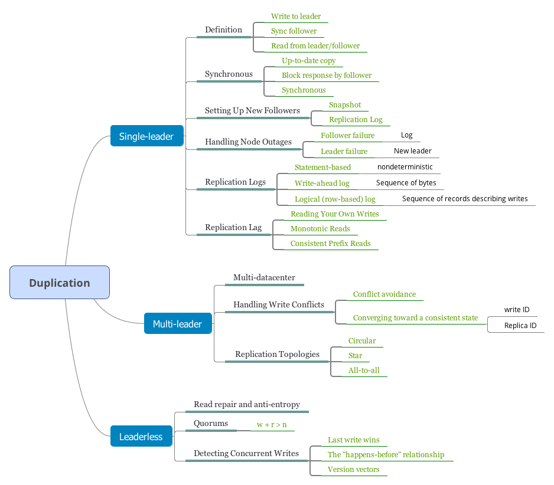
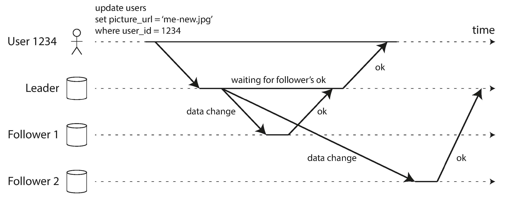
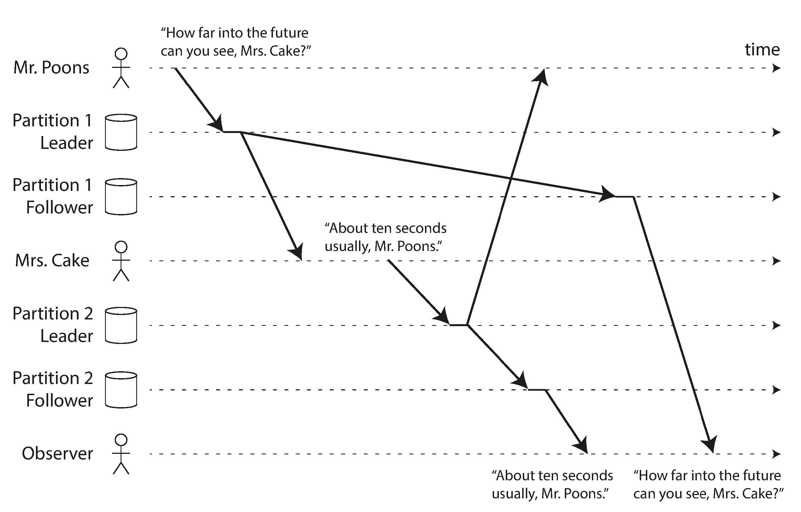
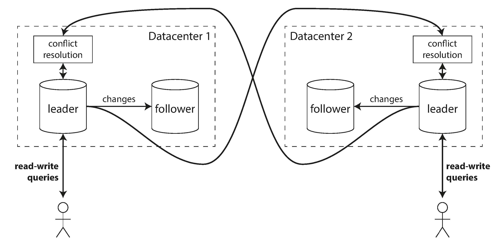
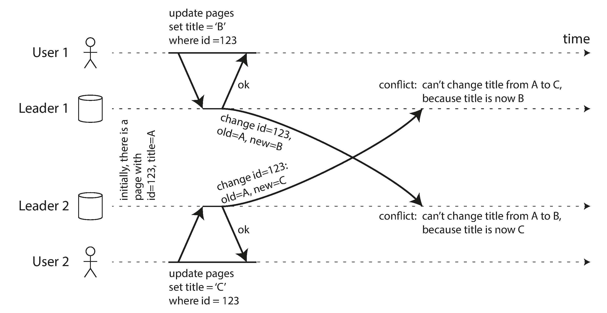
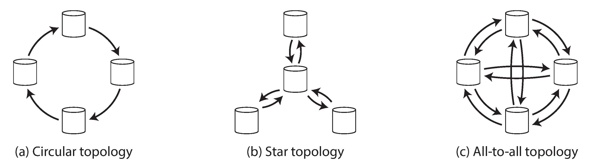
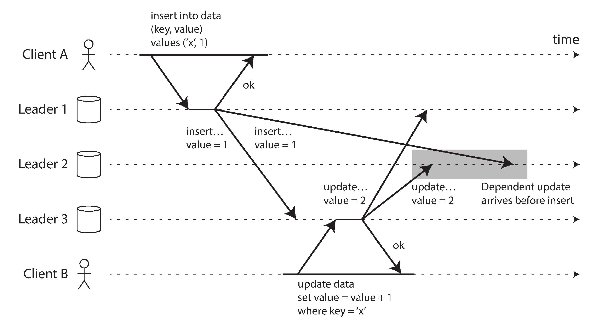
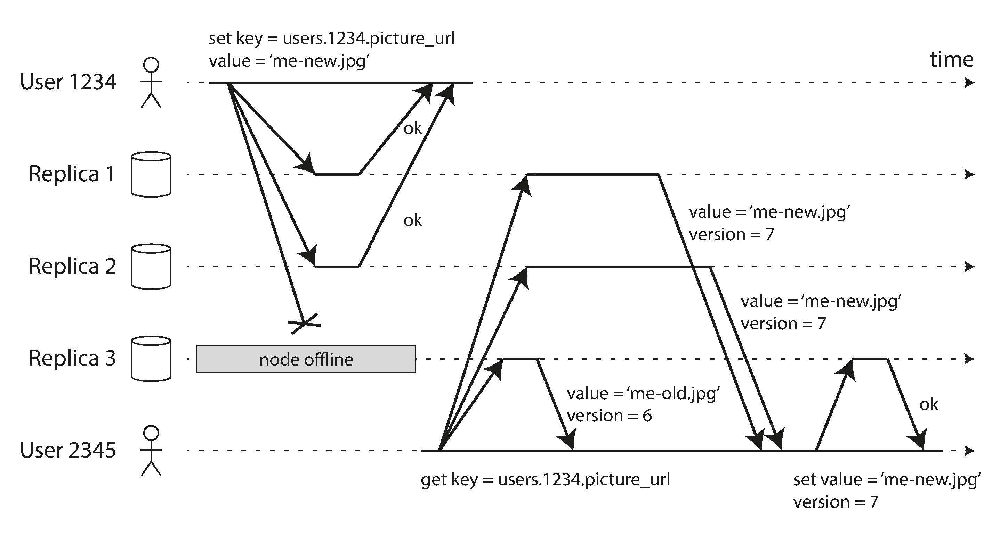
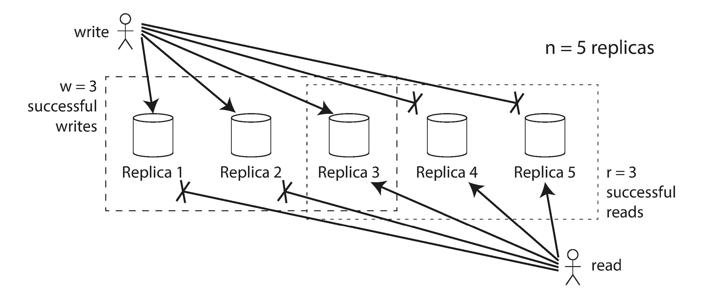

- [Leaders and Followers](#leaders-and-followers)
  - [Synchronous Versus Asynchronous Replication](#synchronous-versus-asynchronous-replication)
  - [Setting Up New Followers](#setting-up-new-followers)
  - [Handling Node Outages](#handling-node-outages)
    - [Follower failure: Catch-up recovery](#follower-failure-catch-up-recovery)
    - [Leader failure: Failover](#leader-failure-failover)
  - [Implementation of Replication Logs](#implementation-of-replication-logs)
    - [Statement-based replication](#statement-based-replication)
    - [Write-ahead log (WAL) shipping](#write-ahead-log-wal-shipping)
    - [Logical (row-based) log replication](#logical-row-based-log-replication)
    - [Trigger-based replication](#trigger-based-replication)
- [Problems with Replication Lag](#problems-with-replication-lag)
  - [Reading Your Own Writes](#reading-your-own-writes)
  - [Monotonic Reads](#monotonic-reads)
  - [Consistent Prefix Reads](#consistent-prefix-reads)
  - [Solutions for Replication Lag](#solutions-for-replication-lag)
- [Multi-Leader Replication](#multi-leader-replication)
  - [Use Cases for Multi-Leader Replication](#use-cases-for-multi-leader-replication)
  - [Multi-datacenter operation](#multi-datacenter-operation)
    - [Client with offline operation](#client-with-offline-operation)
  - [Handling Write Conflicts](#handling-write-conflicts)
    - [Synchronous versus asynchronous conflict detection](#synchronous-versus-asynchronous-conflict-detection)
    - [Conflict avoidance](#conflict-avoidance)
    - [Converging toward a consistent state](#converging-toward-a-consistent-state)
    - [Custom conflict resolution logic](#custom-conflict-resolution-logic)
  - [Multi-Leader Replication Topologies](#multi-leader-replication-topologies)
- [Leaderless Replication](#leaderless-replication)
  - [Writing to the Database When a Node Is Down](#writing-to-the-database-when-a-node-is-down)
    - [Read repair and anti-entropy](#read-repair-and-anti-entropy)
    - [Quorums for reading and writing](#quorums-for-reading-and-writing)
  - [Limitations of Quorum Consistency](#limitations-of-quorum-consistency)
    - [Monitoring staleness](#monitoring-staleness)
  - [Sloppy Quorums and Hinted Handoff](#sloppy-quorums-and-hinted-handoff)
    - [Multi-datacenter operation](#multi-datacenter-operation-1)
  - [Detecting Concurrent Writes](#detecting-concurrent-writes)
    - [Last write wins (discarding concurrent writes)](#last-write-wins-discarding-concurrent-writes)
    - [The "happens-before" relationship and concurrency](#the-happens-before-relationship-and-concurrency)
    - [Version vectors](#version-vectors)
- [Navigation](#navigation)

<!-- END doctoc generated TOC please keep comment here to allow auto update -->

Replication means keeping a copy of the same data on multiple machines that are
connected via a network. There are several reasons why you might want to replicate data:

- To keep data *geographically close* to your users (and thus reduce *latency*)
- To allow the system to continue working even if some of its parts have failed
(and thus increase *availability*)
- To scale out the number of machines that can serve read queries (and thus increase *read throughput*)

All of the difficulty in replication lies in handling changes to replicated data. We will discuss three popular algorithms for replicating changes
between nodes: 

- single-leader, 
- multi-leader, 
- and leaderless replication. 

There are many trade-offs to consider with replication: for example, whether to use synchronous or asynchronous replication, and how to handle failed replicas.

# Leaders and Followers

Each node that stores a copy of the database is called a *replica*. With multiple replicas, a question inevitably arises: how do we ensure that all the data ends up on all the replicas?

Every write to the database needs to be processed by every replica; otherwise, the replicas would no longer contain the same data. The most common solution for this is called leader-based replication (also known as *active/passive* or *master–slave* replication):

1. One of the replicas is designated the leader (also known as master or primary). When clients want to write to the database, they must send their requests to the leader.
2. The other replicas are known as followers (read replicas, slaves, secondaries, or hot standbys). Whenever the leader writes new data to its local storage, it also sends the data change to all of its followers as part of a replication log or change stream. Each follower takes the log from the leader and updates its local copy of the database accordingly, by applying all writes in the same order as they were processed on the leader.
3. When a client wants to read from the database, it can query either the leader or any of the followers. However, writes are only accepted on the leader.

This mode of replication is a build-in feature of

- MySQL, PostgresSQL
- MongoDB, Espresso
- Kafka, RabbitMQ

## Synchronous Versus Asynchronous Replication

The advantage of synchronous replication is that the follower is guaranteed to have an up-to-date copy of the data that is consistent with the leader. If the leader suddenly fails, we can be sure that the data is still available on the follower. The disadvantage is that if the synchronous follower doesn't respond,  The leader must block all writes and wait until the synchronous replica is available again.

In practice, if you enable synchronous replication on a database, it usually means that one of the followers is synchronous, and the others are asynchronous. If the synchronous follower becomes unavailable or slow, one of the asynchronous followers is made synchronous. This guarantees that you have an up-to-date copy of the data on at least two nodes. This configuration is sometimes also called *semi-synchronous*.

Often, leader-based replication is configured to be completely asynchronous. In this case, if the leader fails and is not recoverable, any writes that have not yet been replicated to followers are lost.

## Setting Up New Followers

How do you ensure that the new follower has an accurate copy of the leader's data? Simply copying data files from one node to another is typically not sufficient: clients are constantly writing to the database, and the data is always in flux, so a standard file copy would see different parts of the database at different points in time.

Fortunately, setting up a follower can usually be done without downtime. 

1. Take a consistent *snapshot* of the leader's database at some point in time—if possible, without taking a lock on the entire database. 
2. Copy the snapshot to the new follower node.
3. The follower connects to the leader and requests all the data changes that have happened since the snapshot was taken. This requires that the snapshot is associated with an exact position in the leader's replication log.
4. When the follower has processed the backlog of data changes since the snapshot, we say it has caught up. 

## Handling Node Outages

### Follower failure: Catch-up recovery

On its local disk, each follower keeps a log of the data changes it has received from the leader. If a follower crashes and is restarted, or if the network between the leader and the follower is temporarily interrupted, the follower can recover quite easily: from its log, it knows the last transaction that was processed before the fault occurred.

Thus, the follower can connect to the leader and request all the data changes that occurred during the time when the follower was disconnected.

### Leader failure: Failover

Handling a failure of the leader is trickier: one of the followers needs to be promoted to be the new leader, clients need to be reconfigured to send their writes to the new leader, and the other followers need to start consuming data changes from the new leader. This process is called *failover*.

An automatic failover process usually consists of the following steps:

1. Determining that the leader has failed. There is no
foolproof way of detecting what has gone wrong, so most systems simply use a
timeout: nodes frequently bounce messages back and forth between each other,
and if a node doesn't respond for some period of time—say, 30 seconds—it is
assumed to be dead. 
2. Choosing a new leader. This could be done through an election process (where
the leader is chosen by a majority of the remaining replicas), or a new leader
could be appointed by a previously elected controller node. 
3. Reconfiguring the system to use the new leader. Clients now need to send
their write requests to the new leader. 

If the old leader comes back, it might still believe that it is the leader,
not realizing that the other replicas have forced it to step down. The system
needs to ensure that the old leader becomes a follower and recognizes the new
leader.

Failover is fraught with things that can go wrong:

- If asynchronous replication is used, the new leader may not have received all the writes from the old leader before it failed. If the former leader rejoins the cluster after a new leader has been chosen, what should happen to those writes? 
- Discarding writes is especially dangerous if other storage systems outside of the database need to be coordinated with the database contents. 
- In certain fault scenarios, it could happen that two nodes both believe that they are the leader. This situation is called split brain, and it is dangerous:
if both leaders accept writes, and there is no process for resolving conflicts.
- What is the right timeout before the leader is declared dead?

## Implementation of Replication Logs

### Statement-based replication

The leader logs every write request (statement) that it executes and sends that statement log to its followers. For a relational database, this means `INSERT`, `UPDATE`, or `DELETE` statement.

There are various ways in which this approach to replication can break down:

- Any statement that calls a nondeterministic function, such as *NOW()*.
- If statements use an auto-incrementing column, or if they depend on the existing data in the database (e.g., `UPDATE` … `WHERE` <some condition>), they must be executed in exactly the same order on each replica. This can be limiting when there are multiple concurrently executing transactions.
- Statements that have side effects (e.g., triggers, stored procedures, user-defined functions) may result in different side effects occurring on each replica.

By default MySQL now switches to row-based replication (discussed shortly) if there is any nondeterminism in a statement.

### Write-ahead log (WAL) shipping

The log is an *append-only sequence of bytes* containing all writes to the database. We can use the exact same log to build a replica on another node.

This method of replication is used in PostgreSQL and Oracle, among others. The main disadvantage is that the log describes the data on a very low level: this makes replication closely coupled to the storage engine.

### Logical (row-based) log replication

A logical log for a relational database is usually a sequence of records describing writes to database tables at the granularity of a row:

- For an inserted row, the log contains the new values of all columns.
- For a deleted row, the log contains enough information to uniquely identify the row that was deleted. Typically this would be the primary key.
- For an updated row, the log contains enough information to uniquely identify the updated row, and the new values of all columns (or at least the new values of all columns that changed).

A transaction that modifies several rows generates several such log records, followed by a record indicating that the transaction was committed. MySQL's binlog (when configured to use row-based replication) uses this approach.

### Trigger-based replication

Some tools, such as Oracle GoldenGate, can make data changes available to an application by reading the database log. An alternative is to use features that are available in many relational databases: *triggers* and *stored procedures*.

A trigger lets you register custom application code that is automatically executed when a data change (write transaction) occurs in a database system. The trigger has the opportunity to log this change into a separate table, from which it can be read by an external process.

# Problems with Replication Lag

In this read-scaling architecture, you can increase the capacity for serving read-only requests simply by adding more followers. However, this approach only realistically works with asynchronous replication — if you tried to synchronously replicate to all followers, a single node failure or network outage would make the entire system unavailable for writing.

Unfortunately, if an application reads from an asynchronous follower, it may see outdated information if the follower has fallen behind. This inconsistency is just a temporary state — if you stop writing to the database and wait a while, the followers will eventually catch up and become consistent with the leader. For that reason, this effect is known as *eventual consistency*.

## Reading Your Own Writes

we need read-after-write consistency, also known as read-your-writes consistency. This is a guarantee that if the user reloads the page, they will always see any updates they submitted themselves. 

How can we implement read-after-write consistency with leader-based replication?

- When reading something that the user may have modified, read it from the leader; otherwise, read it from a follower. This requires that you have some way of knowing whether something might have been modified, without actually querying it.
- The client can remember the timestamp of its most recent write—then the system can ensure that the replica serving any reads for that user reflects updates at least until that timestamp. The timestamp could be a logical timestamp (something that indicates ordering of writes, such as the log sequence number) or the actual system clock (in which case clock synchronization becomes critical.

## Monotonic Reads

Our second example of an anomaly that can occur when reading from asynchronous followers is that it's possible for a user to see things moving backward in time.

Monotonic reads is a guarantee that this kind of anomaly does not happen. It's a lesser guarantee than strong consistency, but a stronger guarantee than eventual consistency.

When you read data, you may see an old value; monotonic reads only means that if one user makes several reads in sequence, they will not see time go backward.

One way of achieving monotonic reads is to make sure that each user always makes their reads from the same replica (different users can read from different replicas.

## Consistent Prefix Reads

Consistent prefix reads says that if a sequence of writes happens in a certain order, then anyone reading those writes will see them appear in the same order.

In many distributed databases, different partitions operate independently, so there is no global ordering of writes: when a user reads from the database, they may see some parts of the database in an older state and some in a newer state.

One solution is to make sure that any writes that are causally related to each other are written to the same partition — but in some applications that cannot be done efficiently.

## Solutions for Replication Lag

There are ways in which an application can provide a stronger guarantee than the underlying database—for example, by performing certain kinds of reads on the leader. However, dealing with these issues in application code is complex
and easy to get wrong.

It would be better if application developers didn't have to worry about subtle replication issues and could just trust their databases to "do the right thing". This is why transactions exist: they are a way for a database to provide stronger guarantees so that the application can be simpler.

# Multi-Leader Replication

Leader-based replication has one major downside: there is only one leader, and all writes must go through it. If you can't connect to the leader for any reason, you can't write to the database.

A natural extension of the leader-based replication model is to allow more than one node to accept writes. Replication still happens in the same way: each node that processes a write must forward that data change to all the other nodes. We call this a multi-leader configuration (also known as *master–master* or *active/active* replication)

## Use Cases for Multi-Leader Replication

It rarely makes sense to use a multi-leader setup within a single datacenter, because the benefits rarely outweigh the added complexity.

## Multi-datacenter operation

Let's compare how the single-leader and multi-leader configurations fare in a multi-datacenter deployment:

- Performance
- Tolerance of datacenter outages
- Tolerance of network problems

Multi-leader replication also has a big downside: the same data may be concurrently modified in two different datacenters, and those write conflicts must be resolved.

### Client with offline operation

Another situation in which multi-leader replication is appropriate is if you have an application that needs to continue to work while it is disconnected from the internet.

From an architectural point of view, this setup is essentially the same as multi-leader replication between datacenters, taken to the extreme: each device is a "datacenter", and the network connection between them is extremely unreliable.

## Handling Write Conflicts

The biggest problem with multi-leader replication is that write conflicts can occur, which means that conflict resolution is required.

### Synchronous versus asynchronous conflict detection

In a multi-leader setup, both writes are successful, and the conflict is only detected asynchronously at some later point in time. At that time, it may be too late to ask the user to resolve the conflict.

In principle, you could make the conflict detection synchronous—i.e., wait for the write to be replicated to all replicas before telling the user that the write was successful.

However, by doing so, you would lose the main advantage of multi-leader replication: allowing each replica to accept writes independently. 

### Conflict avoidance

The simplest strategy for dealing with conflicts is to avoid them: if the application can ensure that all writes for a particular record *go through the same leader*, then conflicts cannot occur. 

### Converging toward a consistent state

In a multi-leader configuration, there is no defined ordering of writes, so it's not clear what the final value should be.

Every replication scheme must ensure that the data is eventually the same in all replicas. Thus, the database must resolve the conflict in a converging way.

There are various ways of achieving convergent conflict resolution:

- Give each write a unique ID (e.g., a timestamp, a long random number, a UUID,
or a hash of the key and value), pick the write with the highest ID as the winner, and throw away the other writes. 
- Give each replica a unique ID, and let writes that originated at a higher-numbered replica always take precedence over writes that originated at a lower-numbered replica. This approach also implies data loss.
- Somehow merge the values together — e.g., order them alphabetically and then
concatenate them .
- Record the conflict in an explicit data structure that preserves all information, and write application code that resolves the conflict at some later time (perhaps by prompting the user).

### Custom conflict resolution logic

Most multi-leader replication tools let you write conflict resolution logic using application code. That code may be executed on write or on read:

- On write
    As soon as the database system detects a conflict in the log of replicated changes, it calls the conflict handler. 
- On read
    When a conflict is detected, all the conflicting writes are stored. The next time the data is read, these multiple versions of the data are returned to the application.

## Multi-Leader Replication Topologies

A replication topology describes the communication paths along which writes are
propagated from one node to another.

To prevent infinite replication loops in circular and start topologies, each node is given a unique identifier, and in the replication log, each write is tagged with the identifiers of all the nodes it has passed through.

A problem with circular and star topologies is that if just one node fails, it can interrupt the flow of replication messages between other nodes, causing them to be unable to communicate until the node is fixed.

All-to-all topologies can have issues too. In particular, some network links may be faster than others (e.g., due to network congestion), with the result that some replication messages may "overtake" others.

To order these events correctly, a technique called version vectors can be used.

# Leaderless Replication

In some leaderless implementations, the client directly sends its writes to several replicas, while in others, a coordinator node does this on behalf of the client. However, unlike a leader database, that coordinator does not enforce a particular ordering of writes. 

## Writing to the Database When a Node Is Down

In a leaderless configuration, failover does not exist.

When a client reads from the database, it doesn't just send its request to one replica: read requests are also sent to several nodes in parallel. The client may get different responses from different nodes; i.e., the up-to-date value from one node and a stale value from another. Version numbers are used to determine which value is newer.

### Read repair and anti-entropy

Two mechanisms are often used in Dynamo-style datastores:
- Read repair
    When a client makes a read from several nodes in parallel, it can detect any stale responses. 
- Anti-entropy process
    In addition, some datastores have a background process that constantly looks for differences in the data between replicas and copies any missing data from one replica to another. 

### Quorums for reading and writing

More generally, if there are n replicas, every write must be confirmed by w nodes to be considered successful, and we must query at least r nodes for each read. (In our example, n = 3, w = 2, r = 2.) As long as w + r > n, we expect to get an up-to-date value when reading, because at least one of the r nodes we're reading from must be up to date. Reads and writes that obey these r and w values are called quorum reads and writes.

A workload with few writes and many reads may benefit from setting w = n and r = 1. This makes reads faster, but has the disadvantage that just one failed node causes all database writes to fail.

## Limitations of Quorum Consistency

Often, r and w are chosen to be a majority (more than n/2) of nodes, because that ensures w + r > n while still tolerating up to n/2 node failures. But quorums are not necessarily majorities—it only matters that the sets of nodes used by the read and write operations overlap in at least one node.

However, even with w + r > n, there are likely to be edge cases where stale values are returned.

- If two writes occur concurrently, it is not clear which one happened first. In this case, the only safe solution is to merge the concurrent writes.
- If a write happens concurrently with a read, the write may be reflected on only some of the replicas.
- If a write succeeded on some replicas but failed on others (for example because the disks on some nodes are full), and overall succeeded on fewer than w replicas, it is not rolled back on the replicas where it succeeded.
- If a node carrying a new value fails, and its data is restored from a replica carrying an old value, the number of replicas storing the new value may fall below w, breaking the quorum condition.

### Monitoring staleness

For leader-based replication, the database typically exposes metrics for the replication lag, which you can feed into a monitoring system. This is possible because writes are applied to the leader and to followers in the same order, and each node has a position in the replication log (the number of writes it has applied locally).

In systems with leaderless replication, there is no fixed order in which writes are applied, which makes monitoring more difficult.

## Sloppy Quorums and Hinted Handoff

In a large cluster (with significantly more than n nodes) it's likely that the client can connect to some database nodes during the network interruption, just not to the nodes that it needs to assemble a quorum for a particular value. In that case, database designers face a trade-off:

- Is it better to return errors to all requests for which we cannot reach a quorum of w or r nodes?
- Or should we accept writes anyway, and write them to some nodes that are
reachable but aren't among the n nodes on which the value usually lives?

The latter is known as a *sloppy quorum*: writes and reads still require w and r successful responses, but those may include nodes that are not among the designated n "home" nodes for a value.

Sloppy quorums are particularly useful for increasing write availability: as long as any w nodes are available, the database can accept writes. However, this means that even
when w + r > n, you cannot be sure to read the latest value for a key, because the latest value may have been temporarily written to some nodes outside of n.

Thus, a sloppy quorum actually isn't a quorum at all in the traditional sense. It's only an assurance of durability, namely that the data is stored on w nodes somewhere. There is no guarantee that a read of r nodes will see it until the hinted handoff has completed.

### Multi-datacenter operation

Cassandra and Voldemort implement their multi-datacenter support within the normal leaderless model: the number of replicas n includes nodes in all datacenters, and in the configuration you can specify how many of the n replicas you want to have in each datacenter. Each write from a client is sent to all replicas, regardless of datacenter, but the client usually only waits for acknowledgment from a quorum of nodes within its local datacenter so that it is unaffected by delays and interruptions on the cross-datacenter link. 

Riak keeps all communication between clients and database nodes local to one datacenter, so n describes the number of replicas within one datacenter. Cross-datacenter replication between database clusters happens asynchronously in the background, in a style that is similar to multi-leader replication

## Detecting Concurrent Writes

### Last write wins (discarding concurrent writes)

One approach for achieving eventual convergence is to declare that each replica need only store the most "recent" value and allow "older" values to be overwritten and discarded. Then, as long as we have some way of unambiguously determining which write is more "recent", and every write is eventually copied to every replica, the replicas will eventually converge to the same value.

Even though the writes don't have a natural ordering, we can force an arbitrary order on them. For example, we can attach a timestamp to each write, pick the biggest timestamp as the most "recent", and discard any writes with an earlier timestamp. This conflict resolution algorithm is called last write wins (LWW).

### The "happens-before" relationship and concurrency

An operation A happens before another operation B if B knows about A, or depends on A, or builds upon A in some way. Whether one operation happens before another operation is the key to defining what concurrency means. In fact, we can simply say that two operations are concurrent if neither happens before the other (i.e., neither knows about the other).

For defining concurrency, exact time doesn't matter: we simply call two operations concurrent if they are both unaware of each other, regardless of the physical time at which they occurred.

Note that the server can determine whether two operations are concurrent by looking at the version numbers.

- The server maintains a version number for every key, increments the version
number every time that key is written, and stores the new version number along
with the value written.
- When a client reads a key, the server returns all values that have not been overwritten, as well as the latest version number. A client must read a key before writing.
- When a client writes a key, it must include the version number from the prior
read, and it must merge together all values that it received in the prior read. 
- When the server receives a write with a particular version number, it can overwrite all values with that version number or below (since it knows that they have been merged into the new value), but it must keep all values with a higher version number (because those values are concurrent with the incoming write).

### Version vectors

The collection of version numbers from all the replicas is called a version vector. version vectors are sent from the database
replicas to clients when values are read, and need to be sent back to the database when a value is subsequently written. The version vector allows the database to distinguish between overwrites and concurrent writes.

# Navigation

[Table of Contents](README.md)

Prev: [4. Encoding and Evolution](ch4.md)

Next: [6. Partitioning](ch6.md)
