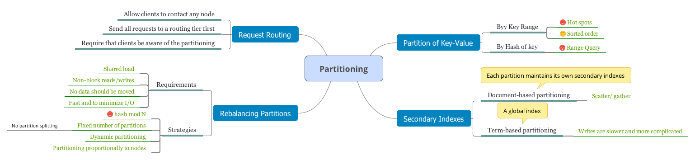
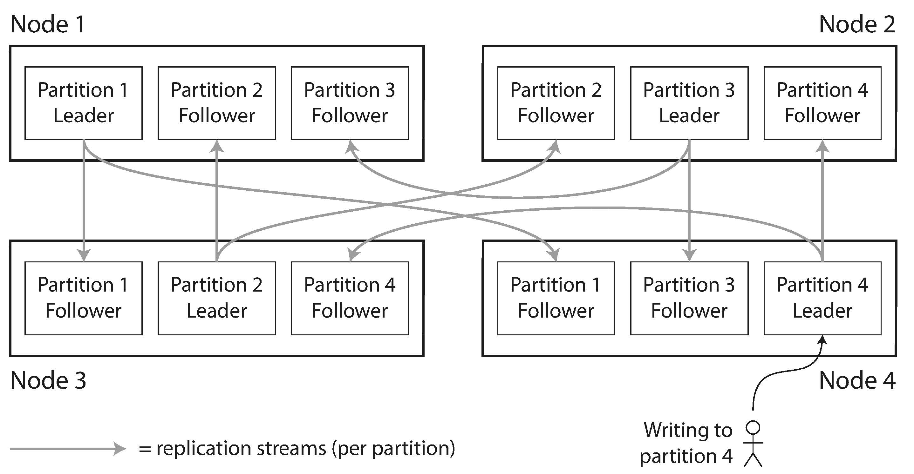
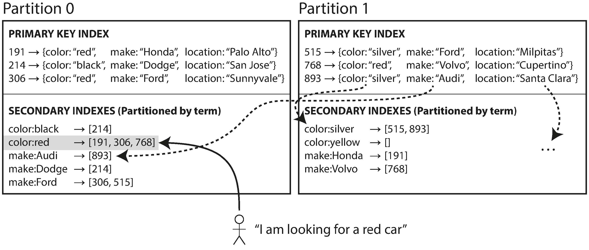
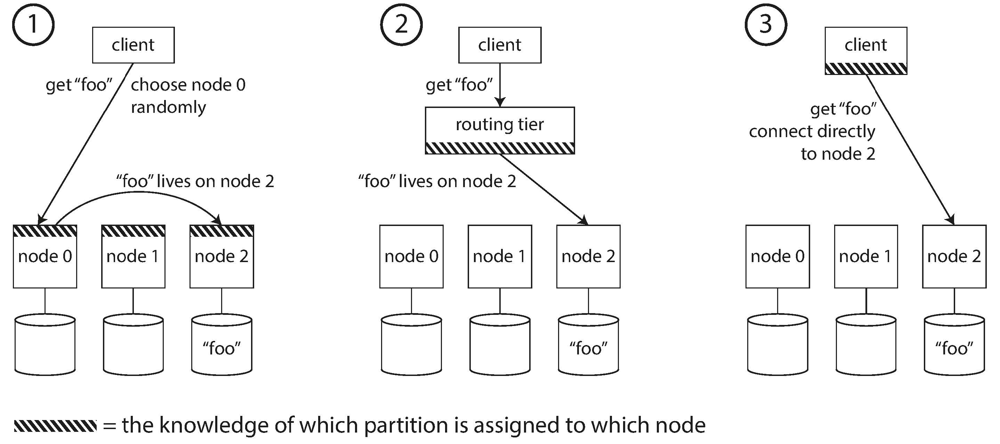

- [Partition and Replication](#partition-and-replication)
- [Partitioning of Key-Value Data](#partitioning-of-key-value-data)
  - [Partitioning by Key Range](#partitioning-by-key-range)
  - [Partitioning by Hash of Key](#partitioning-by-hash-of-key)
  - [Skewed Workloads and Relieving Hot Spots](#skewed-workloads-and-relieving-hot-spots)
- [Partitioning and Secondary Indexes](#partitioning-and-secondary-indexes)
  - [Partitioning Secondary Indexes by Document](#partitioning-secondary-indexes-by-document)
  - [Partitioning Secondary Indexes by Term](#partitioning-secondary-indexes-by-term)
- [Rebalancing Partitions](#rebalancing-partitions)
  - [Strategies for Rebalancing](#strategies-for-rebalancing)
    - [How not to do it: hash mod N](#how-not-to-do-it-hash-mod-n)
    - [Fixed number of partitions](#fixed-number-of-partitions)
    - [Dynamic partitioning](#dynamic-partitioning)
    - [Partitioning proportionally to nodes](#partitioning-proportionally-to-nodes)
  - [Operations: Automatic or Manual Rebalancing](#operations-automatic-or-manual-rebalancing)
- [Request Routing](#request-routing)
  - [Parallel Query Execution](#parallel-query-execution)
- [Navigation](#navigation)

<!-- END doctoc generated TOC please keep comment here to allow auto update -->

The main reason for wanting to partition data is scalability. Different partitions can be placed on different nodes in a shared-nothing cluster. Thus, a large dataset can be distributed across many disks, and the query load can be distributed across many processors.

# Partition and Replication

Partitioning is usually combined with replication so that copies of each partition are stored on multiple nodes. This means that, even though each record belongs to exactly one partition, it may still be stored on several different nodes for fault tolerance.

Each partition's leader is assigned to one node, and its followers are assigned to other nodes. Each node may be the leader for some partitions and a follower for other partitions.

# Partitioning of Key-Value Data

Our goal with partitioning is to spread the data and the query load evenly across nodes.

If the partitioning is unfair, so that some partitions have more data or queries than others, we call it *skewed*, making partitioning much less effective.

The simplest approach for avoiding hot spots would be to assign records to nodes randomly. That would distribute the data quite evenly across the nodes, but it has a big disadvantage: when you're trying to read a particular item, you have no way of knowing which node it is on, so you have to query all nodes in parallel.

## Partitioning by Key Range

One way of partitioning is to assign a continuous range of keys (from some minimum to some maximum) to each partition.

The ranges of keys are not necessarily evenly spaced, because your data may not be evenly distributed. Within each partition, we can keep keys in sorted order. This has the advantage that range scans are easy, and you can treat the key as a concatenated index in order to fetch several related records in one
query.

However, the downside of key range partitioning is that certain access patterns can lead to hot spots. If the key is a timestamp, then the partitions correspond to ranges of time—e.g., one partition per day.

To avoid this problem in the database, you need to use something other than the timestamp as the first element of the key.

## Partitioning by Hash of Key

Because of this risk of skew and hot spots, many distributed datastores use a hash function to determine the partition for a given key. A good hash function takes skewed data and makes it uniformly distributed.

> Consistent hashing uses randomly chosen partition boundaries to avoid the need for central control or distributed consensus.

By using the hash of the key for partitioning we lose the ability to do efficient range queries.

## Skewed Workloads and Relieving Hot Spots

This kind of workload is perhaps unusual, but not unheard of: for example, on a social media site, a celebrity user with millions of followers may cause a storm of activity when they do something. This event can result in a large volume of writes to the same key (where the key is perhaps the user ID of the celebrity, or the ID of the action that people are commenting on). Hashing the key doesn't help, as the hash of two identical IDs is still the same.

# Partitioning and Secondary Indexes

If records are only ever accessed via their primary key, we can determine the partition from that key and use it to route read and write requests to the partition responsible for that key.
 
The situation becomes more complicated if secondary indexes are involved. A secondary index usually doesn't identify a record uniquely but rather is a way of searching for occurrences of a particular
value: find all actions by user 123, find all articles containing the word hogwash, find all cars whose color is red, and so on.

Secondary indexes are the bread and butter of relational databases, and they are common in document databases too. Many key-value stores (such as HBase and Voldemort) have avoided secondary indexes because of their added implementation
complexity.

The problem with secondary indexes is that they don't map neatly to partitions. There are two main approaches to partitioning a database with secondary indexes: 

- document-based partitioning 
- and term-based partitioning.

## Partitioning Secondary Indexes by Document

In this indexing approach, each partition is completely separate: each partition maintains its own secondary indexes, covering only the documents in that partition.

This approach to querying a partitioned database is sometimes known as scatter/ gather, and it can make read queries on secondary indexes quite expensive.

## Partitioning Secondary Indexes by Term

Rather than each partition having its own secondary index (a local index), we can construct a global index that covers data in all partitions. A global index must also be partitioned, but it can be partitioned differently from the primary key index.

We call this kind of index term-partitioned, because the term we're looking for determines the partition of the index. As before, we can partition the index by the term itself, or using a hash of the term.

The advantage of a global (term-partitioned) index over a document-partitioned index is that it can make reads more efficient. The downside of a global index is that writes are slower and more complicated, because a write to a single document may now affect multiple partitions of the index.

In practice, updates to global secondary indexes are often asynchronous.

# Rebalancing Partitions

The process of moving load from one node in the cluster to another is called rebalancing.

No matter which partitioning scheme is used, rebalancing is usually expected to meet some minimum requirements:

- After rebalancing, the load (data storage, read and write requests) should be shared fairly between the nodes in the cluster.
- While rebalancing is happening, the database should continue accepting reads and writes.
- No more data than necessary should be moved between nodes, to make rebalancing
- fast and to minimize the network and disk I/O load.

## Strategies for Rebalancing

### How not to do it: hash mod N

When partitioning by the hash of a key, it's best to divide the possible hashes into ranges and assign each range to a partition (e.g., assign key to partition 0 if 0 ≤ hash(key) < b0, to partition 1 if b0 ≤ hash(key) < b1, etc.).

The problem with the mod N approach is that if the number of nodes N changes, most of the keys will need to be moved from one node to another.

### Fixed number of partitions

There is a fairly simple solution: create many more partitions than there are nodes, and assign several partitions to each node.

If a node is added to the cluster, the new node can steal a few partitions from every existing node until partitions are fairly distributed once again.

In principle, you can even account for mismatched hardware in your cluster: by assigning more partitions to nodes that are more powerful, you can force those nodes to take a greater share of the load.

A fixed number of partitions is operationally simpler, and so many fixed-partition databases choose not to implement partition
splitting. Thus, the number of partitions configured at the outset is the maximum number of nodes you can have, so you need to choose it high enough to accommodate future growth. 

If partitions are very large, rebalancing and recovery from node failures become expensive. But if partitions are too small, they incur too much overhead. The best performance is achieved when the size of partitions is "just right", neither too big nor too small, which can be hard to achieve if the number of partitions is fixed but the dataset size varies.

### Dynamic partitioning

Key range–partitioned databases such as HBase and RethinkDB create partitions dynamically. When a partition grows to exceed a configured size (on HBase, the default is 10 GB), it is split into two partitions so that approximately half of the data ends up on each side of the split.

An advantage of dynamic partitioning is that the number of partitions adapts to the total data volume. 

A caveat is that an empty database starts off with a single partition, since there is no a priori information about where to draw the partition boundaries. To mitigate this issue, HBase and MongoDB allow an initial set of partitions to be configured on an empty database (this is called pre-splitting).

### Partitioning proportionally to nodes

A third option, used by Cassandra and Ketama, is to make the number of partitions proportional to the number of nodes—in other words, to have a fixed number of partitions per node.

When a new node joins the cluster, it randomly chooses a fixed number of existing partitions to split, and then takes ownership of one half of each of those split partitions while leaving the other half of each partition in place.

## Operations: Automatic or Manual Rebalancing

Fully automated rebalancing can be convenient. However, it can be unpredictable. 

Rebalancing is an expensive operation, because it requires rerouting requests and moving a large amount of data from one node to another. If it is not done carefully, this process can overload the network or the nodes and harm the performance of other requests while the rebalancing is in progress.

Such automation can be dangerous in combination with automatic failure detection. For example, say one node is overloaded and is temporarily slow to respond to requests. The other nodes conclude that the overloaded node is dead, and automatically rebalance the cluster to move load away from it.

# Request Routing

If I want to read or write the key "foo", which IP address and port number do I need to connect to? This is an instance of a more general problem called service discovery.

On a high level, there are a few different approaches to this problem:

1. Allow clients to contact any node.
2. Send all requests from clients to a routing tier first.
3. Require that clients be aware of the partitioning and the assignment of partitions to nodes.

Many distributed data systems rely on a separate coordination service such as Zoo‐Keeper to keep track of this cluster metadata.

Cassandra and Riak take a different approach: they use a gossip protocol among the nodes to disseminate any changes in cluster state.

## Parallel Query Execution

Massively parallel processing (MPP) relational database products, often used for analytics, are much more sophisticated in the types of queries they support.

The MPP query optimizer breaks this complex query into a number of execution stages and partitions, many of which can be executed in parallel on different nodes of the database cluster. 

# Navigation

[Table of Contents](README.md)

Prev: [5. Replication](ch5.md)

Next: [7. Transactions](ch7.md)
