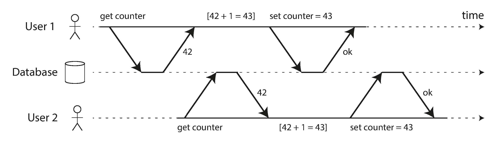

- [The Slippery Concept of a Transaction](#the-slippery-concept-of-a-transaction)
  - [The Meaning of ACID](#the-meaning-of-acid)
    - [Atomicity](#atomicity)
    - [Consistency](#consistency)
    - [Isolation](#isolation)
    - [Durability](#durability)
  - [Single-Object and Multi-Object Operations](#single-object-and-multi-object-operations)
    - [Single-object writes](#single-object-writes)
    - [The need for multi-object transactions](#the-need-for-multi-object-transactions)
    - [Handling errors and aborts](#handling-errors-and-aborts)
- [Weak Isolation Levels](#weak-isolation-levels)
  - [Read Committed](#read-committed)
    - [No dirty reads](#no-dirty-reads)
    - [No dirty writes](#no-dirty-writes)
    - [Implementing read committed](#implementing-read-committed)
  - [Snapshot Isolation and Repeatable Read](#snapshot-isolation-and-repeatable-read)
    - [Implementing snapshot isolation](#implementing-snapshot-isolation)
    - [Visibility rules for observing a consistent snapshot](#visibility-rules-for-observing-a-consistent-snapshot)
    - [Indexes and snapshot isolation](#indexes-and-snapshot-isolation)
  - [Preventing Lost Updates](#preventing-lost-updates)
    - [Atomic write operations](#atomic-write-operations)
    - [Explicit locking](#explicit-locking)
    - [Automatically detecting lost updates](#automatically-detecting-lost-updates)
    - [Compare-and-set](#compare-and-set)
    - [Conflict resolution and replication](#conflict-resolution-and-replication)
  - [Write Skew and Phantoms](#write-skew-and-phantoms)
    - [Characterizing write skew](#characterizing-write-skew)
    - [Phantoms causing write skew](#phantoms-causing-write-skew)
    - [Materializing conflicts](#materializing-conflicts)
- [Serializability](#serializability)
  - [Actual Serial Execution](#actual-serial-execution)
    - [Encapsulating transactions in stored procedures](#encapsulating-transactions-in-stored-procedures)
    - [Pros and cons of stored procedures](#pros-and-cons-of-stored-procedures)
    - [Partitioning](#partitioning)
    - [Summary of serial execution](#summary-of-serial-execution)
  - [Two-Phase Locking (2PL)](#two-phase-locking-2pl)
    - [Implementation of two-phase locking](#implementation-of-two-phase-locking)
    - [Performance of two-phase locking](#performance-of-two-phase-locking)
    - [Predicate locks](#predicate-locks)
    - [Index-range locks](#index-range-locks)
  - [Serializable Snapshot Isolation (SSI)](#serializable-snapshot-isolation-ssi)
    - [Pessimistic versus optimistic concurrency control](#pessimistic-versus-optimistic-concurrency-control)
    - [Decisions based on an outdated premise](#decisions-based-on-an-outdated-premise)
    - [Detecting stale MVCC reads](#detecting-stale-mvcc-reads)
    - [Detecting writes that affect prior reads](#detecting-writes-that-affect-prior-reads)
    - [Performance of serializable snapshot isolation](#performance-of-serializable-snapshot-isolation)
- [Navigation](#navigation)

<!-- END doctoc generated TOC please keep comment here to allow auto update -->

In the harsh reality of data systems, many things can go wrong:

- The database software or hardware may fail at any time (including in the middle of a write operation).
- The application may crash at any time (including halfway through a series of operations).
- Interruptions in the network can unexpectedly cut off the application from the database, or one database node from another.
- Several clients may write to the database at the same time, overwriting each other's changes.
- A client may read data that doesn't make sense because it has only partially been updated.
- Race conditions between clients can cause surprising bugs.

A transaction is a way for an application to group several reads and writes
together into a logical unit: either the entire transaction succeeds (commit) or it fails (abort, rollback). If it fails, the application can safely retry. 

By using transactions, the application is free to ignore certain potential error scenarios and concurrency issues, because the database takes care of them instead (we call these safety guarantees).

# The Slippery Concept of a Transaction

Almost all relational databases today, and some nonrelational databases, support transactions. Many NoSQL databases abandon transactions entirely, or redefine the word to describe a much weaker set of guarantees for good performance and high availability.

## The Meaning of ACID

In practice, one database's implementation of ACID does not equal
another's implementation. For example, as we shall see, there is a lot of ambiguity around the meaning of isolation. 

Systems that do not meet the ACID criteria are sometimes called BASE, which stands for Basically Available, Soft state, and Eventual consistency. This is even more vague than the definition of ACID.

### Atomicity

In the context of ACID, atomicity is not about concurrency.

The ability to abort a transaction on error and have all writes from that transaction discarded is the defining feature of ACID atomicity.

### Consistency

The word consistency is terribly overloaded:

- Replica consistency.
- Consistent hashing.
- Consistency in CAP theorem means linearizability.
- Consistency in ACID refers to an application-specific notion of the database being in a "good state".

Atomicity, isolation, and durability are properties of the database, whereas consistency (in the ACID sense) is a property of the application. The application may rely on the database's atomicity and isolation properties in order to achieve consistency, but it's not up to the database alone.

### Isolation

Isolation in the sense of ACID means that concurrently executing transactions are isolated from each other: they cannot step on each other's toes. 

The classic database textbooks formalize isolation as serializability, which means that each transaction can pretend that it is the only transaction running on the entire database. The database ensures that when the transactions have committed, the result is the same as if they had run serially (one after another), even though in reality they may have run concurrently.

However, in practice, serializable isolation is rarely used, because it carries a performance penalty.

### Durability

Durability is the promise that once a transaction has committed successfully, any data it has written will not be forgotten, even if there is a hardware fault or the database crashes.

In a replicated database, durability may mean that *the data has been successfully copied to some number of nodes*. In order to provide a durability guarantee, a database must wait until these writes or replications are complete before reporting a transaction as successfully committed.

## Single-Object and Multi-Object Operations

Multi-object transactions require some way of determining which read and write operations belong to the same transaction. In relational databases, that is typically done based on the client's TCP connection to the database server: on any particular connection, everything between a BEGIN TRANSACTION and a COMMIT statement is considered to be part of the same transaction.

On the other hand, many nonrelational databases don't have such a way of grouping operations together. Even if there is a multi-object API, that
doesn't necessarily mean it has transaction semantics: the command may succeed for some keys and fail for others, leaving the database in a partially updated state.

### Single-object writes

Atomicity can be implemented using a log for crash recovery, and isolation can be implemented using a lock on each object (allowing only one thread to access an object at any one time).

Some databases also provide more complex atomic operations, such as an increment operation, which removes the need for a read-modify-write cycle . Similarly popular is a compare-and-set operation, which allows a write to
happen only if the value has not been concurrently changed by someone else.

### The need for multi-object transactions

- In a relational data model, a row in one table often has a foreign key reference to a row in another table. Multi-object transactions allow you to ensure that these references remain valid.
- In a document data model, no multi-object transactions are needed when updating a single document. However, document
databases lacking join functionality also encourage denormalization. When denormalized information needs to be updated, you need to update several documents in one go. 
- In databases with secondary indexes, the indexes also need to be updated every time you change a value. 

### Handling errors and aborts

ACID databases are based on this philosophy: if the database is in danger of violating its guarantee of atomicity, isolation, or durability, it would rather abandon the transaction entirely than allow it to remain half-finished.

Retrying an aborted transaction is not perfect:

- If the transaction actually succeeded, but the network failed while the server tried to acknowledge the successful commit to the client.
- If the error is due to overload, retrying the transaction will make the problem worse, not better.
- If the transaction also has side effects outside of the database, those side effects may happen even if the transaction is aborted.
- If the client process fails while retrying, any data it was trying to write to the database is lost.

# Weak Isolation Levels

Concurrency issues (race conditions) only come into play when one transaction reads data that is concurrently modified by another transaction, or when two transactions try to simultaneously modify the same data.

Isolation is unfortunately not that simple. Serializable isolation has a performance cost, and many databases don't want to pay that price. It's therefore common for systems to use weaker levels of isolation, which protect against some concurrency issues, but not all.

Rather than blindly relying on tools, we need to develop a good understanding of the kinds of concurrency problems that exist, and how to prevent them. Then we can build applications that are reliable and correct, using the tools at our disposal.

## Read Committed

The most basic level of transaction isolation is read committed. It makes two guarantees:

1. When reading from the database, you will only see data that has been committed (no dirty reads).
2. When writing to the database, you will only overwrite data that has been committed (no dirty writes).

### No dirty reads

Any writes by a transaction only become visible to others when that transaction commits.

There are a few reasons why it's useful to prevent dirty reads:

- If a transaction needs to update several objects, a dirty read means that another transaction may see some of the updates but not others.
- If the database allows dirty reads, that means a transaction may see data that is later rolled back.

### No dirty writes

By preventing dirty writes, this isolation level avoids some concurrency problems if transactions update multiple objects.

### Implementing read committed

Most commonly, databases prevent dirty writes by using row-level locks: when a transaction wants to modify a particular object (row or document), it must first acquire a lock on that object.

How do we prevent dirty reads? One option would be to use the same lock, and to require any transaction that wants to read an object to briefly acquire the lock and then release it again immediately after reading.

However, the approach of requiring read locks does not work well in practice, because one long-running write transaction can force many read-only transactions to wait until the long-running transaction has completed.

## Snapshot Isolation and Repeatable Read

Read skew is considered acceptable under read committed isolation: the account balances that Alice saw were indeed committed at the time when she read them.

However, some situations cannot tolerate such temporary inconsistency:

- Backups
- Analytic queries and integrity checks

*Snapshot isolation* is the most common solution to this problem. The idea is that each transaction reads from a consistent snapshot of the database—that is, the transaction sees all the data that was committed in the database at the start of the transaction. Even if the data is subsequently changed by another transaction, each transaction sees only the old data from that particular point in time.

### Implementing snapshot isolation

Like read committed isolation, implementations of snapshot isolation typically use write locks to prevent dirty writes, which means that a transaction that makes a write can block the progress of another transaction that writes to the same object. However, reads do not require any locks.

Readers never block writers, and writers never block readers. This allows a database to handle long-running read queries on a consistent snapshot at the same time as processing writes normally, without any lock contention between the two.

The database must potentially keep several different committed versions of an object, because various in-progress transactions may need to see the state of the database at different points in time. This technique is known as multi-version concurrency control (MVCC).

Storage engines that support snapshot isolation typically use MVCC for their read committed isolation level as well. A typical approach is that read committed uses a separate snapshot for each query, while snapshot isolation uses the same snapshot for an entire transaction.

Each row in a table has a `created_by` field, containing the ID of the transaction that inserted this row into the table. Moreover, each row has a `deleted_by` field, which is initially empty. If a transaction deletes a row, the row isn't actually deleted from the database, but it is marked for deletion by setting the `deleted_by` field to the ID of the transaction that requested the deletion. At some later time, when it is certain that no transaction can any longer access the deleted data, a garbage collection process in the database removes any rows marked for deletion and frees their space.

### Visibility rules for observing a consistent snapshot

When a transaction reads from the database, transaction IDs are used to decide which objects it can see and which are invisible.

The visibility rules works as follows:

1. At the start of each transaction, the database makes a list of all the other transactions that are in progress (not yet committed or aborted) at that time. Any writes that those transactions have made are ignored, even if the transactions subsequently commit.
2. Any writes made by aborted transactions are ignored.
3. Any writes made by transactions with a later transaction ID (i.e., which started after the current transaction started) are ignored, regardless of whether those transactions have committed.
4. All other writes are visible to the application's queries.

These rules apply to both creation and deletion of objects.

Put another way, an object is visible if both of the following conditions are true:

- At the time when the reader's transaction started, the transaction that created the object had already committed.
- The object is not marked for deletion, or if it is, the transaction that requested deletion had not yet committed at the time when the reader's transaction started.

### Indexes and snapshot isolation

How do indexes work in a multi-version database? One option is to have the *index simply point to all versions of an object* and require an index query to filter out any object versions that are not visible to the current transaction. When garbage collection removes old object versions that are no longer visible to any transaction, the corresponding index entries can also be removed.

In practice, many implementation details determine the performance of multi-version concurrency control.

Another approach is an append-only/copy-on-write variant that does not overwrite pages of the tree when they are updated, but instead creates a
new copy of each modified page. Parent pages, up to the root of the tree, are copied and updated to point to the new versions of their child pages. Any pages that are not affected by a write do not need to be copied, and remain immutable.

With append-only B-trees, every write transaction (or batch of transactions) creates a new B-tree root, and a particular root is a consistent snapshot of the database at the point in time when it was created. There is no need to filter out objects based on transaction IDs because subsequent writes cannot modify an existing B-tree; they can only create new tree roots. However, this approach also requires a background process for compaction and garbage collection.

## Preventing Lost Updates

The lost update problem can occur if an application reads some value from the database, modifies it, and writes back the modified value (a read-modify-write cycle). If two transactions do this concurrently, one of the modifications can be lost, because the second write does not include the first modification.

### Atomic write operations

Many databases provide *atomic update operations*, which remove the need to implement read-modify-write cycles in application code. They are usually the best solution if your code can be expressed in terms of those operations.

Atomic operations are usually implemented by taking an **exclusive lock** on the object when it is read so that no other transaction can read it until the update has been applied. This technique is sometimes known as cursor stability. Another option is to simply force all atomic operations to be executed on a single thread.

### Explicit locking

Another option for preventing lost updates, if the database's built-in atomic operations don't provide the necessary functionality, is for the application to explicitly lock objects that are going to be updated.

### Automatically detecting lost updates

An alternative is to allow them to execute in parallel and, if the transaction manager detects a lost update, abort the transaction and force it to retry its read-modify-write cycle.

An advantage of this approach is that databases can perform this check efficiently in conjunction with snapshot isolation.

### Compare-and-set

The purpose of compare-and-set is to avoid lost updates by allowing an update to happen only if the value has not changed since you last read it.

### Conflict resolution and replication

Locks and compare-and-set operations assume that there is a single up-to-date copy of the data. However, databases with multi-leader or leaderless replication usually allow several writes to happen concurrently and replicate them asynchronously, so they cannot guarantee that there is a single up-to-date copy of the data.

A common approach in such replicated databases is to allow concurrent writes to create several conflicting versions of a value (also known as siblings), and to use application code or special data structures to resolve and merge these versions after the fact.

Atomic operations can work well in a replicated context, especially if they are commutative.

The last write wins (LWW) conflict resolution method is prone to
lost updates. Unfortunately, LWW is the default in many replicated databases.

## Write Skew and Phantoms

### Characterizing write skew

This anomaly is called write skew. It is neither a dirty write nor a lost update, because the two transactions are updating two different objects (Alice's and Bob's oncall records, respectively).

Write skew can occur if two transactions read the same objects, and then update some of those objects (different transactions may update different objects). In the special case where different transactions update the same object, you get a dirty write or lost update anomaly (depending on the timing).

With write skew, out options are restricted:

- Atomic single-object operations don't help, as multiple objects are involved.
- The automatic detection of lost updates doesn't help either. Automatically
preventing write skew requires true serializable isolation.
- If you can't use a serializable isolation level, the second-best option in this case is probably to explicitly lock the rows that the transaction depends on.

### Phantoms causing write skew

All of write skews follow a similar pattern:

1. A `SELECT` query checks whether some requirement is satisfied by searching for rows that match some search condition.
2. Depending on the result of the first query, the application code decides how to continue.
3. If the application decides to go ahead, it makes a write (INSERT, UPDATE, or
DELETE) to the database and commits the transaction. The effect of this write changes the precondition of the decision of step 2. 

This effect, where a write in one transaction changes the result of a search query in another transaction, is called a phantom. Snapshot isolation avoids phantoms in read-only queries, but in read-write transactions, phantoms can lead to particularly tricky cases of write skew.

### Materializing conflicts

Materializing conflict takes a phantom and turns it into a lock conflict on a concrete set of rows that exist in the database. 

Unfortunately, it can be hard and error-prone to figure out how to materialize conflicts, and it's ugly to let a concurrency control mechanism leak into the application data model. For those reasons, materializing conflicts should be considered a last resort if no alternative is possible. A serializable isolation level is much preferable in most cases.

# Serializability

There are no good tools to help us detect race conditions. In principle, static
analysis may help, but research techniques have not yet found their way into practical use. Testing for concurrency issues is hard, because they are usually nondeterministic—problems only occur if you get unlucky with the timing.

Serializable isolation is usually regarded as the strongest isolation level. It guarantees that even though transactions may execute in parallel, the end result is the same as if they had executed one at a time, serially, without any concurrency.

Most databases that provide serializability today use one of three techniques,

- Literally executing transactions in a serial order
- Two-phase locking
- Optimistic concurrency control techniques such as serializable snapshot isolation

## Actual Serial Execution

The simplest way of avoiding concurrency problems is to remove the concurrency entirely: to execute only one transaction at a time, in serial order, on a single thread.

The approach of executing transactions serially is implemented in VoltDB/H-Store, Redis, and Datomic. A system designed for single-threaded execution can sometimes perform better than a system that supports concurrency, because it can avoid the coordination overhead of locking. However, its throughput is limited to that of a single CPU core.

### Encapsulating transactions in stored procedures

In this interactive style of transaction, a lot of time is spent in network communication between the application and the database. If you were to disallow concurrency in the database and only process one transaction at a time, the throughput would be dreadful because the database would spend most of its time waiting for the application to issue the next query for the current transaction. 

For this reason, systems with single-threaded serial transaction processing don't allow interactive multi-statement transactions. Instead, the application must submit the entire transaction code to the database ahead of time, as a stored procedure.

### Pros and cons of stored procedures

Stored procedures have a bad reputation for various reasons:

- Each database vendor has its own language for stored procedures.
- Code running in a database is difficult to debug.
- A database is often much more performance-sensitive than an application server.

Modern implementations of stored procedures have abandoned PL/SQL and use existing general-purpose programming languages instead: VoltDB uses Java or Groovy, Datomic uses Java or Clojure, and Redis uses Lua.

With stored procedures and in-memory data, executing all transactions on a single thread becomes feasible. As they don't need to wait for I/O and they avoid the overhead of other concurrency control mechanisms, they can achieve quite good throughput on a single thread.

### Partitioning

If you can find a way of partitioning your dataset so that each transaction only needs to read and write data within a single partition, then each partition can have its own transaction processing thread running independently from the others. 

However, for any transaction that needs to access multiple partitions, the database must coordinate the transaction across all the partitions that it touches. The stored procedure needs to be performed in lock-step across all partitions to ensure serializability across the whole system.

Since cross-partition transactions have additional coordination overhead, they are vastly slower than single-partition transactions.

### Summary of serial execution

Serial execution of transactions has become a viable way of achieving serializable isolation within certain constraints:

- Every transaction must be small and fast, because it takes only one slow transaction to stall all transaction processing.
- It is limited to use cases where the active dataset can fit in memory. Rarely
accessed data could potentially be moved to disk, but if it needed to be accessed
in a single-threaded transaction, the system would get very slow.
- Write throughput must be low enough to be handled on a single CPU core, or
else transactions need to be partitioned without requiring cross-partition coordination.
- Cross-partition transactions are possible, but there is a hard limit to the extent to which they can be used.

## Two-Phase Locking (2PL)

If two transactions concurrently try to write to the same object, the lock ensures that the second writer must wait until the first one has finished its transaction (aborted or committed) before it may continue.

Two-phase locking is similar, but makes the lock requirements much stronger.

In 2PL, writers don't just block other writers; they also block readers and vice versa. Snapshot isolation has the mantra readers never block writers, and writers never block readers.

### Implementation of two-phase locking

2PL is used by the serializable isolation level in MySQL (InnoDB) and SQL Server, and the repeatable read isolation level in DB2.

The blocking of readers and writers is implemented by a having a lock on each object in the database. The lock can either be in *shared mode* or in *exclusive mode*. The lock is used as follows:

- If a transaction wants to read an object, it must first acquire the lock in shared mode. Several transactions are allowed to hold the lock in shared mode simultaneously, but if another transaction already has an exclusive lock on the object, these transactions must wait.
- If a transaction wants to write to an object, it must first acquire the lock in exclusive mode. No other transaction may hold the lock at the same time (either in shared or in exclusive mode), so if there is any existing lock on the object, the transaction must wait.
- If a transaction first reads and then writes an object, it may upgrade its shared lock to an exclusive lock. The upgrade works the same as getting an exclusive lock directly.
• After a transaction has acquired the lock, it must continue to hold the lock until the end of the transaction (commit or abort). This is where the name "two-phase" comes from: the first phase (while the transaction is executing) is when the locks are acquired, and the second phase (at the end of the transaction) is when all the locks are released.

Since so many locks are in use, it can happen quite easily that transaction A is stuck waiting for transaction B to release its lock, and vice versa. This situation is called deadlock. The database automatically detects deadlocks between transactions and aborts one of them so that the others can make progress.

### Performance of two-phase locking

The big downside of two-phase locking is performance: transaction throughput and response times of queries are significantly worse under two-phase locking than under weak isolation.

This is partly due to the overhead of acquiring and releasing all those locks, but more importantly due to reduced concurrency.

Traditional relational databases don't limit the duration of a transaction, because they are designed for interactive applications that wait for human input. Consequently, when one transaction has to wait on another, there is no limit on how long it may have to wait.

### Predicate locks

We need a predicate lock. It works similarly to the shared/exclusive lock described earlier, but rather than belonging to a particular object (e.g., one row in a table), it belongs to all objects that match some search condition.

A predicate lock restricts access as follows:

- If transaction A wants to read objects matching some condition, like in that SELECT query, it must acquire a shared-mode predicate lock on the conditions of
the query.
- If transaction A wants to insert, update, or delete any object, it must first check whether either the old or the new value matches any existing predicate lock.

### Index-range locks

Most databases with 2PL actually implement index-range locking (also known as next-key locking), which is a simplified approximation of predicate locking.

It's safe to simplify a predicate by making it match a greater set of objects. For example, if you have a predicate lock for bookings of room 123 between noon and 1 p.m., you can approximate it by locking bookings for room 123 at any time, or you can approximate it by locking all rooms (not just room 123) between noon and 1 p.m.

This is safe, because any write that matches the original predicate will definitely also match the approximations.

If there is no suitable index where a range lock can be attached, the database can fall back to a shared lock on the entire table.

## Serializable Snapshot Isolation (SSI)

An algorithm called serializable snapshot isolation (SSI) is very promising. It provides full serializability, but has only a small performance penalty compared to snapshot isolation.

### Pessimistic versus optimistic concurrency control

Two-phase locking is a so-called *pessimistic* concurrency control mechanism: it is based on the principle that if anything might possibly go wrong (as indicated by a lock held by another transaction), it's better to wait until the situation is safe again before doing anything. 

Serial execution is, in a sense, pessimistic to the extreme: it is essentially equivalent to each transaction having an exclusive lock on the entire database (or one partition of the database) for the duration of the transaction.

By contrast, serializable snapshot isolation is an optimistic concurrency control technique. Optimistic in this context means that instead of blocking if something potentially dangerous happens, transactions continue anyway, in the hope that everything will turn out all right.

When a transaction wants to commit, the database checks whether anything bad happened; if so, the transaction action is aborted and has to be retried. Only transactions that executed serializably are allowed to commit.

SSI is based on snapshot isolation—that is, all reads within a transaction are made from a consistent snapshot of the database. This is the main difference compared to earlier optimistic concurrency control techniques. On top of snapshot isolation, SSI adds an algorithm for *detecting serialization conflicts* among writes and determining which transactions to abort.

### Decisions based on an outdated premise

Put another way, the transaction is taking an action based on a premise (a fact that was true at the beginning of the transaction.

When the application makes a query (e.g., "How many doctors are currently on call?"), the database doesn't know how the application logic uses the result of that query. To be safe, the database needs to assume that any change in the query result (the premise) means that writes in that transaction may be invalid.

How does the database know if a query result might have changed? There are two cases to consider:

- Detecting reads of a stale MVCC object version (uncommitted write occurred before the read)
- Detecting writes that affect prior reads (the write occurs after the read)

### Detecting stale MVCC reads

When the transaction wants to commit, the database checks whether any of the ignored writes have now been committed. If so, the transaction must be aborted.

### Detecting writes that affect prior reads

When a transaction writes to the database, it must look in the indexes for any other transactions that have recently read the affected data. This process is similar to acquiring a write lock on the affected key range, but rather than blocking until the readers have committed, the lock acts as a tripwire: it simply *notifies the transactions that the data they read may no longer be up to date*.

### Performance of serializable snapshot isolation

Compared to two-phase locking, the big advantage of serializable snapshot isolation is that one transaction doesn't need to block waiting for locks held by another transaction.

Compared to serial execution, serializable snapshot isolation is not limited to the throughput of a single CPU core.

The rate of aborts significantly affects the overall performance of SSI, so SSI requires that read-write transactions be fairly short.

# Navigation

[Table of Contents](README.md)

Prev: [6. Partitioning](ch6.md)

Next: [8. The Trouble with Distributed Systems](ch8.md)
