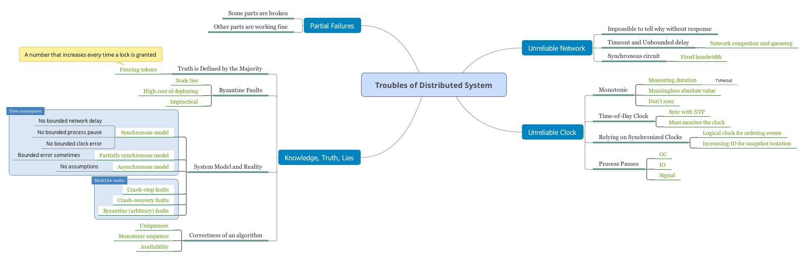
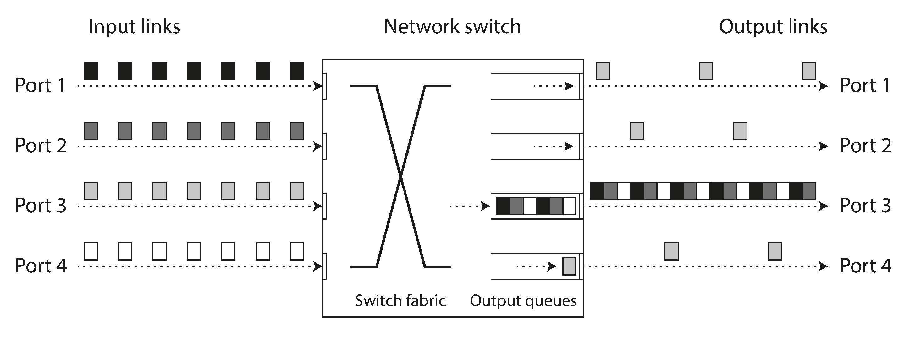
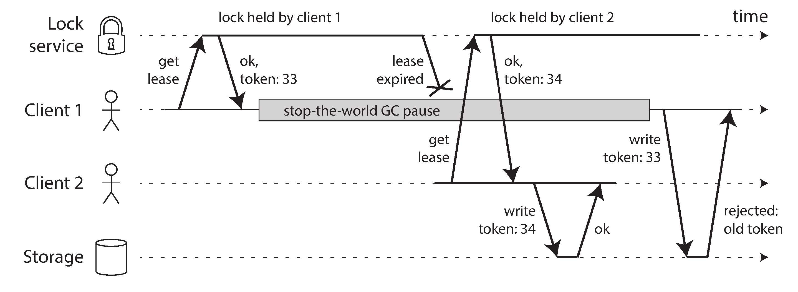

- [Faults and Partial Failures](#faults-and-partial-failures)
  - [Cloud Computing and Supercomputing](#cloud-computing-and-supercomputing)
- [Unreliable Networks](#unreliable-networks)
  - [Network Faults in Practice](#network-faults-in-practice)
  - [Detecting Faults](#detecting-faults)
  - [Timeouts and Unbounded Delays](#timeouts-and-unbounded-delays)
    - [Network congestion and queueing](#network-congestion-and-queueing)
  - [Synchronous Versus Asynchronous Networks](#synchronous-versus-asynchronous-networks)
- [Unreliable Clocks](#unreliable-clocks)
  - [Monotonic Versus Time-of-Day Clocks](#monotonic-versus-time-of-day-clocks)
    - [Time-of-day clocks](#time-of-day-clocks)
    - [Monotonic clocks](#monotonic-clocks)
  - [Clock Synchronization and Accuracy](#clock-synchronization-and-accuracy)
  - [Relying on Synchronized Clocks](#relying-on-synchronized-clocks)
    - [Timestamps for ordering events](#timestamps-for-ordering-events)
    - [Clock readings have a confidence interval](#clock-readings-have-a-confidence-interval)
    - [Synchronized clocks for global snapshots](#synchronized-clocks-for-global-snapshots)
  - [Process Pauses](#process-pauses)
    - [Response time guarantees](#response-time-guarantees)
    - [Limiting the impact of garbage collection](#limiting-the-impact-of-garbage-collection)
- [Knowledge, Truth, and Lies](#knowledge-truth-and-lies)
  - [The Truth Is Defined by the Majority](#the-truth-is-defined-by-the-majority)
    - [The leader and the lock](#the-leader-and-the-lock)
    - [Fencing tokens](#fencing-tokens)
  - [Byzantine Faults](#byzantine-faults)
  - [System Model and Reality](#system-model-and-reality)
    - [Correctness of an algorithm](#correctness-of-an-algorithm)
    - [Safety and liveness](#safety-and-liveness)
    - [Mapping system to the real world](#mapping-system-to-the-real-world)
- [Navigation](#navigation)

<!-- END doctoc generated TOC please keep comment here to allow auto update -->



# Faults and Partial Failures

This is a deliberate choice in the design of computers: if an internal fault occurs, we prefer a computer to crash completely rather than returning a wrong result, because wrong results are difficult and confusing to deal with.

In a distributed system, there may well be some parts of the system that are broken in some unpredictable way, even though other parts of the system are working fine. This is known as a *partial failure*. The difficulty is that partial failures are nondeterministic: if you try to do anything involving multiple nodes and the network, it may sometimes work and sometimes unpredictably fail.

## Cloud Computing and Supercomputing

A supercomputer is more like a single-node computer than a distributed system: it deals with partial failure by letting it escalate into total failure - if any part of the system fails, just let everything crash.

In a system with thousands of nodes, it is reasonable to assume that something is always broken. When the error handling strategy consists of simply giving up, a large system can end up spending a lot of its time recovering from faults rather than doing useful work.

We need to build a reliable system from unreliable components. There is no such thing as perfect reliability, so we'll need to understand the limits of what we can realistically promise.

In distributed systems, suspicion, pessimism, and paranoia pay off.


# Unreliable Networks

The internet and most internal networks in datacenters (often Ethernet) are asynchronous packet networks. In this kind of network, one node can send a message (a packet) to another node, but the network gives no guarantees as to when it will arrive, or whether it will arrive at all.

The sender can't even tell whether the packet was delivered: the only option is for the recipient to send a response message, which may in turn be lost or delayed. 

If you send a request to another node and don't receive a response, it is impossible to tell why.

## Network Faults in Practice

Handling network faults doesn't necessarily mean tolerating them: if your network is normally fairly reliable, a valid approach may be to simply show an error message to users while your network is experiencing problems. However, you do need to know how your software reacts to network problems and ensure that the system can recover from them.

## Detecting Faults

Unfortunately, the uncertainty about the network makes it difficult to tell whether a node is working or not.

Rapid feedback about a remote node being down is useful, but you can't count on it. Even if TCP acknowledges that a packet was delivered, the application may have crashed before handling it. If you want to be sure that a request was successful, you need a positive response from the application itself.

## Timeouts and Unbounded Delays

A long timeout means a long wait until a node is declared dead (and during this time, users may have to wait or see error messages). A short timeout detects faults faster, but carries a higher risk of incorrectly declaring a node dead when in fact it has only suffered a temporary slowdown.

Unfortunately, most systems we work with have neither of those guarantees: asynchronous networks have unbounded delays. And most server implementations cannot guarantee that they can handle requests within some maximum time.

### Network congestion and queueing

The packet delays on computer networks is most often due to queueing:

- If several different nodes simultaneously try to send packets to the same destination, the network switch must queue them up and feed them into the destination network link one by one.
- When a packet reaches the destination machine, if all CPU cores are currently busy, the incoming request from the network is queued by the operating system.
- TCP performs flow control (also known as congestion avoidance or backpressure), in which a node limits its own rate of sending in order to avoid overloading a network link or the receiving node.



> UDP does not perform flow control and does not retransmit lost packets, it avoids some of the reasons for variable network delays. UDP is a good choice in situations where delayed data is worthless.

Rather than using configured constant timeouts, systems can continually measure response times and their variability (jitter), and automatically adjust timeouts according to the observed response time distribution. This can be done with a Phi Accrual failure detector, which is used for example in Akka and Cassandra. TCP retransmission timeouts also work similarly.


## Synchronous Versus Asynchronous Networks

When you make a call over the telephone network, it establishes a circuit: a fixed, guaranteed amount of bandwidth is allocated for the call, along the entire route between the two callers. This circuit remains in place until the call ends.

A circuit in a telephone network is very different from a TCP connection: a circuit is a fixed amount of reserved bandwidth which nobody else can use while the circuit is established, whereas the packets of a TCP connection opportunistically use whatever network bandwidth is available.

Why do datacenter networks and the internet use packet switching? The answer is
that they are optimized for bursty traffic. A circuit is good for an audio or video call, which needs to transfer a fairly constant number of bits per second for the duration of the call. On the other hand, requesting a web page, sending an email, or transferring a file doesn't have any particular bandwidth requirement.

Using circuits for bursty data transfers wastes network capacity and makes transfers unnecessarily slow. By contrast, TCP dynamically adapts the rate of data transfer to the available network capacity.


# Unreliable Clocks

In a distributed system, time is a tricky business, because communication is not instantaneous: it takes time for a message to travel across the network from one machine to another.

Moreover, each machine on the network has its own clock, which is an actual hardware device. It's possible to synchronize clocks to some degree:
the most commonly used mechanism is the Network Time Protocol.

## Monotonic Versus Time-of-Day Clocks

Modern computers have at least two different kinds of clocks: a time-of-day clock and a monotonic clock.

### Time-of-day clocks

A time-of-day clock does what you intuitively expect of a clock: it returns the current date and time according to some calendar.

Time-of-day clocks are usually synchronized with NTP, which means that a timestamp from one machine (ideally) means the same as a timestamp on another machine. It may jump back to a previous point in time. These jumps, as well as the fact that they often ignore leap seconds, make time-of-day clocks unsuitable for measuring elapsed time.

### Monotonic clocks

A monotonic clock is suitable for measuring a duration (time interval), such as a timeout or a service's response time: `clock_gettime(CLOCK_MONOTONIC)` on Linux and `System.nanoTime()` in Java are monotonic clocks.

You can check the value of the monotonic clock at one point in time, do something, and then check the clock again at a later time. The difference between the two values tells you how much time elapsed between the two checks. However, the absolute value of the clock is meaningless.

NTP may adjust the frequency at which the monotonic clock moves forward (this is known as slewing the clock) if it detects that the computer's local quartz is moving faster or slower than the NTP server.

In a distributed system, using a monotonic clock for measuring elapsed time (e.g., timeouts) is usually fine, because it doesn't assume any synchronization between different nodes' clocks and is not sensitive to slight inaccuracies of measurement.

## Clock Synchronization and Accuracy

Monotonic clocks don't need synchronization, but time-of-day clocks need to be set according to an NTP server or other external time source in order to be useful.

Unfortunately, our methods for getting a clock to tell the correct time aren’t nearly as reliable or accurate as you might hope—hardware clocks and NTP can be fickle beasts.

## Relying on Synchronized Clocks

Even though networks are well behaved most of the time, software must be designed on the assumption that the network will occasionally be faulty, and the software must handle such faults gracefully. The same is true with clocks: although they work quite well most of the time, robust software needs to be prepared to deal with incorrect clocks.

Thus, if you use software that requires synchronized clocks, it is essential that you also carefully monitor the clock offsets between all the machines. Any node whose clock drifts too far from the others should be declared dead and removed from the cluster.

### Timestamps for ordering events

Some implementations generate timestamps on the client rather than the server, but this doesn’t change the fundamental problems with LWW:

- Database writes can mysteriously disappear: a node with a lagging clock is unable to overwrite values previously written by a node with a fast clock until the clock skew between the nodes has elapsed. 
- LWW cannot distinguish between writes that occurred sequentially in quick succession and writes that were truly concurrent (neither writer was aware of the other).
- It is possible for two nodes to independently generate writes with the same timestamp, especially when the clock only has millisecond resolution.

Thus, even though it is tempting to resolve conflicts by keeping the most "recent" value and discarding others, it’s important to be aware that the definition of "recent" depends on a local time-of-day clock, which may well be incorrect.

So-called logical clocks, which are based on incrementing counters rather than an oscillating quartz crystal, are a safer alternative for ordering events.

Logical clocks do not measure the time of day or the number of seconds elapsed, only the relative ordering of events (whether one event happened before or after another.

### Clock readings have a confidence interval

Unfortunately, most systems don’t expose this uncertainty: for example, when you call `clock_gettime()`, the return value doesn’t tell you the expected error of the timestamp, so you don’t know if its confidence interval is five milliseconds or five years. 

An interesting exception is Google’s TrueTime API in Spanner [41], which explicitly reports the confidence interval on the local clock.

### Synchronized clocks for global snapshots

The most common implementation of snapshot isolation requires a monotonically increasing transaction ID. If a write happened later than the snapshot (i.e., the write has a greater transaction ID than the snapshot), that write is invisible to the snapshot transaction.

A global, monotonically increasing transaction ID (across all partitions) is difficult to generate, because it requires coordination. The transaction ID must reflect causality: if transaction B reads a value that was written by transaction A, then B must have a higher transaction ID than A.

Spanner implements snapshot isolation across datacenters in this way. It uses the clock’s confidence interval as reported by the TrueTime API, and is based on the following observation: if you have two confidence intervals, each consisting of an earliest and latest possible timestamp.

## Process Pauses

```java
while (true) {
    request = getIncomingRequest();
    // Ensure that the lease always has at least 10 seconds remaining
    if (lease.expiryTimeMillis - System.currentTimeMillis() < 10000) {
        lease = lease.renew();
    }

    if (lease.isValid()) {
        process(request);
    }
}
```

The code assumes that very little time passes between the point that it checks the time (`System.currentTimeMillis()`) and the time when the request is processed (process(request)).

There are various reasons why process pauses:

- GC
- A virtual machine can be suspended
- User closes the lid of their laptop
- If the application performs synchronous disk access, a thread may be paused waiting for a slow disk I/O operation to complete.
- Swapping to disk (paging), a simple memory access may result in a page fault that requires a page from disk to be loaded into memory.
- A Unix process can be paused by sending it the SIGSTOP signal.

A node in a distributed system must assume that its execution can be paused for a significant length of time at any point, even in the middle of a function.

### Response time guarantees

In these systems, there is a specified deadline by which the software must respond; if it doesn’t meet the deadline, that may cause a failure of the entire system. These are so-called hard real-time systems.

Providing real-time guarantees in a system requires support from all levels of the software stack: a real-time operating system (RTOS) that allows processes to be scheduled with a guaranteed allocation of CPU time in specified intervals is needed.

Moreover, "real-time" is not the same as "high-performance" — in fact, real-time systems may have lower throughput, since they have to prioritize timely responses above all else. 

For most server-side data processing systems, real-time guarantees are simply not economical or appropriate. Consequently, these systems must suffer the pauses and clock instability that come from operating in a non-real-time environment.

### Limiting the impact of garbage collection

An emerging idea is to treat GC pauses like brief planned outages of a node, and to let other nodes handle requests from clients while one node is collecting its garbage.

variant of this idea is to use the garbage collector only for short-lived objects (which are fast to collect) and to restart processes periodically, before they accumulate enough long-lived objects to require a full GC of long-lived objects.


# Knowledge, Truth, and Lies

Distributed systems are different from programs running on a single computer: there is no shared memory, only message passing via an unreliable network with variable delays, and the systems may suffer from partial failures, unreliable clocks, and processing pauses.

A node in the network cannot know anything for sure—it can only make guesses based on the messages it receives (or doesn’t receive) via the network. If a remote node doesn’t respond, there is no way of knowing what state it is in, because problems in the network cannot reliably be distinguished from problems at a node.

## The Truth Is Defined by the Majority

A distributed system cannot exclusively rely on a single node, because a node may fail at any time, potentially leaving the system stuck and unable to recover. Instead, many distributed algorithms rely on a quorum, that is, voting among the nodes: decisions require some minimum number of votes from several nodes in order to reduce the dependence on any one particular node.

The quorum is an absolute majority of more than half the nodes (although other kinds of quorums are possible). A majority quorum allows the system to continue working if individual nodes have failed.

### The leader and the lock

Implementing this in a distributed system requires care: even if a node believes that it is "the chosen one" (the leader of the partition, the holder of the lock), that doesn’t necessarily mean a quorum of nodes agrees! A node may have formerly been the leader, but if the other nodes declared it dead in the meantime (e.g., due to a network interruption or GC pause), it may have been demoted and another leader may have already been elected.

### Fencing tokens

We need to ensure that a node that is under a false belief of being "the chosen one" cannot disrupt the rest of the system. A fairly simple technique that achieves this goal is called fencing.

Let’s assume that every time the lock server grants a lock or lease, it also returns a fencing token, which is a number that increases every time a lock is granted (e.g., incremented by the lock service). We can then require that every time a client.



If ZooKeeper is used as lock service, the transaction ID zxid or the node version cversion can be used as fencing token. Since they are guaranteed to be monotonically increasing, they have the required properties.

## Byzantine Faults

Distributed systems problems become much harder if there is a risk that nodes may "lie" (send arbitrary faulty or corrupted responses) — for example, if a node may claim to have received a particular message when in fact it didn’t. Such behavior is known as a Byzantine fault, and the problem of reaching consensus in this untrusting environment is known as the Byzantine Generals Problem.

Byzantine fault-tolerant are quite complicated, and fault-tolerant embedded systems rely on support from the hardware level. In most server-side data systems, the cost of deploying Byzantine fault-tolerant solutions makes them impractical.

Most Byzantine fault-tolerant algorithms require a supermajority of more than two-thirds of the nodes to be functioning correctly (i.e., if you have four nodes, at most one may malfunction). To use this approach against bugs, you would have to have four independent implementations of the same software and hope that a bug only appears in one of the four implementations.

## System Model and Reality

Algorithms need to be written in a way that does not depend too heavily on the details of the hardware and software configuration on which they are run.

It requires that we somehow formalize the kinds of faults that we expect to happen in a system. We do this by defining a system model, which is an abstraction that describes what things an algorithm may assume.

With regard to timing assumptions, three system models are in common use:

- Synchronous model. The synchronous model assumes bounded network delay, bounded process pauses, and bounded clock error.
- Partially synchronous model. Partial synchrony means that a system behaves like a synchronous system most of the time, but it sometimes exceeds the bounds for network delay, process pauses, and clock drift.
- Asynchronous model. In this model, an algorithm is not allowed to make any timing assumptions—in fact, it does not even have a clock.

The three most common system models for nodes are:

- Crash-stop faults. In the crash-stop model, an algorithm may assume that a node can fail in only one way, namely by crashing. 
- Crash-recovery faults. We assume that nodes may crash at any moment, and perhaps start responding again after some unknown time. In the crash-recovery model, nodes are assumed to have stable storage that is preserved across crashes, while the in-memory state is assumed to be lost.
- Byzantine (arbitrary) faults. Nodes may do absolutely anything, including trying to trick and deceive other nodes, as described in the last section.

### Correctness of an algorithm

We may require the algorithm to have the following properties:

- Uniqueness. No two requests for a fencing token return the same value.
- Monotonic sequence. If request x returned token tx, and request y returned token ty, and x completed before y began, then tx < ty.
- Availability. A node that requests a fencing token and does not crash eventually receives a response.

### Safety and liveness

Safety is often informally defined as nothing bad happens, and liveness as something good eventually happens.

An advantage of distinguishing between safety and liveness properties is that it helps us deal with difficult system models. For distributed algorithms, it is common to require that safety properties always hold, in all possible situations of a system model.

### Mapping system to the real world

A real implementation may still have to include code to handle the case where something happens that was assumed to be impossible, even if that handling boils down to `printf`.


# Navigation

[Table of Contents](README.md)

Prev: [7. Transactions](ch7.md)

Next: [9. Consistency and Consensus](ch9.md) 
