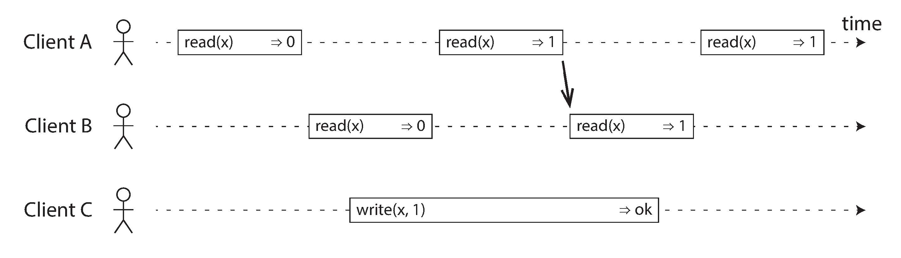

- [Consistency Guarantees](#consistency-guarantees)
- [Linearizability](#linearizability)
  - [What Makes a System Linearizable?](#what-makes-a-system-linearizable)
  - [Relying on Linearizability](#relying-on-linearizability)
    - [Locking and leader election](#locking-and-leader-election)
    - [Constraints and uniqueness guarantees](#constraints-and-uniqueness-guarantees)
    - [Cross-channel timing dependencies](#cross-channel-timing-dependencies)
  - [Implementing Linearizable Systems](#implementing-linearizable-systems)
    - [Linearizability and quorums](#linearizability-and-quorums)
  - [The Cost of Linearizability](#the-cost-of-linearizability)
    - [The CAP theorem](#the-cap-theorem)
    - [Linearizability and network delays](#linearizability-and-network-delays)
- [Ordering Guarantees](#ordering-guarantees)
  - [Ordering and Causality](#ordering-and-causality)
    - [The causal order is not a total order](#the-causal-order-is-not-a-total-order)
    - [Linearizability is stronger than causal consistency](#linearizability-is-stronger-than-causal-consistency)
  - [Sequence Number Ordering](#sequence-number-ordering)
    - [Noncausal sequence number generators](#noncausal-sequence-number-generators)
    - [Lamport timestamps](#lamport-timestamps)
    - [Timestamp ordering is not sufficient](#timestamp-ordering-is-not-sufficient)
  - [Total Order Broadcast](#total-order-broadcast)
    - [Using total order broadcast](#using-total-order-broadcast)
  - [Implementing linearizable storage using total order broadcast](#implementing-linearizable-storage-using-total-order-broadcast)
    - [Implementing total order broadcast using linearizable storage](#implementing-total-order-broadcast-using-linearizable-storage)
- [Distributed Transactions and Consensus](#distributed-transactions-and-consensus)
  - [Atomic Commit and Two-Phase Commit (2PC)](#atomic-commit-and-two-phase-commit-2pc)
    - [From single-node to distributed atomic commit](#from-single-node-to-distributed-atomic-commit)
    - [Introduction to two-phase commit](#introduction-to-two-phase-commit)
    - [A system of promises](#a-system-of-promises)
    - [Coordinator failure](#coordinator-failure)
    - [Three-phase commit](#three-phase-commit)
  - [Distributed Transactions in Practice](#distributed-transactions-in-practice)
    - [XA transactions](#xa-transactions)
    - [Holding locks while in doubt](#holding-locks-while-in-doubt)
    - [Recovering from coordinator failure](#recovering-from-coordinator-failure)
    - [Limitations of distributed transactions](#limitations-of-distributed-transactions)
  - [Fault-Tolerant Consensus](#fault-tolerant-consensus)
    - [Consensus algorithms and total order broadcast](#consensus-algorithms-and-total-order-broadcast)
    - [Single-leader replication and consensus](#single-leader-replication-and-consensus)
    - [Epoch numbering and quorums](#epoch-numbering-and-quorums)
    - [Limitations of consensus](#limitations-of-consensus)
  - [Membership and Coordination Services](#membership-and-coordination-services)
    - [Allocating work to nodes](#allocating-work-to-nodes)
    - [Service discovery](#service-discovery)
    - [Membership services](#membership-services)
- [Navigation](#navigation)

<!-- END doctoc generated TOC please keep comment here to allow auto update -->

The best way of building fault-tolerant systems is to find some general-purpose abstractions with useful guarantees, implement them once, and then let applications rely on those guarantees.

One of the most important abstractions for distributed systems is consensus: that is, getting all of the nodes to agree on something.

# Consistency Guarantees

Most replicated databases provide at least eventual consistency, which means that if you stop writing to the database and wait for some unspecified length of time, then eventually all read requests will return the same value. A better name for eventual consistency may be convergence, as we expect all replicas to eventually converge to the same value.

When working with a database that provides only weak guarantees, you need to be constantly aware of its limitations and not accidentally assume too much.

# Linearizability

But the basic idea is to make a system appear as if there were only one copy of the data, and all operations on it are atomic. With this guarantee, even though there may be multiple replicas in reality, the application does not need to worry about them.

In a linearizable system, as soon as one client successfully completes a write, all clients reading from the database must be able to see the value just written.

## What Makes a System Linearizable?

If reads that are concurrent with a write can return either the old or the new value, then readers could see a value flip back and forth between the old and the new value several times while a write is going on. That is not what we expect of a system that emulates a "single copy of the data".

After any one read has returned the new value, all following reads must also return the new value.

The requirement of linearizability is that the lines joining up the operation markers always move forward in time (from left to right), never backward.

> Serializability is an isolation property of transactions, where every transaction may read and write multiple objects. Linearizability is a recency guarantee on reads and writes of a register (an individual object). It doesn’t group operations together into transactions, so it does not prevent problems such as write skew.

## Relying on Linearizability

### Locking and leader election

A system that uses single-leader replication needs to ensure that there is indeed only one leader, not several (split brain). One way of electing a leader is to use a **lock**: every node that starts up tries to acquire the lock, and the one that succeeds becomes the leader.

Coordination services like Apache ZooKeeper and etcd are often used to implement distributed locks and leader election. They use consensus algorithms to implement linearizable operations in a fault-tolerant way.

### Constraints and uniqueness guarantees

In real applications, it is sometimes acceptable to treat such constraints loosely. In such cases, Linearizability may not be needed. 

However, a hard uniqueness constraint, such as the one you typically find in relational databases, requires linearizability. Other kinds of constraints, such as foreign key or attribute constraints, can be implemented without requiring linearizability.

### Cross-channel timing dependencies

The web server and image resizer communicate both through file storage and a message queue, opening the potential for race conditions.

Linearizability is not the only way of avoiding this race condition, but it’s the simplest to understand.

## Implementing Linearizable Systems

Since linearizability essentially means “behave as though there is only a single copy of the data, and all operations on it are atomic,” the simplest answer would be to really only use a single copy of the data.

The most common approach to making a system fault-tolerant is to use replication.

- Single-leader replication (potentially linearizable). If you make reads
from the leader, or from synchronously updated followers, they have the potential to be linearizable.iv However, not every single-leader database is actually linearizable, either by design (e.g., because it uses snapshot isolation) or due to concurrency bugs.
- Consensus algorithms (linearizable). consensus protocols contain measures to prevent split brain and stale replicas. Thanks to these details, consensus algorithms can implement linearizable storage safely.
- Multi-leader replication (not linearizable). Systems with multi-leader replication are generally not linearizable, because they concurrently process writes on multiple nodes and asynchronously replicate them to other nodes.
- Leaderless replication (probably not linearizable). Even with strict quorums, nonlinearizable behavior is possible, as demonstrated in the next section.

### Linearizability and quorums

It is possible to make Dynamo-style quorums linearizable at the cost of reduced performance: a reader must perform read repair synchronously, before returning results to the application, and a writer must read the latest state of a quorum of nodes before sending its writes.

## The Cost of Linearizability

### The CAP theorem

The trade-off is as follows:v

- If your application requires linearizability, and some replicas are disconnected from the other replicas due to a network problem, then some replicas cannot process requests while they are disconnected: they must either wait until the network problem is fixed, or return an error (either way, they become unavailable).
- If your application does not require linearizability, then it can be written in a way that each replica can process requests independently, even if it is disconnected from other replicas (e.g., multi-leader). In this case, the application can remain available in the face of a network problem, but its behavior is not linearizable.

Thus, applications that don’t require linearizability can be more tolerant of network problems.

> At times when the network is working correctly, a system can provide both consistency (linearizability) and total availability. When a network fault occurs, you have to choose between either linearizability or total availability.

### Linearizability and network delays

Although linearizability is a useful guarantee, surprisingly few systems are actually linearizable in practice.

The reason for dropping linearizability is performance, not fault tolerance. Linearizability is slow—and this is true all the time, not only during a network fault.

Attiya and Welch prove that if you want linearizability, the response time of read and write requests is at least proportional to the uncertainty of delays in the network.

# Ordering Guarantees

A linearizable register behaves as if there is only a single copy of the data, and that every operation appears to take effect atomically at one point in time. This definition implies that operations are executed in some well-defined order.

The other context of ordering:

- The main purpose of the leader in single-leader replication is to determine the order of writes in the replication log—that is, the order in which followers apply those writes.
- Serializability is about ensuring that transactions behave as if they were executed in some sequential order.
- The use of timestamps and clocks in distributed systems is another attempt to introduce order into a disorderly world.

## Ordering and Causality

Causality imposes an ordering on events: cause comes before effect; a message is sent before that message is received; the question comes before the answer.

### The causal order is not a total order

A total order allows any two elements to be compared, so if you have two elements, you can always say which one is greater and which one is smaller.

Partially ordered: in some cases one set is greater than another (if one set contains all the elements of another), but in other cases they are incomparable.

According to this definition, there are no concurrent operations in a linearizable datastore: there must be a single timeline along which all operations are totally ordered.

Concurrency would mean that the timeline branches and merges again—and in this case, operations on different branches are incomparable.

### Linearizability is stronger than causal consistency

linearizability implies causality: any system that is linearizable will preserve causality correctly. Linearizability ensures that causality is automatically preserved without the system having to do anything special.

Linearizability is not the only way of preserving causality—there are other ways too. A system can be causally consistent without incurring the performance hit of making it linearizable.

## Sequence Number Ordering

We can use sequence numbers or timestamps to order events. A timestamp need not come from a time-of-day clock (or physical clock). It can instead come from a logical clock, which is an algorithm to generate a sequence of numbers to identify operations, typically using counters that are incremented for every operation.

### Noncausal sequence number generators

If there is not a single leader (perhaps because you are using a multi-leader or leaderless database, or because the database is partitioned), it is less clear how to generate sequence numbers for operations.

Various methods are used in practice:

- Each node can generate its own independent set of sequence numbers.
- You can attach a timestamp from a time-of-day clock (physical clock) to each operation
- You can preallocate blocks of sequence numbers.

However, they all have a problem: the sequence numbers they generate are not consistent with causality. The causality problems occur because these sequence number generators do not correctly capture the ordering of operations across different nodes.

### Lamport timestamps

The Lamport timestamp is then simply a pair of (counter, node ID). Two nodes may sometimes have the same counter value, but by including the node ID in the timestamp, each timestamp is made unique.

A Lamport timestamp bears no relationship to a physical time-of-day clock, but it provides total ordering: if you have two timestamps, the one with a greater counter value is the greater timestamp; if the counter values are the same, the one with the greater node ID is the greater timestamp.

The key idea about Lamport timestamps, which makes them consistent
with causality, is the following: every node and every client keeps track of the maximum counter value it has seen so far, and includes that maximum on every request.

### Timestamp ordering is not sufficient

The total order of operations only emerges after you have collected all of the operations. If another node has generated some operations, but you don’t yet know what they are, you cannot construct the final ordering of operations: the unknown operations from the other node may need to be inserted at various positions in the total order.

In order to implement something like a uniqueness constraint for usernames, it’s not sufficient to have a total ordering of operations—you also need to know when that order is finalized.

## Total Order Broadcast

Single-leader replication determines a total order of operations by choosing one node as the leader and sequencing all operations on a single CPU core on the leader. The challenge then is how to scale the system if the throughput is greater than a single leader can handle, and also how to handle failover if the leader fails. In the distributed systems literature, this problem is known as total order broadcast or atomic broadcast.

Total order broadcast is usually described as a protocol for exchanging messages between nodes. Informally, it requires that two safety properties always be satisfied:

- Reliable delivery. No messages are lost: if a message is delivered to one node, it is delivered to all nodes.
- Totally ordered delivery. Messages are delivered to every node in the same order.

### Using total order broadcast

Total order broadcast is exactly what you need for database replication: if every message represents a write to the database, and every replica processes the same writes in the same order, then the replicas will remain consistent with each other.

An important aspect of total order broadcast is that the order is fixed at the time the messages are delivered: a node is not allowed to retroactively insert a message into an earlier position in the order if subsequent messages have already been delivered.

Another way of looking at total order broadcast is that it is a way of creating a log (as in a replication log, transaction log, or write-ahead log): delivering a message is like appending to the log. Since all nodes must deliver the same messages in the same order, all nodes can read the log and see the same sequence of messages.

Total order broadcast is also useful for implementing a lock service that provides fencing tokens. Every request to acquire the lock is appended as a message to the log, and all messages are sequentially numbered in the order they appear in the log. The sequence number can then serve as a fencing token, because it is monotonically increasing. In ZooKeeper, this sequence number is called `zxid`.

## Implementing linearizable storage using total order broadcast

Total order broadcast is asynchronous: messages are guaranteed to be delivered reliably in a fixed order, but there is no guarantee about when a message will be delivered (so one recipient may lag behind the others). By contrast, linearizability is a recency guarantee: a read is guaranteed to see the latest value written.

However, if you have total order broadcast, you can build linearizable storage on top of it.

Because log entries are delivered to all nodes in the same order, if there are several concurrent writes, all nodes will agree on which one came first. A similar approach can be used to implement serializable multi-object transactions on top of a log.

To make reads linearizable, there are a few options:

- You can sequence reads through the log by appending a message, reading the log, and performing the actual read when the message is delivered back to you.
- If the log allows you to fetch the position of the latest log message in a linearizable way, you can query that position, wait for all entries up to that position to be delivered to you, and then perform the read.
- You can make your read from a replica that is synchronously updated on writes, and is thus sure to be up to date.

### Implementing total order broadcast using linearizable storage

Assume you have a linearizable register that stores an integer and that has an atomic increment-and-get operation.

The algorithm is simple: for every message you want to send through total order broadcast, you increment-and-get the linearizable integer, and then attach the value you got from the register as a sequence number to the message. You can then send the message to all nodes (resending any lost messages), and the recipients will deliver the messages consecutively by sequence number.

The problem lies in handling the situation when network connections to that node are interrupted, and restoring the value when that node fails. In general, if you think hard enough about linearizable sequence number generators, you inevitably end up with a consensus algorithm.

# Distributed Transactions and Consensus

> FLP: there is no algorithm that is always able to reach consensus in the asynchronous system model if there is a risk that a node may crash. If the algorithm is allowed to use timeouts, or some other way of identifying suspected crashed nodes (even if the suspicion is sometimes wrong), then consensus becomes solvable.

## Atomic Commit and Two-Phase Commit (2PC)

Each secondary index is a separate data structure from the primary data—thus, if you modify some data, the corresponding change needs to also be made in the secondary index. Atomicity ensures that the secondary index stays consistent with the primary data.

### From single-node to distributed atomic commit

On a single node, transaction commitment crucially depends on the order in which data is durably written to disk: first the data, then the commit record.

Most "NoSQL" distributed datastores do not support such distributed transactions, but various clustered relational systems do.

### Introduction to two-phase commit

Instead of a single commit request, as with a single-node transaction, the commit/abort process in 2PC is split into two phases.

> 2PL provides serializable isolation.

A 2PC transaction begins with the application reading and writing data on multiple database nodes, as normal. We call these database nodes participants in the transaction. When the application is ready to commit, the coordinator begins phase 1: it sends a prepare request to each of the nodes, asking them whether they are able to commit. The coordinator then tracks the responses from the participants:

- If all participants reply “yes,” indicating they are ready to commit, then the coordinator sends out a commit request in phase 2, and the commit actually takes place.
- If any of the participants replies “no,” the coordinator sends an abort request to all nodes in phase 2.

### A system of promises

When the application wants to begin a distributed transaction, it requests a transaction ID from the coordinator. This transaction ID is globally unique.

When the application is ready to commit, the coordinator sends a prepare request to all participants, tagged with the global transaction ID. If any of these requests fails or times out, the coordinator sends an abort request for that transaction ID to all participants.

### Coordinator failure

If any of the prepare requests fail or time out, the coordinator aborts the transaction; if any of the commit or abort requests fail, the coordinator retries them indefinitely.

Once the participant has received a prepare request and
voted "yes", it can no longer abort unilaterally—it must wait to hear back from the coordinator whether the transaction was committed or aborted. If the coordinator crashes or the network fails at this point, the participant can do nothing but wait. A participant’s transaction in this state is called in doubt or uncertain.

Without hearing from the coordinator, the participant has no way of knowing whether to commit or abort.

### Three-phase commit

Two-phase commit is called a blocking atomic commit protocol due to the fact that 2PC can become stuck waiting for the coordinator to recover.

3PC assumes a network with bounded delay and nodes with bounded response times; in most practical systems with unbounded network delay and process pauses, it cannot guarantee atomicity.

## Distributed Transactions in Practice

### XA transactions

X/Open XA (short for eXtended Architecture) is a standard for implementing two-phase commit across heterogeneous technologies.

XA is not a network protocol—it is merely a C API for interfacing with a transaction coordinator.

### Holding locks while in doubt

when using two-phase commit, a transaction must hold onto the locks throughout the time it is in doubt. If the coordinator has crashed and takes 20 minutes to start up again, those locks will be held for 20 minutes.

### Recovering from coordinator failure

Many XA implementations have an emergency escape hatch called heuristic decisions: allowing a participant to unilaterally decide to abort or commit an in-doubt transaction without a definitive decision from the coordinator. To be clear, heuristic here is a euphemism for probably breaking atomicity.

### Limitations of distributed transactions

If the coordinator is not replicated but runs only on a single machine, it is a single point of failure for the entire system.

Many server-side applications are developed in a stateless model (as favored by HTTP), with all persistent state stored in a database.

There remains the problem that for 2PC to successfully commit a transaction, all participants must respond. Consequently, if any part of the system is broken, the transaction also fails.

## Fault-Tolerant Consensus

The consensus problem is normally formalized as follows: one or more nodes may propose values, and the consensus algorithm decides on one of those values.

A consensus algorithm must satisfy the following properties [25]:xiii

- Uniform agreement. No two nodes decide differently.
- Integrity. No node decides twice.
- Validity. If a node decides value v, then v was proposed by some node.
- Termination. Every node that does not crash eventually decides some value.

Most consensus algorithms assume that there are no Byzantine faults. That is, if a node does not correctly follow the protocol (for example, if it sends contradictory messages to different nodes), it may break the safety properties of the protocol.

### Consensus algorithms and total order broadcast

Most of these algorithms actually don’t directly use the formal model described here (proposing and deciding on a single value, while satisfying the agreement, integrity, validity, and termination properties). Instead, they decide on a sequence of values, which makes them total order broadcast algorithms.

### Single-leader replication and consensus

Some databases perform automatic leader election and failover, promoting a follower to be the new leader if the old leader fails. This brings us closer to fault-tolerant total order broadcast, and thus to solving consensus.

### Epoch numbering and quorums

Instead, they can make a weaker guarantee: the protocols define an epoch number (called the ballot number in Paxos, view number in Viewstamped Replication, and term number in Raft) and guarantee that within each epoch, the leader is unique.

For every decision that a leader wants to make, it must send the proposed value to the other nodes and wait for a quorum of nodes to respond in favor of the proposal. The quorum typically, but not always, consists of a majority of nodes. A node votes in favor of a proposal only if it is not aware of any other leader with a higher epoch.

In 2PC the coordinator is not elected, and that fault-tolerant consensus algorithms only require votes from a majority of nodes, whereas 2PC requires a "yes" vote from every participant. Moreover, consensus algorithms define a recovery process by which nodes can get into a consistent state after a new leader is elected, ensuring that the safety properties are always met. These differences are key to the correctness and fault tolerance of a consensus algorithm.

### Limitations of consensus

Most consensus algorithms assume a fixed set of nodes that participate in voting, which means that you can’t just add or remove nodes in the cluster. Dynamic membership extensions to consensus algorithms allow the set of nodes in the cluster to change over time, but they are much less well understood than static membership algorithms.

In environments with highly variable network delays, especially geographically distributed systems, it often happens that a node falsely believes the leader to have failed due to a transient network issue.

## Membership and Coordination Services

ZooKeeper and etcd are designed to hold small amounts of data that can fit entirely in memory.

ZooKeeper is modeled after Google’s Chubby lock service, implementing not only total order broadcast (and hence consensus), but also an interesting set of other features:

- Linearizable atomic operations. Using an atomic compare-and-set operation, you can implement a lock.
- Total ordering of operations. ZooKeeper provides fencing token by totally ordering all operations and giving each operation a monotonically increasing transaction ID (zxid) and version number (cversion).
- Failure detection. Clients maintain a long-lived session on ZooKeeper servers, and the client and server periodically exchange heartbeats to check that the other node is still alive.
- Change notifications. Not only can one client read locks and values that were created by another client, but it can also watch them for changes.

### Allocating work to nodes

ZooKeeper runs on a fixed number of nodes (usually
three or five) and performs its majority votes among those nodes while supporting a potentially large number of clients. Thus, ZooKeeper provides a way of "outsourcing" some of the work of coordinating nodes.

### Service discovery

ZooKeeper, etcd, and Consul are also often used for service discovery—that is, to find out which IP address you need to connect to in order to reach a particular service.

### Membership services

A membership service determines which nodes are currently active and live members of a cluster.

# Navigation

[Table of Contents](README.md)

Prev: [8. The Trouble with Distributed Systems](ch8.md)

Next: [10. Batch Processing](ch10.md)
